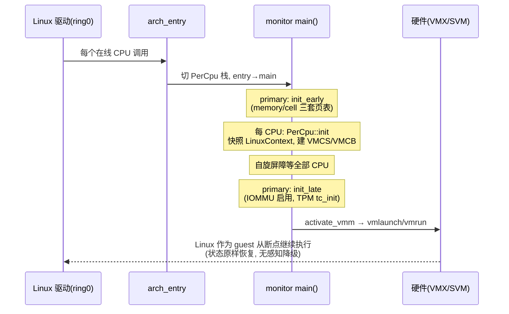
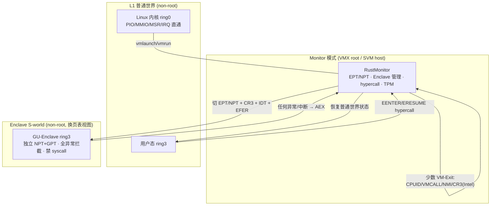
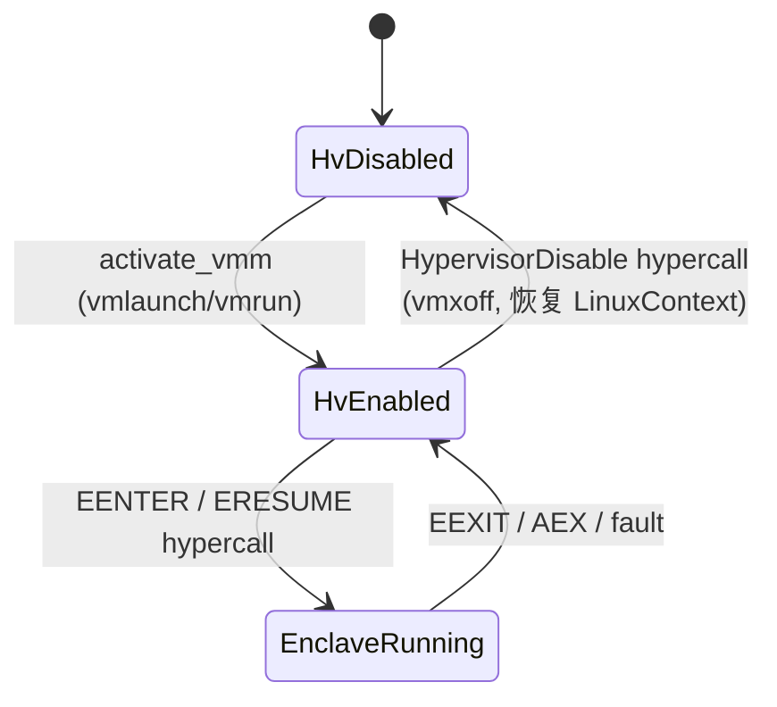
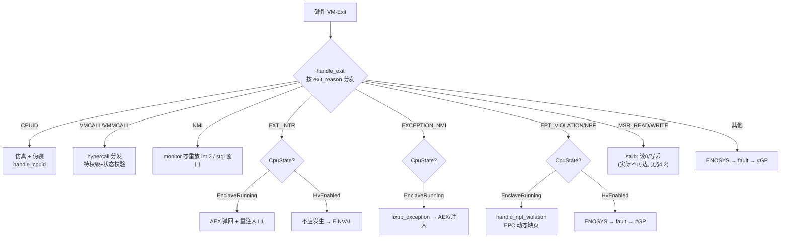
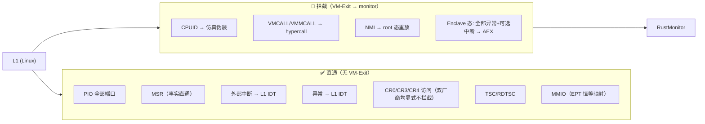
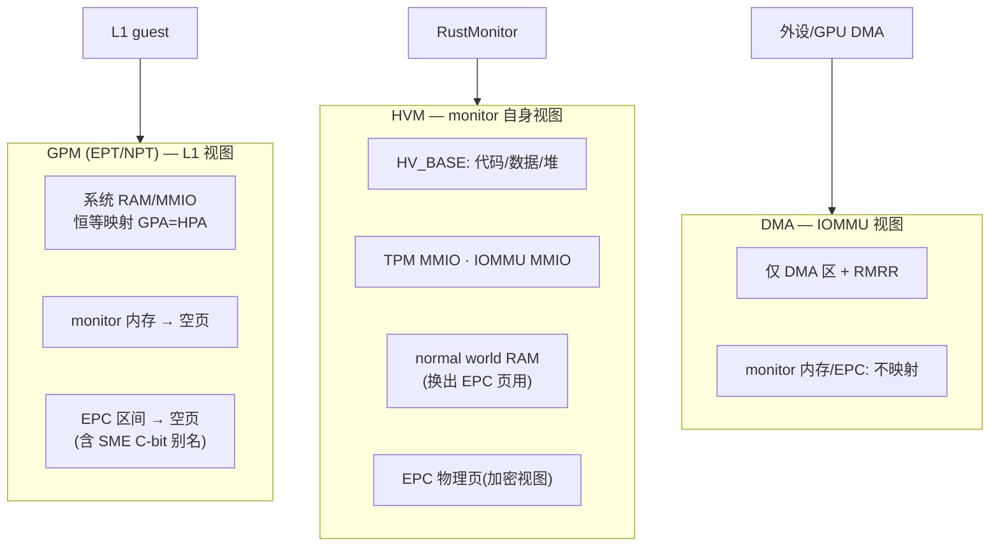

# RustMonitor 硬件资源管理与 VM Exit 机制深度分析

> 本文以虚拟化与 Linux 内核视角，基于当前代码库（v1 实现）分析 RustMonitor（HyperEnclave 的
> Rust hypervisor，Cargo 包名 `rust-hypervisor`）如何管理 VM、如何管理硬件资源，并重点回答：
> **"host 降级为 L1 后，对硬件的访问会 VM-Exit 到 monitor 吗？"**
>
> **图示约定**：每张图提供双版本——上方为看板图（HTML 表格化直观视图，默认展开），下方为
> Mermaid 源图（折叠，点击展开），两版内容一致。
>
> 相关文档：`docs/rustmonitor-architecture.md`（总体架构）、
> `docs/rustmonitor-v2-architecture.md`（v2 演进设计）、
> `docs/rustmonitor-v2-implementation-design.md`（v2 实现级设计）。

---

## 1. TL;DR：一句话回答核心问题

**不完全是。**"L1 访问硬件就 VM-Exit 到 monitor"是 KVM/Xen 式**设备模型虚拟化**
（trap-and-emulate）的直觉；RustMonitor 走的是另一条路线——**极简拦截 + 页表结构性隔离**：

| 维度 | 传统 Type-1/Type-2 hypervisor（KVM、Hyper-V） | RustMonitor（HyperEnclave v1） |
|---|---|---|
| 设计目标 | 完整虚拟出多台"机器" | 只虚拟出**一个安全能力**：SGX 兼容 Enclave |
| PIO/MMIO | 拦截 + 模拟（virtio、设备模型） | **全部直通**，L1 直接操作真实硬件 |
| MSR | 按策略拦截/仿真/切换 | 意图拦截，但 Intel 侧存在位图缺陷（见 §4.2），**事实上直通** |
| 内存隔离 | EPT/NPT 动态管理 + swap | EPT/NPT **静态恒等映射** + 敏感区"挖洞"（映射到空页） |
| 中断 | APICv/中断重映射/注入 | 普通态**完全直通**（不开 INTR_EXITING）；Enclave 态全拦截触发 AEX |
| VM-Exit 频率 | 高频（设备模拟、缺页、时钟） | 极低频（CPUID、hypercall、NMI、Enclave 事件） |
| 隔离强度来源 | "每次访问都经过我"（动态仲裁） | "你根本映射不到"（静态结构，SLAT 层面不可见） |

换言之：**RustMonitor 不靠拦截每一次硬件访问来保护 Enclave，而是靠让 Enclave 内存和
monitor 自身内存在 L1 的 EPT/NPT 视图里物理上不可见**。L1 绝大多数硬件访问（读写 MMIO、
PIO、绝大多数 MSR、收外部中断）都不产生 VM-Exit，直接命中真实硬件——这是刻意的设计选择，
不是遗漏（但 MSR/PIO 的"完全不拦截"确实超出了设计意图，构成 v2 要修复的安全缺口，见 §5）。

---

## 2. 全景：激活流程与特权级模型

### 2.1 从 Linux 裸机到 "Linux 成为 L1 guest"

内核模块（hyperenclave-driver）加载时，把系统配置（`HvSystemConfig`：内存布局、EPC 区间、
IOMMU 单元、TPM MMIO）与 ELF 头信息（`HvHeader`）布置在预留物理内存中，随后**所有在线 CPU**
各自调用 monitor 的入口 `arch_entry`。之后发生的是一次"整机降级"：

<table>
<tr><th colspan="4" align="center" style="background:#1a5276;color:#fff">🚀 激活时序（看板图）</th></tr>
<tr><th style="background:#21618c;color:#fff">步骤</th><th style="background:#21618c;color:#fff">触发</th><th style="background:#21618c;color:#fff">动作</th><th style="background:#21618c;color:#fff">结果</th></tr>
<tr><td align="center">1️⃣</td><td>驱动逐 CPU 调用</td><td><code>arch_entry</code>（entry.rs）：cli、压栈 callee-saved 寄存器、切到 PerCpu 私有栈 → <code>entry()</code> → <code>main()</code></td><td>进入 monitor 代码，仍在 Linux 页表/特权级语境</td></tr>
<tr><td align="center">2️⃣</td><td>首个到达的 CPU（primary）</td><td><code>primary_init_early</code>：logging、<code>memory::init</code>（堆/帧分配器）、<code>cell::init</code>（构建 ROOT_CELL 三套页表）</td><td>monitor 自有内存世界就绪</td></tr>
<tr><td align="center">3️⃣</td><td>每个 CPU</td><td><code>PerCpu::init</code>：保存 <code>LinuxContext</code>（Linux 的 RIP/RSP/CR0/3/4/段/IDT/GDT/EFER…），克隆 HVM 页表并激活（切到 monitor 自己的 CR3），构建 <code>Vcpu</code>（VMXON + VMCS 填写 / VMCB 填写）</td><td>Linux 全部 CPU 状态被"快照"进 guest 状态区</td></tr>
<tr><td align="center">4️⃣</td><td>全部 CPU 到位（自旋屏障）</td><td><code>primary_init_late</code>：<code>iommu::init</code>（下发 DMA 页表并启用）、<code>tc_init</code>（TPM/密码模块，版本须匹配）</td><td>DMA 隔离与信任根就绪</td></tr>
<tr><td align="center">5️⃣</td><td>每个 CPU</td><td><code>activate_vmm</code>：栈重定位到 LOCAL_PER_CPU_BASE 私有映射 → <code>vmlaunch</code>/<code>vmrun</code></td><td>💥 Linux 在"毫无知觉"中变为 guest：RIP/RSP/CR3 原样恢复，从驱动调用的下一条指令继续执行</td></tr>
</table>

📐 Mermaid 源图（点击展开 / 折叠）

关键点（虚拟化专家视角）：

1. **这不是"启动一台新 VM"，而是"把正在运行的裸机 Linux 原地封装进 VM"**。
   `LinuxContext`（`src/arch/x86_64/context.rs`）完整快照了降级瞬间的 CPU 架构状态，
   `setup_vmcs_guest` / `vmcb_setup` 将其逐字段写回 guest 状态区，`vmlaunch` 后 Linux
   从驱动调用点的返回路径继续执行，软件层面完全透明。这与 Jailhouse 的
   "root cell" 激活模型同源，与 KVM "先有 host 再创建 guest VM" 的模型根本不同。
2. **单 VM 模型**：全系统只有一个"VM"（ROOT_CELL），即降级后的 Linux。monitor 不是
   多租户 hypervisor，没有 VM 创建/销毁/调度概念。CPU 状态机只有三态（见 §3.1）。
3. **多核同步用自旋屏障**（`wait_for_other_completed`，main.rs）：monitor 态没有调度器，
   原子计数 + `spin_loop()` 是唯一同步原语；任一 CPU 失败通过 `ERROR_NUM` 广播，全体回滚
   （`restore_states` 关 IOMMU 并 `return_to_linux`）。
4. **地址空间切换的双重性**：`PerCpu::init` 里 `hvm.activate()` 切换的是 **monitor 自己的
   CR3**（HVM 页表），而 `vmlaunch` 之后 Linux 的 CR3 仍是它自己的页表——EPT/NPT 恒等
   映射保证 GPA=HPA，Linux 的页表语义不变。也就是说降级后存在**三个地址翻译世界**：
   L1 的 GVA→GPA（Linux 自己的页表）、GPA→HPA（monitor 维护的 EPT/NPT）、
   monitor 自身的 HVA→HPA（HVM 页表）。

### 2.2 特权级与隔离边界

<table>
<tr><th colspan="3" align="center" style="background:#154360;color:#fff">🏛️ 特权级分层（看板图）</th></tr>
<tr><td align="center" style="background:#7b241c;color:#fff;padding:8px"><b>Monitor 模式</b>（VMX root / SVM host, ring 0） RustMonitor：EPT/NPT 管理、Enclave 生命周期、hypercall、TPM/RoT 🔒 其内存与 EPC 在 L1 的 SLAT 视图中映射为空页</td></tr>
<tr><td align="center">⬇️ vmlaunch / vmrun ⬇️ &nbsp;&nbsp;&nbsp; ⬆️ VM-Exit（仅限 §4 列出的少数原因）⬆️</td></tr>
<tr><td align="center" style="background:#1a5276;color:#fff;padding:8px"><b>L1 普通世界</b>（VMX non-root / SVM guest） Linux 内核（ring 0）+ 用户态（ring 3） ⚡ PIO/MMIO/绝大多数 MSR/外部中断直通，无 VM-Exit</td></tr>
<tr><td align="center">⬇️ EENTER/ERESUME hypercall（切换到 Enclave EPT 视图 + 全异常拦截）⬇️</td></tr>
<tr><td align="center" style="background:#196f3d;color:#fff;padding:8px"><b>Enclave（S-world）</b>（仍是 L1 non-root，但换了页表视图） GU-Enclave：ring 3 用户态可信应用，EFER.SCE 关闭（禁 syscall） 🛡️ 独立 NPT/GPT 视图；任何异常/中断 → AEX 弹回普通世界</td></tr>
</table>

📐 Mermaid 源图（点击展开 / 折叠）

**重要澄清：Enclave 不是第二个 VM。** Enclave 运行时 CPU 仍处于同一个 VMCS/VMCB 的
non-root 模式，monitor 只是原子地切换了一组"视图寄存器"（Intel：EPTP + guest CR3 +
IDTR + EFER，`intel/enclave.rs::store_enclave_thread_state`；AMD：`vmcb.control.nest_cr3`
+ `save.cr3` + IDTR + EFER，`amd/enclave.rs`）。Enclave 与普通世界共享同一个 vCPU，
切换开销是页表指针级别的，这是 HyperEnclave 能做到 SGX 兼容低开销 EENTER/EEEXIT 语义的关键。

---

## 3. 如何管理 VM

### 3.1 VM 的形态：一个 ROOT_CELL + 每 CPU 一个 vCPU 状态机

RustMonitor 的"VM 管理"退化为极简形态——没有 `struct kvm` 式的 VM 对象、没有 vCPU
调度、没有内存 ballooning：

- **`Cell`（`src/cell.rs`）**：全局唯一 `ROOT_CELL`，持有三套页表内存集
  （`gpm`/`hvm`/`dma_regions`，见 §4.3）和 normal world 区间树。这就是"VM"的全部静态描述。
- **`PerCpu`（`src/percpu.rs`）**：每 CPU 一份，4K 对齐，内含 `Vcpu`（VMXON/VMCS 区或
  VMCB + guest 寄存器保存区）、monitor 私有栈、`LinuxContext` 快照、私有的 HVM 克隆
  （含 `LOCAL_PER_CPU_BASE` 自映射）、`EnclaveThread` 上下文。
- **状态机 `CpuState`**：`HvDisabled → HvEnabled → EnclaveRunning`。所有 hypercall 与
  VM-Exit 处理都以该状态做前置校验（`validate_state`），非法状态迁移直接注入 #UD/#GP。

<table>
<tr><th colspan="3" align="center" style="background:#4a235a;color:#fff">🔄 CpuState 状态机（看板图）</th></tr>
<tr><th style="background:#6c3483;color:#fff">状态</th><th style="background:#6c3483;color:#fff">含义</th><th style="background:#6c3483;color:#fff">迁移</th></tr>
<tr><td align="center"><code>HvDisabled</code></td><td>激活前 / 卸载后，Linux 是裸机</td><td>→ <code>HvEnabled</code>：activate_vmm 成功</td></tr>
<tr><td align="center"><code>HvEnabled</code></td><td>L1 普通世界运行中，可受理 Supervisor 级 hypercall（建/毁 Enclave、共享内存、TPM 等）</td><td>→ <code>EnclaveRunning</code>：EENTER/ERESUME；→ <code>HvDisabled</code>：HypervisorDisable（VMXOFF/_clrgi 后原路返回驱动）</td></tr>
<tr><td align="center"><code>EnclaveRunning</code></td><td>S-world 运行中，仅受理 User 级 Enclave hypercall；异常/中断 → AEX</td><td>→ <code>HvEnabled</code>：EEXIT / AEX / fault</td></tr>
</table>

📐 Mermaid 源图（点击展开 / 折叠）

### 3.2 VM-Exit 分发路径

统一入口 `vmexit_handler`（`src/arch/x86_64/vmm.rs:180`）→ 厂商 `handle_exit`
（`intel/vmexit.rs` / `amd/vmexit.rs`）→ 公共处理（CPUID/MSR/hypercall 在 vmm.rs）或
厂商私有处理（EPT violation/NPF、异常、外部中断）。处理失败时打印完整 guest 状态并
`PerCpu::fault()`：若正在 Enclave 态先 AEX 弹回，再向 L1 注入 #GP——**错误尽量不 panic**
（monitor 态 panic = 整机崩溃）。

<table>
<tr><th colspan="4" align="center" style="background:#7e5109;color:#fff">🧭 VM-Exit 分发表（看板图）</th></tr>
<tr><th style="background:#9c640c;color:#fff">Exit 原因</th><th style="background:#9c640c;color:#fff">普通世界（HvEnabled）</th><th style="background:#9c640c;color:#fff">Enclave 态（EnclaveRunning）</th><th style="background:#9c640c;color:#fff">代码位置</th></tr>
<tr><td>CPUID</td><td colspan="2" align="center">仿真：清 VMX/SVM 位、置 HYPERVISOR 位、0x4000_0000 返回 "HyperEnclave" 签名</td><td>vmm.rs <code>handle_cpuid</code></td></tr>
<tr><td>VMCALL / VMMCALL</td><td colspan="2" align="center">hypercall 分发：特权级校验（bit31）+ CpuState 校验 → 40+ 个 handler</td><td>vmm.rs <code>handle_hypercall</code> → hypercall/mod.rs</td></tr>
<tr><td>外部中断</td><td>❌ 不会发生（未开 INTR_EXITING，中断直达 L1 IDT）</td><td>仅 <code>enclave_interrupt</code> feature 开启时 exit → AEX + 向 L1 重注入</td><td>intel/vmexit.rs <code>handle_external_interrupt</code></td></tr>
<tr><td>NMI</td><td>exit：Intel 在 monitor 态重放 <code>int 2</code>；AMD stgi/clgi 窗口放行</td><td>AEX</td><td>intel/vmexit.rs:36 / amd/vmexit.rs:26</td></tr>
<tr><td>异常（#PF 等）</td><td>❌ 不发生（EXCEPTION_BITMAP=0）</td><td>✅ 全拦截（bitmap=0xFFFF_FFFF）→ <code>fixup_exception</code> → AEX 或注入</td><td>intel/enclave.rs:65</td></tr>
<tr><td>EPT violation / NPF</td><td>理论不发生（GPM 全静态预映射）→ 出现即 ENOSYS 警告</td><td>Enclave 动态缺页：<code>Enclave::handle_npt_violation</code>（EPC 页换入/权限修复）</td><td>intel/vmexit.rs:94 / enclave/mod.rs:899</td></tr>
<tr><td>MSR_READ / MSR_WRITE</td><td>stub：读返回 0、写丢弃（因 §4.2 缺陷实际不可达）</td><td>同左</td><td>vmm.rs:85-104</td></tr>
<tr><td>CR 访问（含 CR3）</td><td>❌ 不会发生（CR3 load/store exiting 位于 clear 掩码，显式禁用；CR0/CR4 guest-host mask=0）</td><td>❌ 不会发生（intercept_cr=0）</td></tr>
<tr><td>TRIPLE_FAULT / SHUTDOWN</td><td colspan="2" align="center">记录日志并注入 #GP（不关机、不 panic）</td><td>intel/vmexit.rs:182 / amd/vmexit.rs:200</td></tr>
</table>

📐 Mermaid 源图（点击展开 / 折叠）

### 3.3 Hypercall：L1 与 monitor 的唯一"上行控制通道"

L1（驱动/enclave 运行时）通过 `VMCALL`（Intel）/`VMMCALL`（AMD）主动陷入 monitor，
参数经 RAX（code）、RDI、RSI 传递。分发在 `src/hypercall/mod.rs`：

- **编码即特权级**：code bit31 = 0 → Supervisor 级（驱动发起：EnclaveCreate/AddPage/Init/
  Destroy、SharedMemoryAdd/Remove、TpmCmdSync、HypervisorDisable…）；bit31 = 1 → User 级
  （Enclave 内发起：EEXIT、EREPORT、EACCEPT、EnclaveGetKey…）。发起方 CPL 与 code 特权级
  不符 → 注入 #UD。
- **状态双重校验**：每个 code 在 `validate_state` 中登记合法的 `CpuState`，防止在
  Enclave 内调用管理类 hypercall（或反之）——这是把 SGX 的 ring 转换语义映射到
  hypercall 语义的核心防线。
- **指针参数经 guest 页表翻译**：`as_guest_ptr_ns` 用 L1 当前 CR3 的页表
  （`GuestPageTableImmut`）把 GVA 翻成 GPA 再访问（marshalling buffer 模式），monitor
  从不直接信任 L1 传来的地址。
- **共享内存合法性**：Enclave 访问普通世界内存必须经 `SharedMemoryAdd` 注册的区间，
  由 `Cell::normal_world_mem_region`（区间树）校验 GPA 落在合法 normal world RAM 内。

**对 VM 的"管理"因此可以总结为**：monitor 不管理 VM 的资源配额与调度（Linux 自己管），
只管理 VM 的**安全语义**——谁能进入 S-world、S-world 能看到哪些物理页、L1 与 S-world
之间的每一次跨越（hypercall/AEX/EEXIT）都经过强制校验。

---

## 4. 如何管理硬件

### 4.1 CPU：直通为主，选择性拦截

`setup_vmcs_control`（`intel/vcpu.rs:319`）与 `vmcb_setup`（`amd/vcpu.rs:191`）中的
拦截配置是理解整个设计的钥匙。逐类硬件资源看：

<table>
<tr><th colspan="4" align="center" style="background:#1b4f72;color:#fff">⚙️ CPU 级资源拦截矩阵（看板图，普通世界/HvEnabled 态）</th></tr>
<tr><th style="background:#21618c;color:#fff">资源</th><th style="background:#21618c;color:#fff">Intel VMX 配置</th><th style="background:#21618c;color:#fff">AMD SVM 配置</th><th style="background:#21618c;color:#fff">L1 视角效果</th></tr>
<tr><td>PIO（IN/OUT）</td><td>未开 UNCOND_IO_EXITING、未设 IO bitmap → <b>直通</b>（vcpu.rs:333 注释明示）</td><td>未设 IOPM（iopm_base_pa=0）→ <b>直通</b></td><td>串口、PM1a 电源端口、0xB2/APM 端口全部直达硬件 ⚠️</td></tr>
<tr><td>MSR</td><td>开 USE_MSR_BITMAPS，但位图因 <code>&=</code> 缺陷全零 → <b>事实直通</b>（§4.2）</td><td>未设 MSRPM → <b>直通</b></td><td>EFER/STAR/LSTAR/APIC MSR/MTRR 均直达硬件 ⚠️</td></tr>
<tr><td>CPUID</td><td>无条件 exit（VMX 架构规定）</td><td>intercept CPUID</td><td>被仿真+伪装（隐藏 VMX/SVM，宣告 hypervisor 存在）</td></tr>
<tr><td>CR 访问</td><td>CR3 load/store exiting 在 <code>set_control</code> 的 <b>clear</b> 掩码中被显式禁用；CR0/CR4 guest-host mask=0 → <b>全直通</b></td><td>intercept_cr=0 → <b>全直通</b></td><td>Linux 正常切页表，进程切换零 exit</td></tr>
<tr><td>外部中断</td><td>未开 INTR_EXITING（注释 "NO INTR_EXITING to pass-through interrupts"）</td><td>未 intercept INTR</td><td>中断经物理 LAPIC 直达 L1 自己的 IDT，<b>零 exit</b></td></tr>
<tr><td>NMI</td><td>NMI_EXITING 开</td><td>intercept NMI</td><td>exit 后 monitor 在 root 态重放（Intel <code>int 2</code> 交给 monitor IDT / AMD stgi 窗口）</td></tr>
<tr><td>异常</td><td>EXCEPTION_BITMAP=0 → <b>直通</b></td><td>intercept_exceptions=0 → <b>直通</b></td><td>#PF/#GP 等直达 L1 IDT，Linux 缺页处理完全不受影响</td></tr>
<tr><td>虚拟化指令</td><td>VMXON/VMREAD… 在 non-root 执行 → #UD（硬件行为）；CPUID 已隐藏 VMX 位</td><td>intercept VMRUN/VMLOAD/VMSAVE/STGI/CLGI/SKINIT/VMMCALL</td><td>L1 无法 nested 虚拟化、无法自我卸载</td></tr>
<tr><td>TSC / RDTSC</td><td colspan="2" align="center">不拦截、offset=0</td><td>直通读物理 TSC</td></tr>
<tr><td>调试寄存器 / XSETBV / MONITOR / PAUSE</td><td colspan="2" align="center">均不拦截</td><td>直通</td></tr>
</table>

📐 Mermaid 源图（点击展开 / 折叠）

> **CR 访问的易误读点**：`intel/vcpu.rs:335` 的
> `(CR3_LOAD_EXITING | CR3_STORE_EXITING).bits()` 位于 `Vmcs::set_control(field, msr, set, clear)`
> 的**第四个参数（clear 掩码）**，即这两位被显式清零（libvmm `vmcs.rs:308`：
> `write((old & !clear) | set)`）。因此 Intel 与 AMD 行为一致：L1 的 CR0/CR3/CR4 访问
> 全部直通，进程切换（MOV CR3）不产生 VM-Exit——这是 L1 调度延迟不受影响的前提。

**为什么中断/异常/PIO 敢全直通？** 因为普通世界里 L1 就是"物理机的合法主人"——
HyperEnclave 的威胁模型不防御"L1 使用自己的硬件"，只防御"L1 窥探/篡改 Enclave"。
而 Enclave 的机密性由 SLAT（EPT/NPT）视图切换保证：进入 S-world 时换用 Enclave 专属
NPT，普通世界的所有内存映射不复存在；回到普通世界时 GPM 中 Enclave 页（EPC）和
monitor 页映射为空页。**拦截面越小，L1 性能越接近裸机，TCB 的实时性负担也越小**——
这是 type-1 安全监控器（Jailhouse、Hyper-V VBS 的早期形态、Nemesis）的共同取舍。

### 4.2 MSR 管理：意图、缺陷与实际行为

代码**意图**是选择性拦截敏感 MSR：`MsrBitmap::default()`（`intel/structs.rs:78`）
登记了 APIC_BASE、MTRR 全系、PAT、PERF_GLOBAL_CTRL、x2APIC 寄存器组、0xC80–0xD8F
（含 EFER/STAR/LSTAR/CSTAR/SFMASK/KERNEL_GS_BASE）等写拦截，以及 PAT/MTRR/x2APIC
读拦截；对应 stub handler `handle_msr_read/write`（vmm.rs:85，读返回 0、写丢弃、
打 warn 日志）。

**但存在一个决定性缺陷**：`MsrBitmap::mask()`（structs.rs:69）用
`bitmap[byte] &= 1 << bit` 置拦截位，而位图页 `AlignedPage::new()` 零初始化
（memory/mod.rs:66）——`0 &= x` 恒为 0，**所有拦截位从未置起**。正确写法应为 `|=`。
后果链：

1. Intel 平台 MSR 全直通（MSR bitmap 全零 = 不拦截任何 MSR）；
2. `handle_msr_read/write` 成为不可达死代码——这解释了为何"读返 0/写丢弃"这种
   足以让 Linux 崩溃的 stub 从未引发事故；
3. AMD 平台本就未配置 MSRPM（`msrpm_base_pa=0`），行为与 Intel 一致（直通）。

**内核专家视角的影响评估**：L1 可无感知写 EFER（但 VMX 下 non-root 写 EFER 受
VMCS EFER guest/host mask 约束的路径此处未启用）、写 MTRR/PAT（可改变内存缓存类型，
理论上可对 Enclave 页做缓存侧信道/一致性攻击）、写 x2APIC ICR（可向任意 CPU 发 IPI，
包括正在跑 Enclave 的 CPU——不过 Enclave 态 AEX 机制会兜底）。这些构成 v2 阶段
"MSR 三层虚拟化（拦截层+策略层+VMCS MSR load/store 加速层）"要修复的核心缺口，
详见 `docs/rustmonitor-v2-implementation-design.md` PR2。

### 4.3 内存：三套页表 + 静态分区 + SLAT 挖洞

`Cell::new_root()`（`src/cell.rs`）在激活早期一次性构建三套页表，此后**普通世界的
GPM 视图终生不变**（无 demand paging、无 swap、无 dirty tracking）：

<table>
<tr><th colspan="4" align="center" style="background:#145a32;color:#fff">🗺️ 三套页表（看板图）</th></tr>
<tr><th style="background:#1e8449;color:#fff">页表</th><th style="background:#1e8449;color:#fff">翻译</th><th style="background:#1e8449;color:#fff">服务对象</th><th style="background:#1e8449;color:#fff">内容要点</th></tr>
<tr><td><b>GPM</b> (EPT / NPT)</td><td>GPA → HPA</td><td>L1 guest（经 EPTP / nest_cr3 挂到 VMCS/VMCB）</td><td>① 全部系统 RAM/MMIO <b>恒等映射</b>（GPA=HPA，去掉 ENCRYPTED 标志）；② monitor 自身内存区 → <b>映射到公共空页</b>（读得到 0，写丢弃）；③ 全部初始 EPC 区间 → 同样映射空页；④ SME 下 C-bit=1 的加密别名地址也挖洞，防止 L1 用加密视图绕过读 EPC 明文</td></tr>
<tr><td><b>HVM</b> (monitor CR3)</td><td>HVA → HPA</td><td>monitor 自身（每 CPU 克隆一份，加 PerCpu 私有映射）</td><td>HV_BASE 起映射自身代码/数据（RWX+ENCRYPTED）、堆；TPM MMIO、IOMMU MMIO；DMA 标记的 guest RAM（供换出 EPC 页时读写 normal world）；EPC 物理页的加密视图（供清零/换页）</td></tr>
<tr><td><b>DMA</b> (IOMMU 页表)</td><td>设备 DMA 地址 → HPA</td><td>所有 IOMMU 单元（init 时 <code>set_io_page_table</code> 下发）</td><td>仅映射 DMA 合法区间（驱动声明的 DMA 区 + RMRR）；monitor 内存与 EPC <b>不在其中</b> → 恶意设备/驱动无法经 DMA 读 Enclave（HyperGPU 场景下即 GPU DMA 隔离）</td></tr>
</table>

📐 Mermaid 源图（点击展开 / 折叠）

这一设计的三个安全不变量（页表模块经 CertiK/Coq 形式化验证，ASPLOS'24）：

1. **机密性（读）**：L1 与 DMA 设备对 monitor 内存、EPC 的任何读都命中空页/未映射，
   得到的是常量而非真实内容——不依赖访问时仲裁，天然免疫 TOCTOU。
2. **完整性（写）**：L1 对上述区域的写同样落在空页上，静默丢弃，真实页不受影响。
3. **一致性**：Enclave 页的换出（EWB，加密+MAC 后写入 L1 提供的 normal world 页）与
   换入（`handle_npt_violation` 触发的 EPC 动态映射）只由 monitor 经 HVM 加密视图执行，
   L1 只能搬运密文。

**Enclave 态的第二层内存管理**：每个 Enclave 拥有独立的 NPT（`EnclaveNestedPageTable`，
`enclave/mod.rs:171`）与 GPT（S-world 内部页表）。EENTER 时整套替换（§2.2），Enclave
视图里只有：自己的 ELRANGE（代码/数据/堆）、SSA、经 `SharedMemoryAdd` 白名单化的
marshalling 区域。运行时 Enclave 对 EPC 页的访问若尚未建立映射，产生 EPT violation/NPF
→ `Enclave::handle_npt_violation`（mod.rs:899）按需建立——**这是全系统唯一保留动态
按需映射的地方**，对应 SGX 的 EPCM 准入语义（页类型/权限由 `epcm.rs` 元数据强制）。

### 4.4 中断与 APIC：直通 + Enclave 态兜底

- **普通世界**：物理 LAPIC/IOAPIC 完全归 L1。中断到达时 CPU 处于 non-root，硬件直接按
  L1 的 IDTR 投递（VMCS host IDT 不参与），**零 VM-Exit、零注入开销**。这是
  HyperEnclave 对 L1 中断延迟几乎无影响的根本原因，也意味着 monitor **放弃了对中断的
  仲裁权**（对比：KVM 全拦截 + irqfd/注入；Hyper-V 用合成中断）。代价是 monitor 无法
  阻止 L1 关中断长时间占核——对 TEE 场景可接受，因为 Enclave 进入/退出是同步
  hypercall，不依赖 monitor 抢占。
- **NMI 例外**：NMI exiting 始终开启，因为 NMI 可能在 monitor 敏感操作中途到达；
  Intel 路径在 root 态用自身 IDT（`arch/x86_64/tables.rs`）重放 `int 2`，AMD 用
  `cli; stgi; clgi; sti` 制造 STGI 窗口让被拦 NMI 送达。
- **Enclave 态**：`EXCEPTION_BITMAP=0xFFFF_FFFF` 全异常拦截 +（feature `enclave_interrupt`
  开启时）`INTR_EXITING + ACK_INTR_ON_EXIT`。任何异步事件到达都触发 **AEX**（Asynchronous
  Enclave Exit）：保存 Enclave 现场到 SSA、恢复普通世界页表视图与 IDT、把中断/异常
  **重注入** L1（`Vmcs::inject_interrupt`），使 Linux 的中断处理不丢失事件——精确复刻
  SGX 的 AEX 语义，这是"用 hypervisor 软件实现 SGX 兼容层"的核心技巧。

### 4.5 设备与 DMA：IOMMU 接管，设备本体直通

- 所有 PCI/平台设备**直通**给 L1：MMIO 在 GPM 中恒等映射，驱动正常工作，无 exit。
- monitor 在 `primary_init_late` 启用 IOMMU（Intel VT-d `vtd.rs` / AMD-Vi `amd/iommu.rs`），
  把 DMA 页表钉死为 `dma_regions`——**设备 DMA 能力被裁剪到与 CPU 侧 GPM 相同的可见域**，
  从而闭合"驱动让 GPU/NIC DMA 读 EPC"这条旁路。GRUB 侧要求 `iommu=off` 是让 Linux
  不要抢先管理 IOMMU（monitor 独占）。
- monitor 自己需要访问的硬件（TPM MMIO、IOMMU 寄存器）映射进 HVM 直接操作，不经过
  任何虚拟化——monitor 是这些设备的唯一主人。

### 4.6 monitor 自身的硬件资源

monitor 运行所需资源全部来自驱动预留的连续物理内存（`HvSystemConfig.hypervisor_memory`，
GRUB `memmap=` 参数从 Linux 手里抢出来的区域）：代码/数据/堆、每 CPU 的 PerCpu 结构
（含 8K 级私有栈）、VMXON/VMCS/VMCB 区（各 4K，`VmxRegion`）、MSR bitmap、三套页表。
帧分配在 `memory::init` 建立，堆基于预留区。**monitor 不用 Linux 的任何分配器、
不触发任何 L1 回调**——自包含是 TCB 的基本要求。日志走串口 16550（MMIO/PIO 直通区）
与 hyperbox 共享内存（`logging::hhbox_init`，供 L1 dmesg 侧读取）。

---

## 5. 安全模型审视与 v1 缺口清单

以"OS–硬件隔离"的完备标准（Hyper-V VBS/HVCI 能力模型）衡量，v1 的拦截面存在明确缺口
（均已在 v2 设计中立项，此处汇总供对照）：

| # | 缺口 | 现状 | 影响 | v2 对策 |
|---|---|---|---|---|
| 1 | MSR 拦截失效 | Intel 位图 `&=` 缺陷全直通；AMD 未配 MSRPM；handler 为死代码 | L1 可写 MTRR/PAT/EFER/x2APIC，潜在侧信道与跨核干扰面 | MSR 三层虚拟化：bitmap/MSRPM 拦截层 + fail-closed 策略表 + VMCS MSR load/store 加速层（PR2） |
| 2 | PIO 全直通 | PM1a_CNT（关机）、0xB2（触发 SMI）无守卫 | L1 可绕过 monitor 关机/入 SMM，破坏 Enclave 可用性甚至经 SMM 攻击内存 | PIO 拦截 PM1x/APM 端口，S3/S4 明确拒绝（PR4） |
| 3 | CPUID 伪装不完整 | 仅清 VMX/SVM 位；SGX 位（leaf 7 EBX[2]）与 leaf 0x12 未清 | L1 可探测"存在 SGX 硬件"的矛盾信息，泄露虚拟化细节 | CPUID 策略表统一仿真（PR3） |
| 4 | LA57 未 fail-fast | 检测到 5 级页表仅打日志继续 | 后续必然错误翻译 → 崩溃 | 激活期直接拒绝（PR3） |
| 5 | AMD fs_base/gs_base 读错源 | `amd/vcpu.rs:297` 读物理 MSR（exit 后为 host 值）而非 VMCB save 区 | Enclave 状态保存/恢复可能拿到 monitor 的 base → 状态串扰 | 改读 `vmcb.save.*`（PR1） |

需要强调：**这些缺口不动摇 Enclave 机密性的主防线**——EPC/monitor 内存在 GPM 与 DMA
页表中结构性不可见这一层是完好的；缺口集中在"对 L1 滥用其余硬件能力的约束"上，
属于 v2 对标 Hyper-V 隔离能力模型的增量。

---

## 6. 设计对比与专家点评

### 6.1 与三类系统的定位对比

<table>
<tr><th colspan="4" align="center" style="background:#4a235a;color:#fff">🔬 定位对比（看板图）</th></tr>
<tr><th style="background:#6c3483;color:#fff">系统</th><th style="background:#6c3483;color:#fff">VM 管理</th><th style="background:#6c3483;color:#fff">硬件管理</th><th style="background:#6c3483;color:#fff">与 RustMonitor 的本质差异</th></tr>
<tr><td><b>KVM</b></td><td>多 VM、vCPU 调度、内存 ballooning/swap、设备模型（QEMU）</td><td>全拦截 + 模拟/半虚拟化（virtio）、APICv 加速</td><td>KVM 的目标是"忠实虚拟出机器"；RustMonitor 目标是"最小代价插入一个安全域"，VM 管理退化为单 root cell + 状态机</td></tr>
<tr><td><b>Jailhouse</b>（静态分区）</td><td>静态 cell 划分，root cell 原地降级（与 RustMonitor 激活模型同源）</td><td>按 cell 白名单静态分配设备/中断/内存</td><td>Jailhouse 分区"整台机器"（含设备归属）；RustMonitor 不分区设备——L1 保留全部硬件，被分区的只有"内存可见性 + CPU 特权语义（S-world）"</td></tr>
<tr><td><b>Hyper-V VBS</b></td><td>VSM：root partition + 嵌套可信域</td><td>MBEC/shadow stack/MSR 仿真/DMA 保护全拦截，fail-closed</td><td>VBS 是 RustMonitor v2 的对标物：v1 缺的 MSR/CPUID/PIO/电源仲裁正是 VBS 具备的"OS–硬件隔离"能力面</td></tr>
</table>

### 6.2 点评

1. **"结构性隔离优于动态仲裁"是 v1 最漂亮的设计决策**。Enclave 内存的机密性/完整性
   不依赖任何运行时检查路径，攻击面只有页表构建代码本身——而该代码恰好经过形式化
   验证（CertiK）。用 SLAT 挖洞（映射空页而非 unmap）更是细节到位：unmap 会因
   EPT violation 暴露"这里藏了东西"并引入 exit 信道，空页则连存在性都掩盖。
2. **直通策略与威胁模型严格对齐**。威胁模型假设 L1 是"诚实但好奇"（honest-but-curious）：
   它正常使用硬件不构成威胁，威胁仅在于窥探 S-world。因此把拦截面压到 CPUID/hypercall/
   NMI/Enclave 事件四类，L1 性能损失近零——对比 SGX 原生方案（EENTER 也是同一量级的
   页表/状态切换），这使 HyperEnclave 能以软件方式逼近硬件 SGX 的开销。
3. **薄弱点集中在"策略缺位"而非"机制缺位"**。机制层（VMCS/VMCB 配置、exit 分发、
   AEX、三套页表）完整且工程质量高；但 MSR/PIO/CPUID 缺少 fail-closed 的策略层，
   加上 MSR bitmap 的实现缺陷，使 v1 对 L1 的硬件滥用几乎无约束。v2 的"策略与机制
   分离 + 未知项默认拒绝"正是对症下药。
4. **单 VM 模型是限制也是保护**。没有多 VM 就没有 vCPU 调度、锁竞争与跨 VM 信道，
   TCB 得以维持在万行级 Rust + 一个预编译 libtpm.a；代价是永远无法在同一 monitor 下
   跑第二个隔离负载（v2 的 Partition 概念才开始触碰这一维度）。

---

## 7. 关键源码索引

| 主题 | 位置 |
|---|---|
| 激活入口/多核屏障 | `src/arch/x86_64/entry.rs`、`src/main.rs`（`primary_init_early/late`、`wait_for_other_completed`） |
| CPU 状态机 / PerCpu | `src/percpu.rs`（`CpuState`、`enclave_enter/resume/exit/aex`、`fault`） |
| VMCS 拦截配置 | `src/arch/x86_64/intel/vcpu.rs:319`（`setup_vmcs_control`） |
| VMCB 拦截配置 | `src/arch/x86_64/amd/vcpu.rs:225`（`vmcb_setup` control 段） |
| Exit 分发 | `src/arch/x86_64/vmm.rs:180`、`intel/vmexit.rs:162`、`amd/vmexit.rs:170` |
| CPUID 伪装 / MSR stub | `src/arch/x86_64/vmm.rs:85-145` |
| MSR bitmap（含缺陷） | `src/arch/x86_64/intel/structs.rs:50-71`（`mask()` 的 `&=`） |
| Enclave 视图切换 | `src/arch/x86_64/intel/enclave.rs`、`amd/enclave.rs`（`store_enclave_thread_state`） |
| 三套页表构建 | `src/cell.rs`（`Cell::new_root`） |
| IOMMU 接管 | `src/iommu/mod.rs`、`intel/vtd.rs`、`amd/iommu.rs` |
| Hypercall 分发 | `src/hypercall/mod.rs`（`HyperCallCode`、`validate_state`、`hypercall`） |
| Enclave 动态缺页 | `src/enclave/mod.rs:899`（`handle_npt_violation`） |
| 缺口修复设计 | `docs/rustmonitor-v2-architecture.md`、`docs/rustmonitor-v2-implementation-design.md` |
