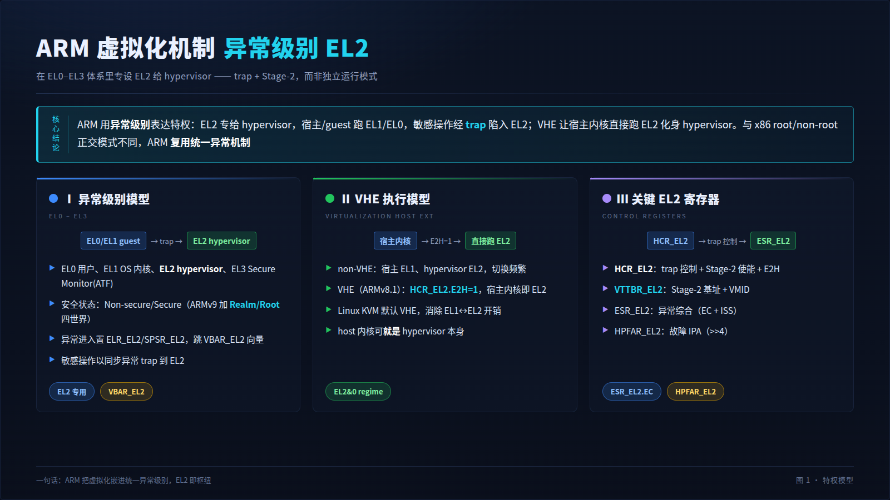
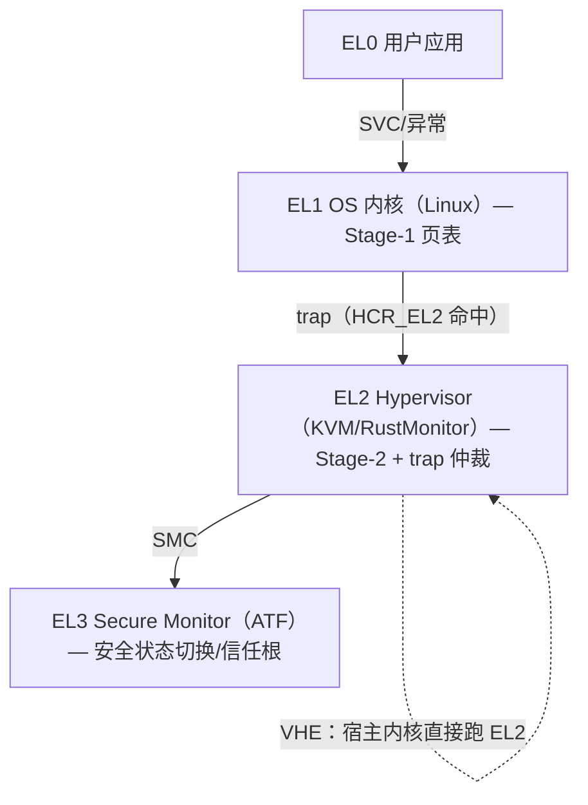
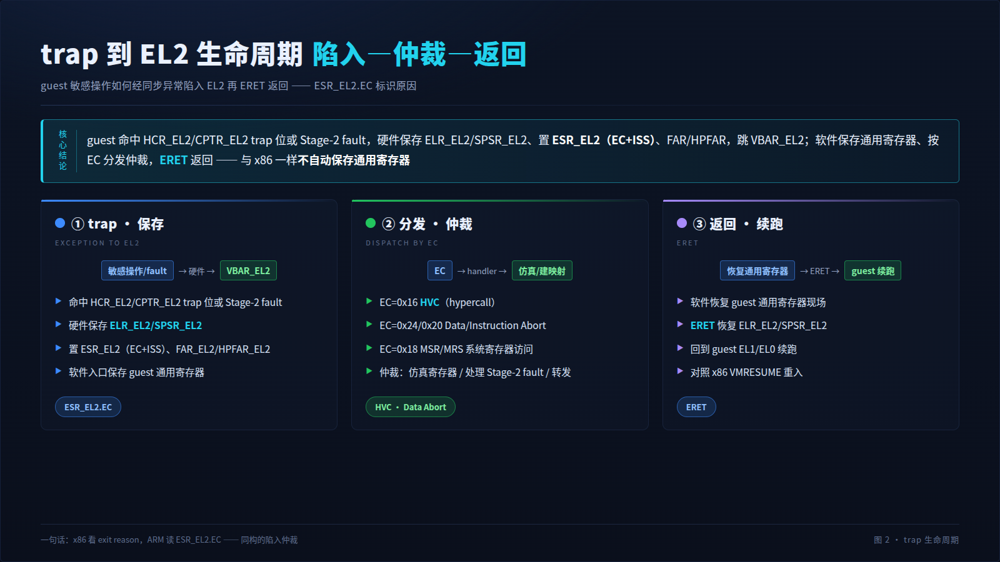
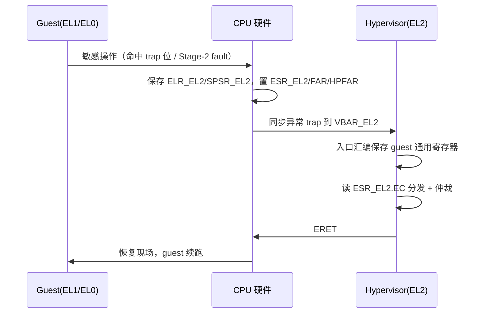
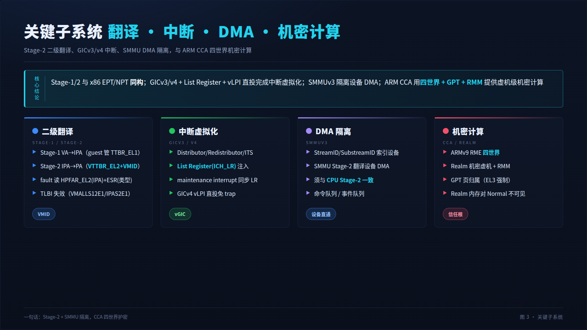
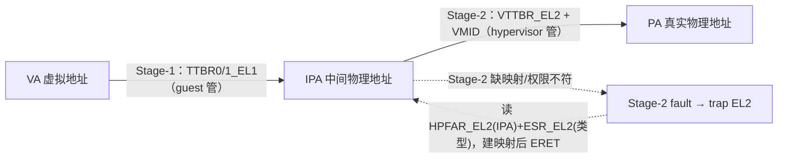
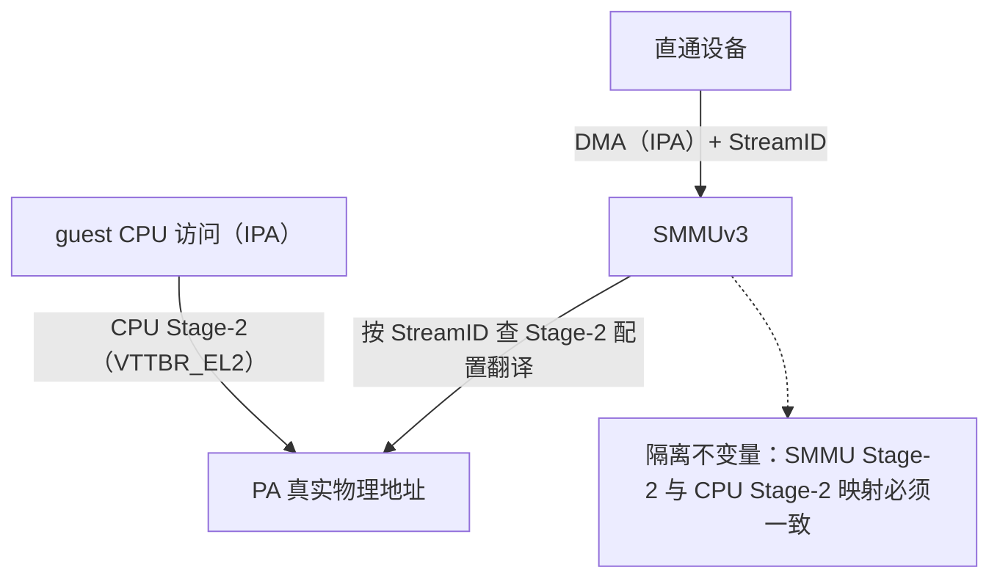
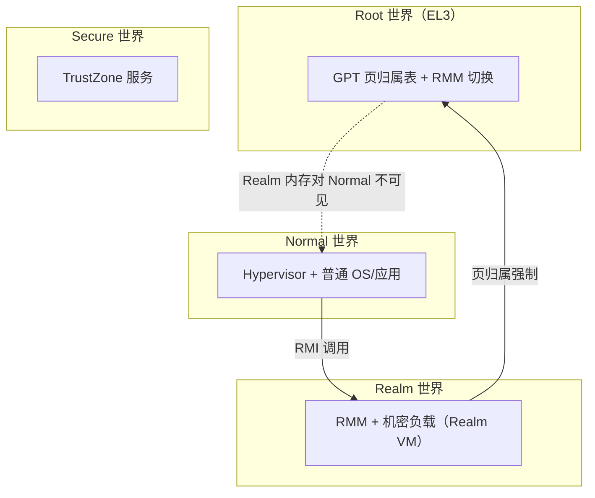

# ARM 虚拟化机制架构详细分析

> 本文以虚拟化、Linux 内核与软件架构视角，系统分析 ARMv8/ARMv9-A（AArch64）平台的硬件
> 虚拟化机制：EL2 异常级别与 VHE 执行模型、Stage-1/Stage-2 二级地址翻译、trap 与异常
> 综合、GICv3/v4 中断虚拟化、SMMU（SMMUv3）DMA 隔离、系统寄存器与定时器虚拟化，以及
> ARM CCA（Realm）机密计算扩展。文末讨论 HyperEnclave/RustMonitor 向鲲鹏/飞腾等 ARM64
> 平台扩展的跨架构抽象路径。
>
> **图示约定**：每张图提供双版本——上方为看板图（HTML 表格化直观视图），下方为
> Mermaid 源图（**默认展开**、可点击折叠），两版内容一致。
>
> **同系列文档**：`virtualization-mechanism-x86.md`（x86 VT-x/SVM）、
> `virtualization-mechanism-riscv.md`（RISC-V H 扩展）、
> `rustmonitor-hardware-resource-management.md`（RustMonitor 硬件资源管理）。

---

## 1. TL;DR：ARM 虚拟化的核心模型

ARM 虚拟化的本质是**在异常级别体系里专设一层 EL2 给 hypervisor**：ARMv8-A 引入
**EL2（Hypervisor exception level）**，宿主内核与 guest 都运行在 EL1/EL0，敏感操作经
**trap** 陷入 EL2 仲裁；guest 物理地址经 **Stage-2** 翻译到真实物理地址。ARMv8.1 的
**VHE** 进一步让宿主内核直接运行在 EL2，消除传统 EL1↔EL2 的频繁切换开销。

与 x86 的根本差异：x86 用"root/non-root **正交模式**"，ARM 用"**异常级别 + trap**"——
ARM 的虚拟化天然嵌在其统一特权级模型里，没有独立的"VMX 指令族"，而是用普通异常机制
（同步异常 trap）+ 一组 EL2 系统寄存器实现。

| 支柱 | 机制 | 关键寄存器/结构 | x86 对应 |
|---|---|---|---|
| **CPU 虚拟化** | EL2 + trap + VHE | HCR_EL2、CPTR_EL2、ESR_EL2 | VMX root/non-root + VMCS |
| **内存虚拟化** | Stage-1/Stage-2 | VTTBR_EL2、VTCR_EL2、HPFAR_EL2 | EPT / NPT |
| **中断虚拟化** | GICv3/v4 + vGIC | ICH_LR_EL2、ICH_HCR_EL2 | APICv / AVIC |
| **DMA 隔离** | SMMU（SMMUv3） | StreamID、SMMU Stage-2 | VT-d / AMD-Vi |
| **机密计算** | CCA / Realm（ARMv9） | RMM、GPT、四世界 | TDX / SEV-SNP |

> 📊 **H5 大屏看板 · 屏 1 · 核心模型（EL0–EL3 与 EL2 枢纽）**
>
> 投屏版：`dashboard/arm-virtualization-dashboard.html`（浏览器打开，F11 全屏）。深色大屏共 3 屏，逐屏截图已嵌入本文 §1 末 / §4 / §5。

---

## 2. ARM 特权模型：异常级别 EL0–EL3

ARMv8-A 用四个**异常级别**（Exception Level）表达特权，EL0 最低、EL3 最高：

| 异常级别 | 典型软件 | 职责 |
|---|---|---|
| **EL0** | 用户应用 | 非特权用户态 |
| **EL1** | OS 内核（Linux） | 操作系统特权，管理 Stage-1 页表 |
| **EL2** | Hypervisor（KVM / RustMonitor） | 虚拟化控制，管理 Stage-2、trap 仲裁 |
| **EL3** | Secure Monitor（ARM Trusted Firmware） | 安全状态切换、最高信任根 |

正交地，ARM 还有**安全状态**（Security state）：传统为 Non-secure / Secure 两世界；
ARMv9-A RME 扩展为**四世界**：Normal、Secure、**Realm**、Root（见 §9）。

异常进入更高 EL 时，硬件保存返回信息（`ELR_ELx`、`SPSR_ELx`）并跳转到该 EL 的
**异常向量表**（`VBAR_ELx`）。虚拟化的关键就是：让 EL1/EL0 的敏感操作以**同步异常**
形式 trap 到 EL2。

<table>
<tr><th colspan="2" align="center" style="background:#0d47a1;color:#fff">🎚️ ARM 异常级别与虚拟化定位（看板图）</th></tr>
<tr>
<th style="background:#1565c0;color:#fff;width:50%">异常级别（特权递增）</th>
<th style="background:#1565c0;color:#fff;width:50%">虚拟化角色</th>
</tr>
<tr>
<td>EL0 用户应用 EL1 OS 内核（Linux） <b>EL2 Hypervisor</b> EL3 Secure Monitor（ATF）</td>
<td>guest 用户态 guest 内核 / 或 VHE 下的宿主内核 <b>虚拟化控制层（Stage-2、trap 仲裁）</b> 安全状态切换、信任根</td>
</tr>
</table>

📐 Mermaid 源图（点击展开 / 折叠）

---

## 3. EL2 执行模型：non-VHE 与 VHE

### 3.1 non-VHE（ARMv8.0 传统模型）

宿主内核跑在 **EL1**，hypervisor 跑在 **EL2**。每次宿主内核需要虚拟化服务（如启动 vCPU、
配置 Stage-2）都要 `HVC` 陷入 EL2，处理完 `ERET` 回 EL1。宿主内核与 hypervisor 是两个
独立地址空间/特权层，**EL1↔EL2 切换频繁**，开销显著。

### 3.2 VHE（ARMv8.1，Virtualization Host Extensions）

VHE 让**宿主内核直接运行在 EL2**（设 `HCR_EL2.E2H=1`，启用 EL2&0 翻译 regime）：

- 宿主内核获得 EL2 特权，直接管理 Stage-2、vGIC 等，无需为每个虚拟化操作陷入；
- guest 仍跑 EL1/EL0，宿主内核（EL2）与 guest（EL1）的特权差天然存在；
- 新增 `HVC` 短路、EL2 可直接访问 EL0（`E2H`）、寄存器重定向（`_EL12` 别名访问 guest 的
  EL1 寄存器）等。

**Linux KVM 自 4.x 起在支持 VHE 的硬件上默认使用 VHE**，宿主内核即 EL2 hypervisor，
大幅降低虚拟化开销。这是 ARM 与 x86（host 永远在 VMX root，guest 在 non-root）模型的
重要分野：ARM 的"host 内核"可以**就是** EL2 hypervisor 本身。

### 3.3 关键 EL2 系统寄存器

| 寄存器 | 作用 | x86 类比 |
|---|---|---|
| `HCR_EL2` | hypervisor 配置：trap 控制位、Stage-2 使能、E2H（VHE）、AMO/IMO/FMO（中断路由） | VMCS execution controls |
| `VTTBR_EL2` | Stage-2 页表基址 + VMID | EPTP / nCR3+ASID |
| `VTCR_EL2` | Stage-2 翻译控制（粒度、IPA 位宽、shareability） | EPT 控制 |
| `CPTR_EL2` | trap 对 FP/SIMD/SVE、debug、PMU 的访问 | secondary controls |
| `ESR_EL2` | 异常综合寄存器：EC（异常类）+ ISS（具体信息） | exit reason + qualification |
| `FAR_EL2` / `HPFAR_EL2` | 故障地址（VA）/ 故障 IPA（>>4） | exit qualification 的 GPA |
| `ICH_LR<n>_EL2` | vGIC List Register，注入虚拟中断 | virtual-APIC / posted intr |

---

## 4. Trap 与异常进入 EL2

> 📊 **H5 大屏看板 · 屏 2 · trap 到 EL2 生命周期（陷入—仲裁—返回）**

guest（EL1/EL0）的敏感操作经 **trap** 陷入 EL2，由 `ESR_EL2` 的 **EC（Exception Class）**
字段标识原因。常见 EC：

| EC | 异常类 | 含义 |
|---|---|---|
| `0x16` | HVC | guest 执行 `HVC`（hypercall） |
| `0x24` | Data Abort（低 EL） | 数据访问异常（含 Stage-2 fault） |
| `0x20` | Instruction Abort（低 EL） | 取指异常（含 Stage-2 fault） |
| `0x18` | MSR/MRS/System | 访问被 trap 的系统寄存器 |
| `0x07` | FP/AdvSIMD | 浮点/向量访问（CPTR_EL2 trap） |
| `0x01` | WFI/WFE | 等待指令 trap |

**trap 控制**主要由 `HCR_EL2` 的位决定：`TVM`（trap 虚拟内存控制寄存器写）、`TRVM`（读）、
`TSC`（trap SMC）、`TID3`（trap ID 寄存器读，用于 CPUID 式仿真）、`AMO`/`IMO`/`FMO`
（物理 SError/IRQ/FIQ 路由到 EL2）等。

<table>
<tr><th colspan="4" align="center" style="background:#4a148c;color:#fff">🔁 guest 敏感操作 trap 到 EL2 时序（看板图）</th></tr>
<tr><th style="background:#6a1b9a;color:#fff">步骤</th><th style="background:#6a1b9a;color:#fff">触发</th><th style="background:#6a1b9a;color:#fff">硬件动作</th><th style="background:#6a1b9a;color:#fff">软件动作</th></tr>
<tr><td>① trap</td><td>guest 命中 HCR_EL2/CPTR_EL2 trap 位或 Stage-2 fault</td><td>保存 ELR_EL2/SPSR_EL2，置 ESR_EL2（EC+ISS）、FAR/HPFAR，跳 VBAR_EL2 向量</td><td>—</td></tr>
<tr><td>② 保存现场</td><td>进入 EL2 异常向量</td><td>—</td><td>保存 guest 通用寄存器（软件，入口汇编）</td></tr>
<tr><td>③ 分发</td><td>读 ESR_EL2.EC</td><td>—</td><td>按 EC 分发：HVC / Data Abort / MSR-MRS / …</td></tr>
<tr><td>④ 仲裁</td><td>handler 执行</td><td>—</td><td>仿真系统寄存器 / 处理 Stage-2 fault 建映射 / 转发 hypercall</td></tr>
<tr><td>⑤ 返回</td><td>ERET</td><td>恢复 ELR_EL2/SPSR_EL2，回到 guest EL1/EL0</td><td>恢复 guest 通用寄存器</td></tr>
</table>

📐 Mermaid 源图（点击展开 / 折叠）

> 与 x86 对照：x86 的 exit reason 来自 VMCS，ARM 的 EC 来自 `ESR_EL2`；x86 用 VMRESUME
> 重入，ARM 用 `ERET`。两者都**不自动保存通用寄存器**，须软件入口汇编处理。

---

## 5. 内存虚拟化：Stage-1 / Stage-2

> 📊 **H5 大屏看板 · 屏 3 · 关键子系统（Stage-2 / GIC / SMMU / CCA，对应 §5–§9）**

### 5.1 两级翻译

ARM 的二阶段翻译与 x86 EPT/NPT 同构：

- **Stage-1**：VA → IPA（Intermediate Physical Address，即 guest 物理地址），由 **guest
  自管**（`TTBR0_EL1`/`TTBR1_EL1` 页表），hypervisor 不介入；
- **Stage-2**：IPA → PA（真实物理地址），由 **hypervisor 管**（`VTTBR_EL2` 指向 Stage-2
  页表 + VMID），是隔离的物理边界。

### 5.2 Stage-2 fault 处理

guest 访问的 IPA 在 Stage-2 无映射或权限不符时，触发 **Stage-2 translation/permission
fault**，trap 到 EL2：

- `HPFAR_EL2` 给出故障 **IPA**（>>4）；
- `ESR_EL2` 的 ISS 给出**访问类型**（读/写/取指、是否 Stage-2、WnR 位）；
- hypervisor 据此**建立 Stage-2 映射**（惰性 populate）、或做 MMIO 仿真、或拒绝。

### 5.3 TLB 维护

ARM 用 `TLBI` 指令族失效 TLB，虚拟化相关：`TLBI VMALLS12E1`（失效某 VMID 的全部
Stage-1&2）、`TLBI IPAS2E1`（按 IPA 失效 Stage-2）等，支持 **broadcast**（`IS` 后缀，
多核一致）。VMID（`VTTBR_EL2`）区分不同 guest，避免切换全刷——类比 x86 ASID/VPID。

<table>
<tr><th colspan="2" align="center" style="background:#004d40;color:#fff">🗺️ ARM Stage-1/Stage-2 二级翻译（看板图）</th></tr>
<tr>
<th style="background:#00695c;color:#fff;width:50%">Stage-1（guest 自管）</th>
<th style="background:#00695c;color:#fff;width:50%">Stage-2（hypervisor 管）</th>
</tr>
<tr>
<td>VA --TTBR0/1_EL1--> IPA <i>guest 自由管理，不 trap</i></td>
<td>IPA --VTTBR_EL2 + VMID--> PA <i>缺映射/权限不符 → Stage-2 fault → EL2 HPFAR_EL2 给 IPA，ESR_EL2 给访问类型</i></td>
</tr>
</table>

📐 Mermaid 源图（点击展开 / 折叠）

---

## 6. 中断虚拟化：GICv3 / GICv4

### 6.1 GIC 架构

ARM 通用中断控制器 **GIC**（v3/v4）组成：

- **Distributor（GICD）**：全局分发 SPI（Shared Peripheral Interrupt）；
- **Redistributor（GICR）**：每 PE 一个，管理 PPI/SGI/LPI；
- **CPU interface（ICC_* 系统寄存器）**：PE 与 GIC 交互（ack/EOI）；
- **ITS（Interrupt Translation Service）**：把设备 MSI 翻译为 LPI（LPI 数量可达数万）。

中断类型：SGI（软件生成，核间）、PPI（私有外设）、SPI（共享外设）、LPI（基于消息）。

### 6.2 虚拟化机制

- **vGIC（软件模拟）**：hypervisor 模拟 guest 看到的 GICD/GICR（MMIO trap + 仿真），
  维护每 vCPU 的虚拟中断状态；
- **List Register（`ICH_LR<n>_EL2`）**：硬件经 LR 把虚拟中断**注入** guest，guest 直接
  在 EL1 ack/EOI，无需每次陷入；
- **维护中断（maintenance interrupt）**：当 LR 耗尽、或虚拟中断状态变化需同步时，硬件
  触发维护中断通知 hypervisor 回收/补充 LR（`ICH_HCR_EL2` 配置）；
- **GICv4 直接注入**：vLPI 可由硬件**直接投递到 vCPU**（经 vPE table + doorbell），
  直通设备的中断**免 hypervisor 介入**——类比 x86 posted interrupt。

| 机制 | 免 trap 能力 | x86 对应 |
|---|---|---|
| List Register 注入 | guest ack/EOI 不 exit | virtual interrupt delivery |
| GICv4 vLPI 直投 | 直通设备中断免 hypervisor | posted interrupt |
| 维护中断 | LR 状态同步 | APICv 通知 |

---

## 7. 设备 DMA 隔离：SMMU（SMMUv3）

**SMMU**（System MMU，即 ARM 的 IOMMU）为设备 DMA 提供地址翻译与隔离，是设备直通的
安全前提（否则设备可 DMA 越界访问任意内存）。

- **StreamID**：标识 DMA 来源设备（类比 PCIe RequesterID）；**SubstreamID** 进一步区分
  设备内上下文（如 PASID，用于 SVA）；
- **两级翻译**：SMMU 支持 Stage-1（设备 VA→IPA，用于 SVA）与 **Stage-2（IPA→PA，由
  hypervisor 配置）**；设备直通时 SMMU Stage-2 映射须与 **CPU Stage-2 一致**（同一 IPA→PA），
  否则设备 DMA 越界；
- **命令队列 / 事件队列**：软件下发 TLB 失效等命令，硬件上报故障事件；
- SMMUv3 支持 ATS（Address Translation Service）、PRI（Page Request Interface）。

<table>
<tr><th colspan="2" align="center" style="background:#3e2723;color:#fff">🔌 SMMUv3 设备直通 DMA 隔离（看板图）</th></tr>
<tr>
<th style="background:#4e342e;color:#fff;width:50%">CPU 路径</th>
<th style="background:#4e342e;color:#fff;width:50%">设备 DMA 路径</th>
</tr>
<tr>
<td>guest CPU 访问（IPA）→ CPU Stage-2（VTTBR_EL2）→ PA <i>受 HCR_EL2 控制</i></td>
<td>设备 DMA（IPA）+ StreamID → SMMUv3 Stage-2 → PA <i>须与 CPU Stage-2 一致，防 DMA 越界</i></td>
</tr>
</table>

📐 Mermaid 源图（点击展开 / 折叠）

---

## 8. 系统寄存器、ID 与定时器虚拟化

| 资源 | 虚拟化机制 |
|---|---|
| **系统寄存器** | `HCR_EL2`/`CPTR_EL2` trap 位拦截 guest 对敏感寄存器的 `MSR`/`MRS`，EL2 仿真（EC=0x18） |
| **ID 寄存器** | `TID3` trap guest 读 `ID_AA64*`，hypervisor 返回**受控视图**（隐藏不支持的特性、伪造拓扑）——类比 x86 CPUID 仿真 |
| **定时器** | 虚拟定时器 `CNTV_*`（guest 直用，EL2 经 `CNTVOFF_EL2` 偏移）；物理定时器 trap；`CNTHP_*` 为 EL2 专用 |
| **PMU/debug** | `CPTR_EL2`/`MDCR_EL2` trap，按需虚拟化或关闭（机密计算下须防侧信道） |

---

## 9. 机密计算：ARM CCA（Realm）

ARMv9-A 引入 **RME（Realm Management Extension）** 与 **CCA（Confidential Compute
Architecture）**，把安全状态从两世界扩展为**四世界**：

| 世界 | 用途 | 信任 |
|---|---|---|
| **Normal** | 普通 OS / hypervisor / 应用 | 非信任（宿主） |
| **Secure** | TrustZone 安全服务 | 信任 |
| **Realm** | 机密虚机/容器（受保护负载） | 信任（独立于 Normal） |
| **Root** | EL3 监控（RMM 切换、GPT 管理） | 最高信任根 |

- **RMM（Realm Management Monitor）**：运行在 Realm 世界的监控器，经 **RMI**（Realm
  Management Interface）被 Normal 世界的 hypervisor 调用，管理 Realm 生命周期；
- **GPT（Granule Protection Table）**：Root 世界（EL3）维护的物理页归属表，硬件按页
  粒度强制"哪个世界能访问哪页"——Realm 内存对 Normal 世界（含 hypervisor）不可见；
- **度量与证明**：Realm 度量经 RMM/EL3，由平台证明（类比 TDX 的 TD Quote、SEV-SNP 报告）。

CCA 与 Intel TDX、AMD SEV-SNP 同属"虚机级机密计算"，但 ARM 用**四世界 + GPT** 而非
内存加密引擎单一手段（CCA 可叠加内存加密）。

<table>
<tr><th colspan="4" align="center" style="background:#1b5e20;color:#fff">🌍 ARM CCA 四世界与 Realm 隔离（看板图）</th></tr>
<tr>
<th style="background:#2e7d32;color:#fff">Root（EL3）</th>
<th style="background:#2e7d32;color:#fff">Realm</th>
<th style="background:#2e7d32;color:#fff">Normal</th>
<th style="background:#2e7d32;color:#fff">Secure</th>
</tr>
<tr>
<td>GPT 页归属表 + RMM 切换 <i>最高信任根</i></td>
<td>RMM + 机密负载（Realm VM） <i>对 Normal 不可见</i></td>
<td>Hypervisor + 普通 OS/应用 <i>非信任宿主，经 RMI 调用 Realm</i></td>
<td>TrustZone 服务 <i>信任</i></td>
</tr>
</table>

📐 Mermaid 源图（点击展开 / 折叠）

---

## 10. 向 ARM64 扩展：HyperEnclave/RustMonitor 的跨架构路径

ISC 类隔离计算方案要求虚拟化层覆盖**鲲鹏、飞腾（ARM64）**与海光/AMD/Intel（x86）。
RustMonitor 当前为 x86（intel/amd 双 vendor），向 ARM64 扩展的抽象要点：

| 抽象层 | x86 后端 | ARM64 后端 |
|---|---|---|
| 执行流控制 | VMCS/VMCB + VMX/SVM 指令 | EL2 系统寄存器（HCR_EL2 等）+ trap |
| 陷入入口 | VM-Exit handler（naked fn） | EL2 异常向量（VBAR_EL2） |
| 二级翻译 | EPT（EPTP）/ NPT（nCR3） | Stage-2（VTTBR_EL2 + VMID） |
| 中断虚拟化 | APICv / AVIC | GICv3/v4 + vGIC + List Register |
| DMA 隔离 | VT-d / AMD-Vi | SMMUv3 |
| 敏感资源 | MSR/CPUID/IO bitmap | 系统寄存器 trap / ID 寄存器仿真 |
| 信任根 | TPM（已解耦 CPU 厂商） | TPM + 可选 CCA/RMM |

**架构无关层**（vCPU 生命周期、二级页表接口 map/unmap/protect、拦截策略语义、hypercall
约定、Enclave/EPCM 逻辑）可复用；**架构特化层**（执行流原语、trap 入口、中断控制器、
TLB 维护指令）需 ARM64 实现。本仓库现有 `vendor` re-export 模式（`src/arch/x86_64/vmm.rs`）
可自然扩展为 `arch` 维度（x86_64 / arm64 / riscv64）。

在 ARM64 上构建软件 enclave（无 CPU enclave 硬件）的可行性与 x86 同理：**EL2 + Stage-2
结构性隔离（挖洞）+ 外置 FPGA/TPM 可信根**，即可在鲲鹏/飞腾等缺少硬件 TEE 的 ARM 服务器
上提供可验证的隔离计算。

---

## 11. x86 vs ARM 虚拟化对照总表

| 维度 | x86（VT-x/SVM） | ARM（ARMv8/9-A） |
|---|---|---|
| 特权模型 | root/non-root **正交模式** + ring0–3 | **异常级别** EL0–EL3（EL2 专用） |
| 控制结构 | VMCS / VMCB（集中） | EL2 系统寄存器（分散） |
| 进入 guest | VMLAUNCH/VMRESUME / VMRUN | ERET（从 EL2 返回低 EL） |
| 陷入原因 | exit reason（VMCS） | ESR_EL2.EC |
| host 内核位置 | 永远 VMX root | VHE 下 host 内核**即** EL2 |
| 二级翻译 | EPT / NPT | Stage-2（VTTBR_EL2） |
| 故障 IPA | exit qualification | HPFAR_EL2 |
| TLB 失效 | INVEPT/INVLPGA | TLBI（VMALLS12E1/IPAS2E1） |
| 中断加速 | APICv / AVIC + posted intr | GICv3/v4 + LR + vLPI 直投 |
| DMA 隔离 | VT-d / AMD-Vi | SMMUv3 |
| 机密计算 | SGX / TDX / SEV-SNP | TrustZone / **CCA（Realm）** |

---

## 12. 小结

ARM 虚拟化以 **EL2 异常级别**为枢纽，用 **trap + ESR_EL2 综合**替代 x86 的 root/non-root
模式与 exit reason；**VHE** 让宿主内核直接化身 EL2 hypervisor，消除切换开销；
**Stage-1/Stage-2** 与 x86 EPT/NPT 同构；**GICv3/v4 + List Register + vLPI 直投**完成
中断虚拟化；**SMMUv3** 隔离设备 DMA；**ARM CCA（四世界 + GPT + RMM）**提供虚机级机密
计算。对 HyperEnclave/RustMonitor 而言，ARM64（鲲鹏/飞腾）扩展的关键是沉淀架构无关层、
特化执行流/中断/翻译后端，并延续"软件隔离 + 外置可信根"的跨厂商可移植路线。

> 跨架构对照见 `virtualization-mechanism-x86.md`（x86 VT-x/SVM）与
> `virtualization-mechanism-riscv.md`（RISC-V H 扩展）。
