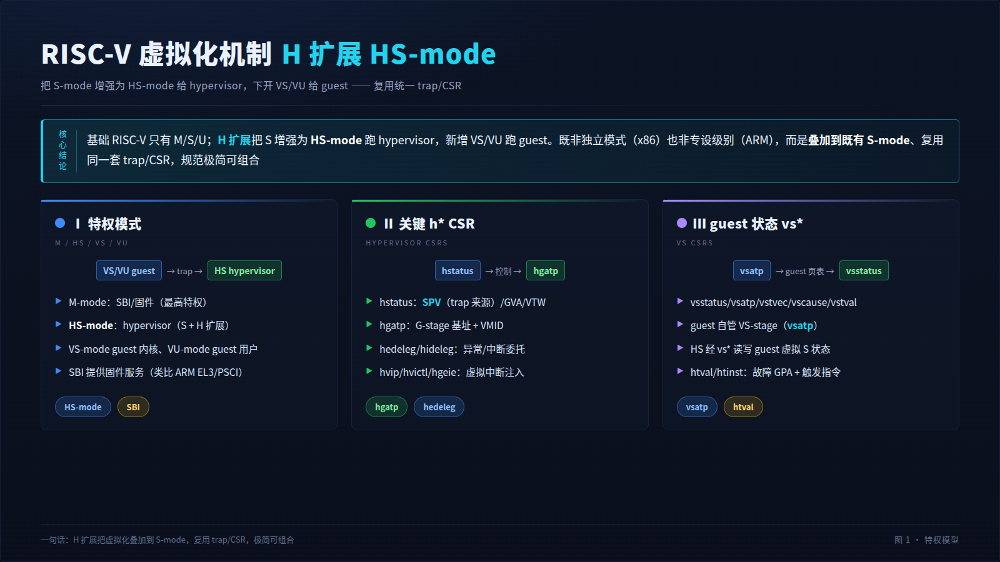
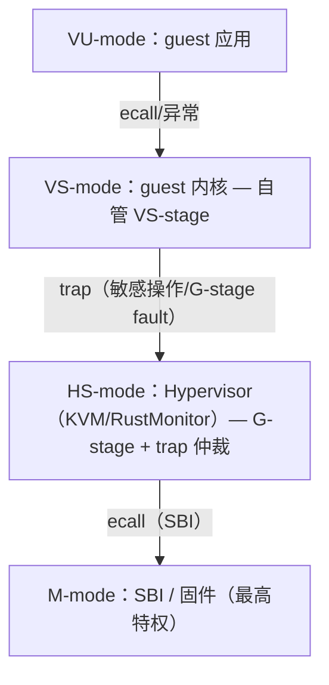
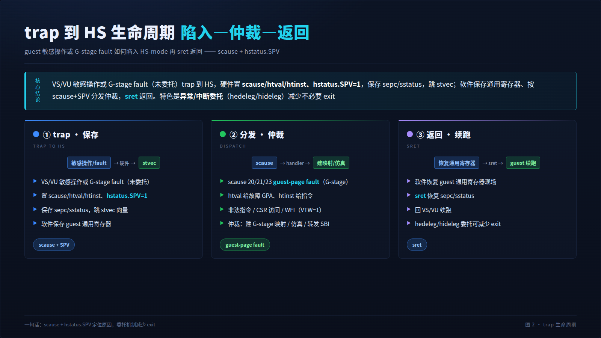
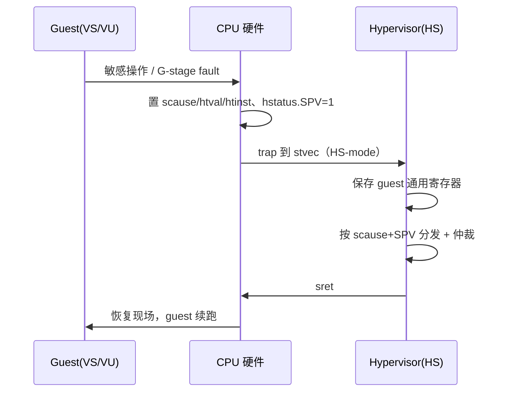
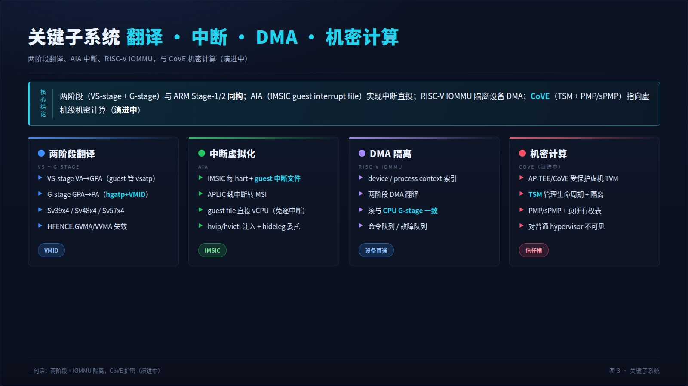
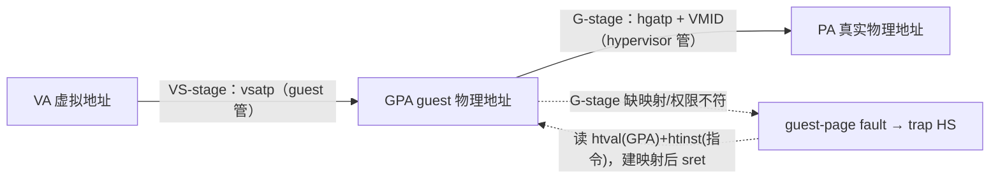
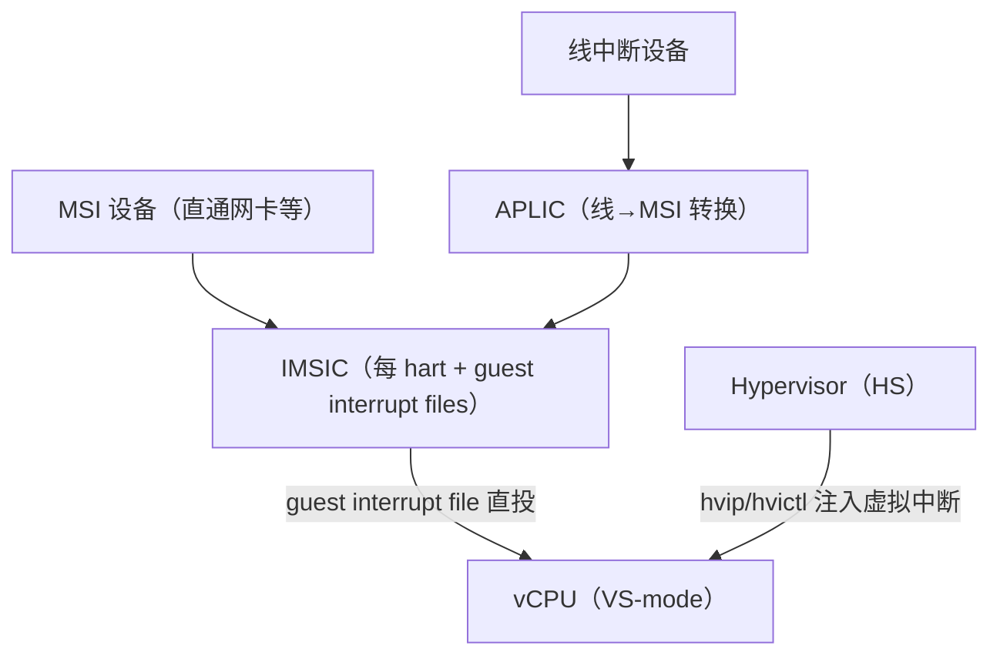
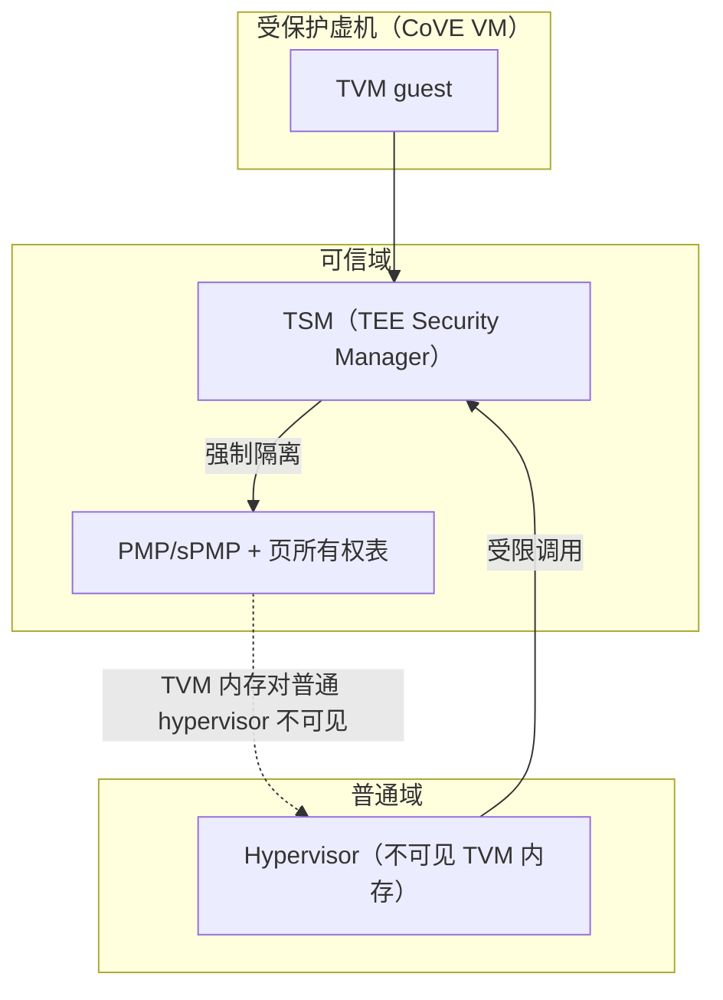

# RISC-V 虚拟化机制架构详细分析

> 本文以虚拟化、Linux 内核与软件架构视角，系统分析 RISC-V 平台的硬件虚拟化机制：
> H 扩展（Hypervisor extension）引入的 HS/VS/VU 特权模式、两阶段地址翻译（VS-stage +
> G-stage）、trap 与异常委托、AIA（Advanced Interrupt Architecture）中断虚拟化、
> RISC-V IOMMU 的 DMA 隔离、CSR 与定时器虚拟化，以及 CoVE（Confidential VM Extension）
> 机密计算扩展。文末讨论 HyperEnclave/RustMonitor 向 RISC-V 扩展的前瞻路径与三架构对照。
>
> **成熟度提示**：RISC-V H 扩展于 2023 年批准（ratified），AIA、IOMMU 规范相继落地，
> KVM RISC-V 已合入 Linux 主线；CoVE 仍在演进中。本文对尚在演进的规范标注状态。
>
> **图示约定**：每张图提供双版本——上方为看板图（HTML 表格化直观视图），下方为
> Mermaid 源图（**默认展开**、可点击折叠），两版内容一致。
>
> **同系列文档**：`virtualization-mechanism-x86.md`（x86 VT-x/SVM）、
> `virtualization-mechanism-arm.md`（ARM64 EL2）、
> `rustmonitor-hardware-resource-management.md`（RustMonitor 硬件资源管理）。

---

## 1. TL;DR：RISC-V 虚拟化的核心模型

RISC-V 虚拟化的本质是**用 H 扩展把原 S-mode 增强为 HS-mode 给 hypervisor，并在其下
再开一层 VS-mode 给 guest 内核**。基础 RISC-V 只有 M/S/U 三级；H 扩展（Hypervisor
extension）在 S 与 U 之间引入虚拟化语义：hypervisor 跑 **HS-mode**，guest 内核跑
**VS-mode**，guest 用户跑 **VU-mode**，M-mode（固件/SBI）不变仍为最高。

与 x86/ARM 的对照：

| 支柱 | RISC-V 机制 | 关键 CSR | x86 对应 | ARM 对应 |
|---|---|---|---|---|
| **CPU 虚拟化** | H 扩展 HS/VS/VU + trap | hstatus、hedeleg、hideleg | VMX root/non-root | EL2 + trap |
| **内存虚拟化** | 两阶段翻译（VS + G-stage） | hgatp、vsatp、htval | EPT / NPT | Stage-1/Stage-2 |
| **中断虚拟化** | AIA（IMSIC/APLIC）+ guest 文件 | hvip、hvictl、hgeie | APICv / AVIC | GICv3/v4 |
| **DMA 隔离** | RISC-V IOMMU | device/process context | VT-d / AMD-Vi | SMMUv3 |
| **机密计算** | CoVE（AP-TEE，演进中） | TSM、PMP/sPMP | TDX / SEV-SNP | CCA（Realm） |

RISC-V 的设计哲学是**极简与可组合**：虚拟化不是独立的"模式正交层"（x86）也不是"专设
异常级别"（ARM EL2），而是把 hypervisor 语义**叠加到既有 S-mode 上**（HS = S + H 扩展），
复用同一套 trap/CSR 机制，规范面积小。

> 📊 **H5 大屏看板 · 屏 1 · 核心模型（HS-mode 与 H 扩展）**
>
> 投屏版：`dashboard/riscv-virtualization-dashboard.html`（浏览器打开，F11 全屏）。深色大屏共 3 屏，逐屏截图已嵌入本文 §1 末 / §4 / §5。

---

## 2. RISC-V 特权模型与 H 扩展

### 2.1 基础特权级（无 H 扩展）

| 模式 | 全称 | 典型软件 |
|---|---|---|
| **M-mode** | Machine | 固件 / SBI（OpenSBI）、最高特权 |
| **S-mode** | Supervisor | OS 内核（Linux） |
| **U-mode** | User | 用户应用 |

M-mode 通过 **SBI**（Supervisor Binary Interface）向 S-mode 提供固件服务（定时器、
IPI、console、hart 状态等）——这是 RISC-V 的"固件—内核"约定，类比 ARM 的 EL3/ATF。

### 2.2 H 扩展引入的虚拟化模式

H 扩展把 **S-mode 增强为 HS-mode**，并新增两个受虚拟化的低特权模式：

| 模式 | 全称 | 运行软件 | 说明 |
|---|---|---|---|
| **M-mode** | Machine | SBI/固件 | 不变，最高 |
| **HS-mode** | Hypervisor-extended Supervisor | **Hypervisor**（KVM/RustMonitor） | 原 S-mode + H 扩展 CSR，管理 G-stage、仲裁 trap |
| **VS-mode** | Virtualized Supervisor | guest 内核 | 受虚拟化的 S，guest 自管 VS-stage 页表 |
| **VU-mode** | Virtualized User | guest 应用 | 受虚拟化的 U |

关键点：**hypervisor 跑在 HS-mode（本质仍是 S 级 + 扩展）**，而非像 ARM 那样有独立的
EL2 硬件级别，也不像 x86 有 root/non-root 正交模式。VS/VU 是"被虚拟化的 S/U"，其敏感
操作 trap 到 HS-mode。

<table>
<tr><th colspan="2" align="center" style="background:#0d47a1;color:#fff">🎚️ RISC-V H 扩展特权模式（看板图）</th></tr>
<tr>
<th style="background:#1565c0;color:#fff;width:50%">模式（特权递减）</th>
<th style="background:#1565c0;color:#fff;width:50%">虚拟化角色</th>
</tr>
<tr>
<td>M-mode（SBI/固件） <b>HS-mode（Hypervisor）</b> VS-mode（guest 内核） VU-mode（guest 应用）</td>
<td>最高信任根、固件服务 <b>虚拟化控制层：G-stage + trap 仲裁</b> guest OS，自管 VS-stage guest 用户态</td>
</tr>
</table>

📐 Mermaid 源图（点击展开 / 折叠）

---

## 3. HS-mode 执行模型与关键 CSR

hypervisor 在 HS-mode 通过一组 **h* 前缀 CSR** 控制虚拟化：

| CSR | 作用 | x86/ARM 类比 |
|---|---|---|
| `hstatus` | 虚拟化状态：SPV（trap 来自 VS/VU）、GVA、VTW（trap WFI）等 | ESR_EL2 部分 / VMCS 状态 |
| `hgatp` | **G-stage 页表基址 + VMID**（mode/BARE/Sv39x4/Sv48x4/Sv57x4） | EPTP / VTTBR_EL2 |
| `hedeleg` | 异常委托：哪些异常直接给 VS（不 trap HS） | exception bitmap 反向 |
| `hideleg` | 中断委托：哪些中断直接给 VS | — |
| `hvip` / `hvictl` / `hgeie` / `hgeip` | 虚拟中断注入、guest 外部中断使能/挂起 | virtual-APIC / ICH_LR |
| `htimedelta` | guest 时间偏移（VS 读 time 时减去） | CNTVOFF_EL2 / TSC offset |
| `hcounteren` | guest 可读计数器使能 | — |
| `henvcfg` | 环境配置（如 STCE 定时器、PBMTE 等） | secondary controls |
| `htval` / `htinst` | 故障 GPA（>>2）/ 触发 trap 的（伪）指令 | exit qualification / HPFAR_EL2 |

guest 自身状态保存在 **vs* 前缀 CSR**（`vsstatus`、`vsatp`、`vstvec`、`vscause`、
`vstval`、`vsscratch`、`vsepc` 等），HS-mode 通过它们读写 guest 的虚拟 S 状态。

**执行流**：guest（VS/VU）敏感操作或 G-stage fault → trap 到 HS-mode（硬件置 `scause`
原因、`htval` 故障 GPA、`htinst` 指令、`hstatus.SPV`=1）→ hypervisor 仲裁 → `sret`
返回 guest。这与 ARM 的 EL2 trap、x86 的 VM-Exit 同构。

---

## 4. Trap 与异常委托

> 📊 **H5 大屏看板 · 屏 2 · trap 到 HS 生命周期（陷入—仲裁—返回）**

RISC-V 虚拟化的一个特色是**异常/中断委托**（delegation）：

- `hedeleg`：hypervisor 把某些**异常**（如 guest 的缺页、系统调用）直接委托给 VS-mode
  处理，**不 trap 到 HS**——减少不必要的 exit；
- `hideleg`：把某些**中断**（如 guest 虚拟定时器/软件中断）委托给 VS；
- 未委托的、或必须仲裁的（G-stage fault、敏感 CSR、WFI 等）才 trap 到 HS-mode。

常见 trap 到 HS 的原因（`scause`）：

| scause | 含义 |
|---|---|
| 20 / 21 / 23 | **Instruction / Load / Store guest-page fault**（G-stage 故障） |
| 2 / 10 / 18（VS 上下文） | 非法指令 / VS 环境调用（经 hstatus.SPV 区分来源） |
| 12（+SPV） | guest 执行 WFI（VTW=1 时 trap） |

<table>
<tr><th colspan="4" align="center" style="background:#4a148c;color:#fff">🔁 guest 操作 trap 到 HS-mode 时序（看板图）</th></tr>
<tr><th style="background:#6a1b9a;color:#fff">步骤</th><th style="background:#6a1b9a;color:#fff">触发</th><th style="background:#6a1b9a;color:#fff">硬件动作</th><th style="background:#6a1b9a;color:#fff">软件动作</th></tr>
<tr><td>① trap</td><td>VS/VU 敏感操作或 G-stage fault（未委托）</td><td>置 scause/htval/htinst、hstatus.SPV=1，保存 sepc/sstatus，跳 stvec</td><td>—</td></tr>
<tr><td>② 保存现场</td><td>进入 HS trap handler</td><td>—</td><td>保存 guest 通用寄存器（软件）</td></tr>
<tr><td>③ 分发</td><td>读 scause + hstatus.SPV</td><td>—</td><td>区分 guest-page fault / 非法指令 / CSR / WFI</td></tr>
<tr><td>④ 仲裁</td><td>handler 执行</td><td>—</td><td>建 G-stage 映射 / 仿真指令 / 转发 SBI</td></tr>
<tr><td>⑤ 返回</td><td>sret</td><td>恢复 sepc/sstatus，回 VS/VU</td><td>恢复 guest 通用寄存器</td></tr>
</table>

📐 Mermaid 源图（点击展开 / 折叠）

---

## 5. 内存虚拟化：两阶段翻译（VS-stage + G-stage）

> 📊 **H5 大屏看板 · 屏 3 · 关键子系统（两阶段 / AIA / IOMMU / CoVE，对应 §5–§9）**

### 5.1 两阶段模型

RISC-V 与 ARM 高度同构，也是两阶段：

- **VS-stage**：guest VA → GPA（guest 物理地址），由 **guest 自管**（`vsatp` 页表），
  hypervisor 不介入；
- **G-stage**（Guest stage）：GPA → PA（真实物理地址），由 **hypervisor 管**（`hgatp`
  指向 G-stage 页表 + VMID），是隔离的物理边界。

G-stage 页表模式：`Sv39x4` / `Sv48x4` / `Sv57x4`（"x4"指根表 4 页连续，以容纳 GPA 空间）。

### 5.2 G-stage fault

guest 访问的 GPA 在 G-stage 无映射或权限不符 → **guest-page fault**（scause 20/21/23），
trap 到 HS：

- `htval` 给出故障 **GPA**（>>2）；
- `htinst` 给出触发指令（或伪指令，便于 hypervisor 直接仿真 MMIO 而无需重新取指译码）；
- hypervisor 据此**惰性建立 G-stage 映射**、或做 MMIO 仿真、或拒绝。

### 5.3 VMID 与 TLB 维护

- `hgatp.VMID` 区分不同 guest，TLB 按 VMID 标记，切换无需全刷（类比 ARM VMID、x86 ASID）；
- **HFENCE 指令**：`HFENCE.GVMA`（失效 G-stage 派生翻译）、`HFENCE.VVMA`（失效 VS-stage），
  支持按 VMID/地址限定。

<table>
<tr><th colspan="2" align="center" style="background:#004d40;color:#fff">🗺️ RISC-V 两阶段地址翻译（看板图）</th></tr>
<tr>
<th style="background:#00695c;color:#fff;width:50%">VS-stage（guest 自管）</th>
<th style="background:#00695c;color:#fff;width:50%">G-stage（hypervisor 管）</th>
</tr>
<tr>
<td>VA --vsatp--> GPA <i>guest 自由管理，不 trap</i></td>
<td>GPA --hgatp + VMID（Sv39x4/48x4/57x4）--> PA <i>缺映射/权限不符 → guest-page fault → HS htval 给 GPA，htinst 给指令</i></td>
</tr>
</table>

📐 Mermaid 源图（点击展开 / 折叠）

---

## 6. 中断虚拟化：AIA（IMSIC / APLIC）

RISC-V 的中断虚拟化由 **AIA**（Advanced Interrupt Architecture）承载，包含两个组件
（扩展 `Smaia`（M 级）/`Ssaia`（S 级））：

- **IMSIC**（Incoming MSI Controller）：每 hart 的 **MSI 接收控制器**，把消息中断（MSI）
  落地为本地中断；为虚拟化提供 **guest interrupt files**（每 hart 多份，直接对应 vCPU）；
- **APLIC**（Advanced PLIC）：把传统**线中断**（wired）转换为 MSI 投递（或直接投递），
  是 PLIC 的增强替代。

### 6.1 虚拟化机制

- **guest interrupt file**：IMSIC 为每个 vCPU 提供硬件中断文件，直通设备的 MSI 可**直接
  注入 guest**，无需 hypervisor 逐中断介入——类比 x86 posted interrupt、ARM GICv4 vLPI；
- **虚拟中断注入**：hypervisor 经 `hvip`/`hvictl`/`hgeie` 向 guest 注入虚拟中断；
- **中断委托**：`hideleg` 把虚拟定时器/软件中断等直接委托 VS，减少 exit。

| 机制 | 免 trap 能力 | x86/ARM 对应 |
|---|---|---|
| IMSIC guest interrupt file | 直通设备 MSI 直投 vCPU | posted interrupt / GICv4 vLPI |
| hvip/hvictl 注入 | 虚拟中断投递 | virtual interrupt delivery / List Register |
| hideleg 委托 | 虚拟定时器/IPI 直达 guest | — |

<table>
<tr><th colspan="2" align="center" style="background:#e65100;color:#fff">⚡ AIA 中断虚拟化路径（看板图）</th></tr>
<tr>
<th style="background:#ef6c00;color:#fff;width:50%">中断来源 → 控制器</th>
<th style="background:#ef6c00;color:#fff;width:50%">投递到 vCPU</th>
</tr>
<tr>
<td>线中断设备 → APLIC（线→MSI） MSI 设备（直通网卡）→ IMSIC <i>IMSIC 每 hart + guest interrupt files</i></td>
<td>guest interrupt file → 直投 vCPU（VS） Hypervisor 经 hvip/hvictl 注入虚拟中断 <i>直通设备 MSI 免逐中断介入</i></td>
</tr>
</table>

📐 Mermaid 源图（点击展开 / 折叠）

---

## 7. 设备 DMA 隔离：RISC-V IOMMU

**RISC-V IOMMU 规范**（已批准）为设备 DMA 提供地址翻译与隔离，是设备直通的安全前提：

- **device context**：按设备（PCIe RequesterID / 类似 StreamID）索引，指向其翻译配置；
- **process context**：进一步按进程（PASID 类比）区分，支持 SVA（共享虚拟地址）；
- **两阶段 DMA 翻译**：IOMMU 支持第一阶段（设备 VA→GPA）与**第二阶段（GPA→PA，由
  hypervisor 配置）**；设备直通时 IOMMU 第二阶段映射须与 **CPU G-stage 一致**，否则
  设备 DMA 越界；
- 命令队列 / 故障队列：软件下发失效命令、硬件上报故障。

与 Intel VT-d、ARM SMMUv3 同构，核心隔离不变量一致：**设备 DMA 翻译 ≡ CPU 二级翻译**。

---

## 8. CSR、定时器与计数器虚拟化

| 资源 | 虚拟化机制 |
|---|---|
| **系统 CSR** | guest 访问敏感 CSR（如 h* 前缀、部分 s* ）trap 到 HS 仿真；`henvcfg` 控制环境特性可见性 |
| **定时器** | `htimedelta`：VS/VU 读 `time` 时硬件自动减去偏移，给 guest 虚拟时间视图；虚拟定时器中断经 `hideleg`/`hvip` |
| **计数器** | `hcounteren` 控制 guest 可读哪些性能/周期计数器（机密计算下须收紧防侧信道） |
| **ID/配置** | hypervisor 经 trap 给 guest 受控的 ISA 扩展视图（隐藏未提供/未授权特性） |

---

## 9. 机密计算：CoVE（Confidential VM Extension）

> **状态：规范演进中**（AP-TEE / CoVE 工作组），尚未完全冻结，以下为设计方向。

RISC-V 的机密计算方向是 **CoVE**（Confidential VM Extension，源自 **AP-TEE**
Authenticated Protected TEE 任务组），目标是提供类似 TDX/SEV-SNP/CCA 的**受保护虚机
（TVM/CoVE VM）**：

- **TSM**（TEE Security Manager）：可信监控器，管理受保护虚机的生命周期与内存隔离，
  运行在隔离的特权域（M-mode 或受保护的 HS 域）；
- **内存隔离**：基于 **PMP/sPMP**（Physical Memory Protection）与页所有权表，强制
  受保护内存对普通 hypervisor 不可见（类比 ARM GPT、AMD RMP）；
- **COVI**：CoVE 的中断虚拟化扩展，保障受保护虚机的中断安全；
- **证明**：受保护虚机度量经 TSM + 硬件信任根，支持远程证明。

| 方案 | 保护粒度 | 隔离手段 | 状态 |
|---|---|---|---|
| Intel TDX | TD 虚机 | SEAM Module + MKTME | 已落地 |
| AMD SEV-SNP | CVM | 内存加密 + RMP | 已落地 |
| ARM CCA | Realm VM | 四世界 + GPT + RMM | 规范就绪 |
| **RISC-V CoVE** | TVM | TSM + PMP/sPMP + 页所有权 | **演进中** |

<table>
<tr><th colspan="3" align="center" style="background:#311b92;color:#fff">🛡️ RISC-V CoVE 域隔离（看板图）</th></tr>
<tr>
<th style="background:#4527a0;color:#fff">可信域（TCB）</th>
<th style="background:#4527a0;color:#fff">受保护虚机（TVM）</th>
<th style="background:#4527a0;color:#fff">普通域</th>
</tr>
<tr>
<td>TSM（TEE Security Manager） PMP/sPMP + 页所有权表 <i>强制内存隔离</i></td>
<td>TVM guest <i>内存对普通 hypervisor 不可见</i></td>
<td>Hypervisor <i>仅能受限调用 TSM</i></td>
</tr>
</table>

📐 Mermaid 源图（点击展开 / 折叠）

---

## 10. 向 RISC-V 扩展：HyperEnclave/RustMonitor 的前瞻路径

RISC-V 是 ISC 类隔离计算方案的**前瞻扩展方向**（当前主力为 x86 与 ARM64）。RustMonitor
向 RISC-V 扩展的抽象映射：

| 抽象层 | x86 后端 | ARM64 后端 | RISC-V 后端 |
|---|---|---|---|
| 执行流控制 | VMCS/VMCB + VMX/SVM | EL2 寄存器 + trap | HS-mode h* CSR + trap |
| 陷入入口 | VM-Exit handler | VBAR_EL2 向量 | stvec（HS）handler |
| 二级翻译 | EPT / NPT | Stage-2（VTTBR_EL2） | G-stage（hgatp） |
| 故障 GPA | exit qualification | HPFAR_EL2 | htval |
| 中断虚拟化 | APICv / AVIC | GICv3/v4 + LR | AIA（IMSIC guest file） |
| DMA 隔离 | VT-d / AMD-Vi | SMMUv3 | RISC-V IOMMU |
| 信任根 | TPM | TPM + CCA | TPM + CoVE/TSM |

在 RISC-V 上构建软件 enclave（无 CPU enclave 硬件）与 x86/ARM 同理：**HS-mode + G-stage
结构性隔离（挖洞）+ 外置 FPGA/TPM 可信根**。RISC-V 的开放 ISA 与 PMP/sPMP 物理内存保护
反而为"软件 + 外置硬件"的可信根方案提供了灵活空间。

---

## 11. 三架构虚拟化对照总表

| 维度 | x86（VT-x/SVM） | ARM（ARMv8/9-A） | RISC-V（H 扩展） |
|---|---|---|---|
| 特权模型 | root/non-root 正交 + ring0–3 | 异常级别 EL0–EL3 | M / HS / VS / VU |
| hypervisor 运行处 | VMX root / SVM host | EL2 | HS-mode |
| 控制结构 | VMCS / VMCB（集中） | EL2 系统寄存器 | h* / vs* CSR |
| 进入 guest | VMLAUNCH/VMRESUME / VMRUN | ERET | sret |
| 陷入原因 | exit reason | ESR_EL2.EC | scause + hstatus.SPV |
| 故障 IPA/GPA | exit qualification | HPFAR_EL2 | htval（+htinst 指令） |
| 二级翻译 | EPT / NPT | Stage-2（VTTBR_EL2） | G-stage（hgatp，Sv39/48/57x4） |
| guest 标识 | VPID / ASID | VMID | VMID（hgatp） |
| TLB 失效 | INVEPT / INVLPGA | TLBI | HFENCE.GVMA/VVMA |
| 中断加速 | APICv / AVIC + posted intr | GICv3/v4 + LR + vLPI | AIA（IMSIC guest file） |
| DMA 隔离 | VT-d / AMD-Vi | SMMUv3 | RISC-V IOMMU |
| 异常委托 | exception bitmap | HCR_EL2 trap 位 | hedeleg / hideleg |
| 机密计算 | SGX / TDX / SEV-SNP | TrustZone / CCA | CoVE（演进中） |
| 固件接口 | — | SMC / PSCI（EL3） | SBI（M-mode） |
| 成熟度 | 最成熟（2005+） | 成熟（2012+） | 较新（H 扩展 2023 批准） |

---

## 12. 小结

RISC-V 虚拟化以 **H 扩展**把 S-mode 增强为 **HS-mode** 承载 hypervisor、下开 **VS/VU**
承载 guest，复用统一的 trap/CSR 机制（`hstatus`/`hedeleg`/`hideleg`/`hgatp`/`htval`）；
**两阶段翻译（VS-stage + G-stage）**与 ARM Stage-1/2、x86 EPT/NPT 同构；**AIA
（IMSIC guest interrupt file）**实现中断直投；**RISC-V IOMMU** 隔离设备 DMA；
**CoVE（TSM + PMP/sPMP）**指向虚机级机密计算（演进中）。其极简可组合的设计，配合开放
ISA 与物理内存保护，为"软件 hypervisor + 外置可信根"的跨厂商隔离计算提供了灵活舞台。

> 跨架构对照见 `virtualization-mechanism-x86.md`（x86 VT-x/SVM）与
> `virtualization-mechanism-arm.md`（ARM64 EL2）。
