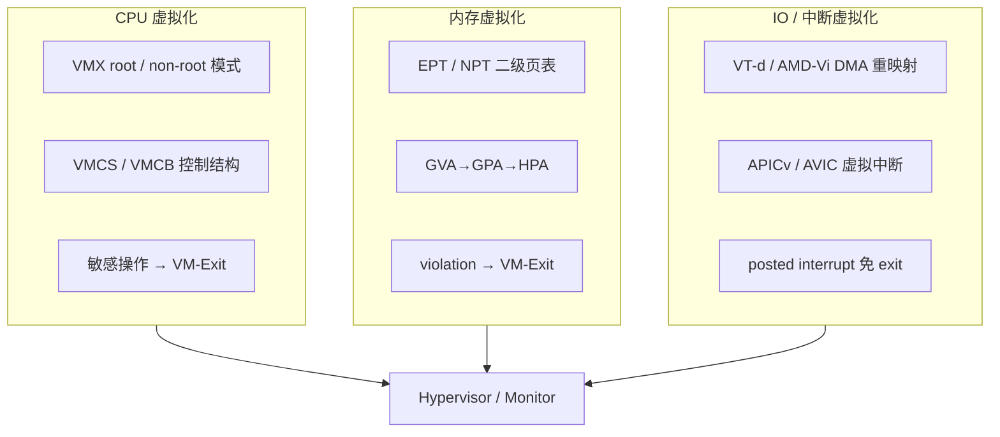
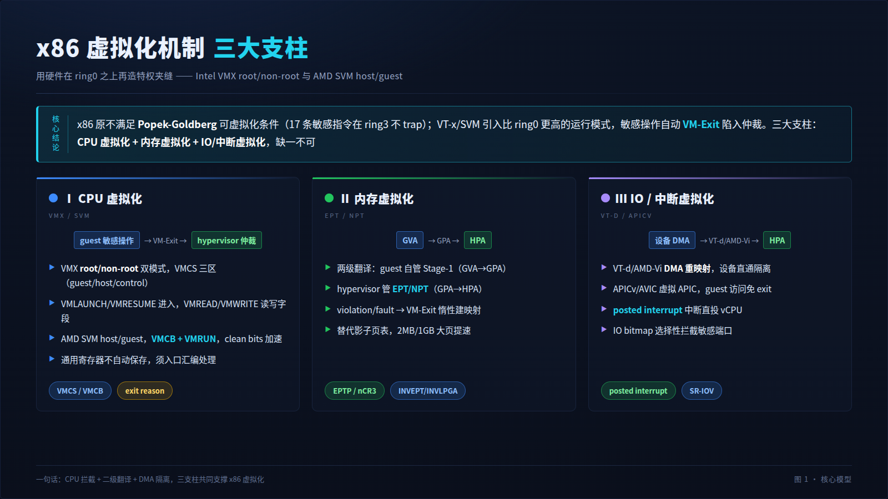
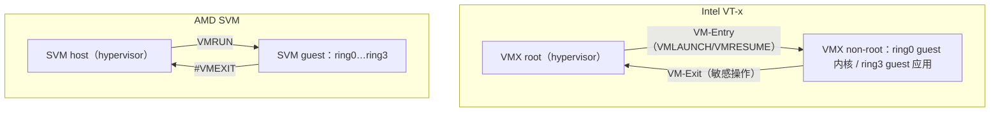
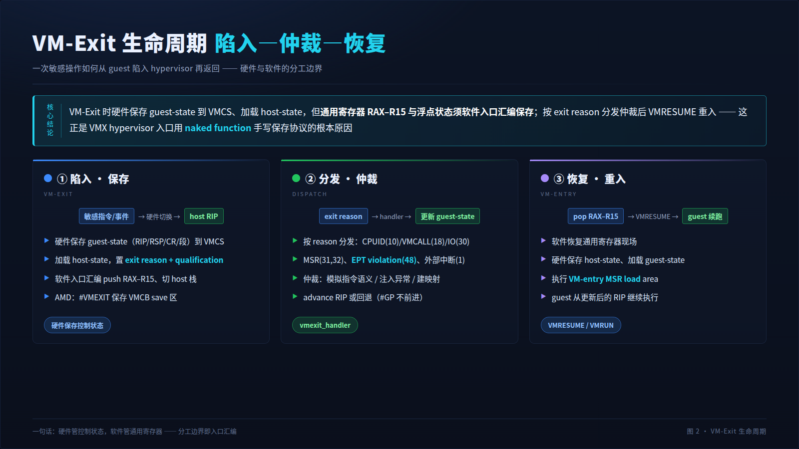
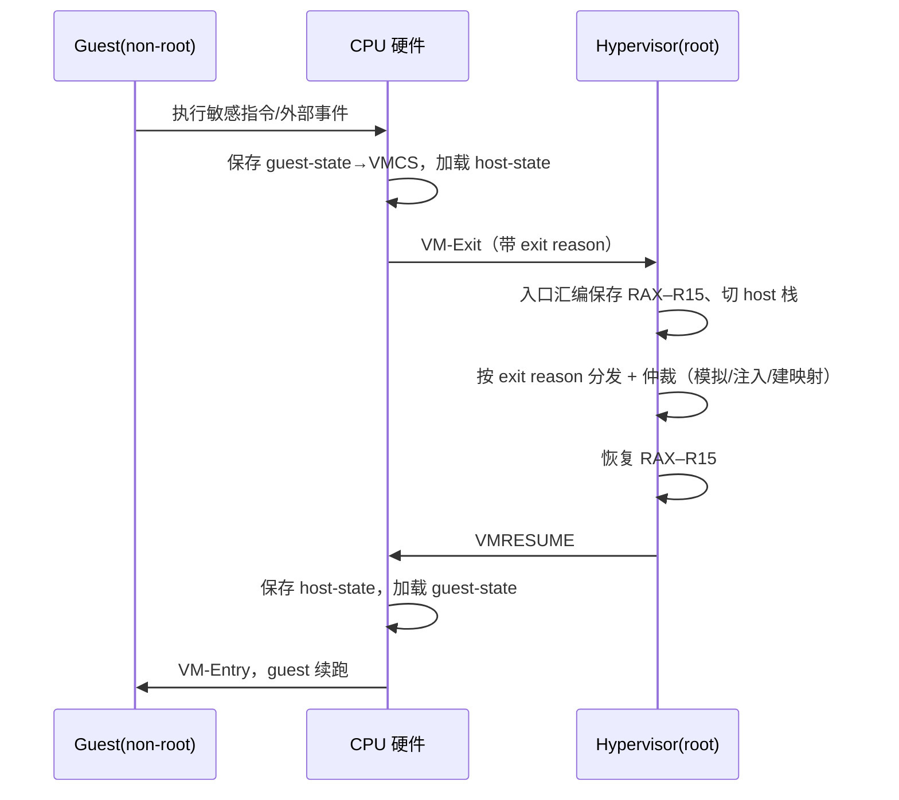
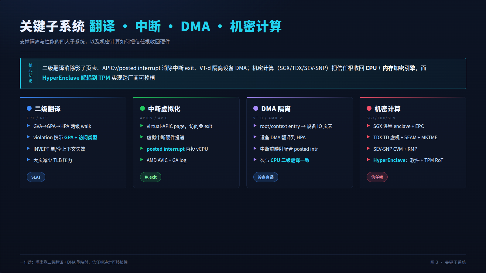
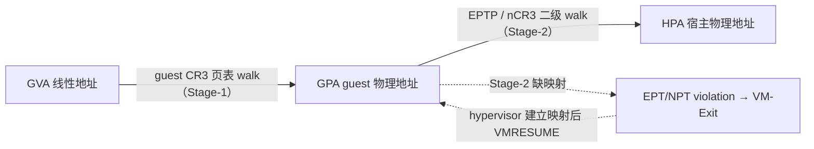
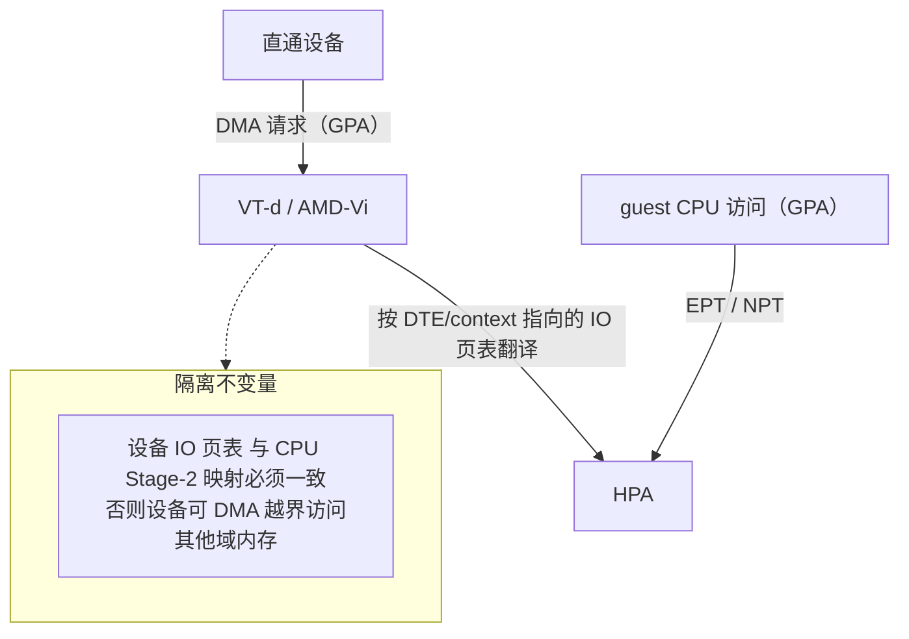
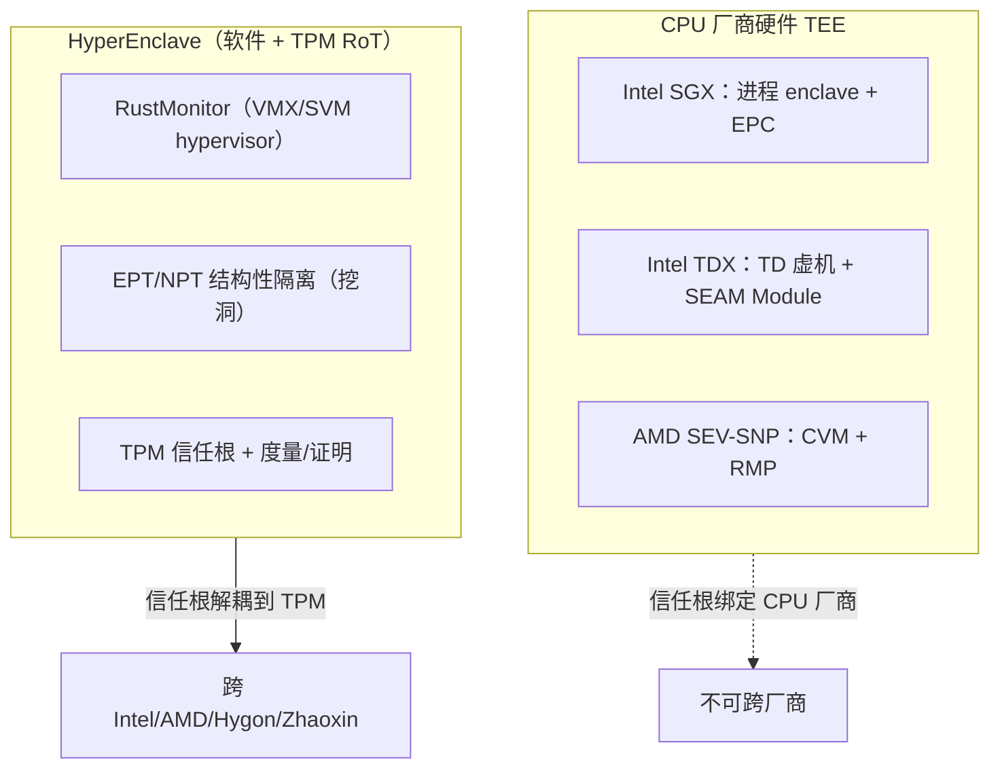

# x86 虚拟化机制架构详细分析

> 本文以虚拟化、Linux 内核与软件架构视角，系统分析 x86-64 平台的硬件虚拟化机制：
> Intel VT-x（VMX）与 AMD-V（SVM）的 CPU 执行模型、EPT/NPT 二级地址翻译、
> APICv/AVIC 中断虚拟化、VT-d/AMD-Vi DMA 重映射、敏感资源拦截，以及 SGX/TDX/SEV-SNP
> 机密计算扩展。文末映射到本仓库 RustMonitor（HyperEnclave）的 intel/amd 双实现。
>
> **图示约定**：每张图提供双版本——上方为看板图（HTML 表格化直观视图），下方为
> Mermaid 源图（**默认展开**、可点击折叠），两版内容一致。
>
> **同系列文档**：`virtualization-mechanism-arm.md`（ARM64 EL2 虚拟化）、
> `virtualization-mechanism-riscv.md`（RISC-V H 扩展虚拟化）、
> `rustmonitor-hardware-resource-management.md`（RustMonitor 硬件资源管理）。

---

## 1. TL;DR：x86 虚拟化的核心模型

x86 虚拟化的本质是**用硬件在 CPU 里再造一个"特权层夹缝"**：原本 ring0 是最高特权，
硬件虚拟化扩展引入一个比 ring0 更高的运行模式（Intel **VMX root**、AMD **SVM host**），
把整个操作系统（含其 ring0 内核）降级为受控的 guest，敏感操作自动陷入（VM-Exit）到
hypervisor 仲裁。

三大支柱缺一不可：

| 支柱 | 解决的问题 | Intel | AMD | 关键结构 |
|---|---|---|---|---|
| **CPU 虚拟化** | 特权指令拦截、模式切换 | VT-x（VMX root/non-root） | SVM（host/guest） | VMCS / VMCB |
| **内存虚拟化** | guest 物理地址→宿主物理地址 | EPT | NPT（RVI） | EPTP / nCR3 + 二级页表 |
| **IO/中断虚拟化** | 设备 DMA 隔离、中断投递 | VT-d、APICv | AMD-Vi、AVIC | DMAR/DTE、virtual-APIC page |

<table>
<tr><th colspan="3" align="center" style="background:#1a237e;color:#fff">🏗️ x86 虚拟化三支柱（看板图）</th></tr>
<tr>
<th style="background:#283593;color:#fff">CPU 虚拟化</th>
<th style="background:#283593;color:#fff">内存虚拟化</th>
<th style="background:#283593;color:#fff">IO / 中断虚拟化</th>
</tr>
<tr>
<td>VMX root ↔ non-root VMCS 保存/恢复 guest 状态 敏感操作 → VM-Exit <i>Intel: VMLAUNCH/VMRESUME AMD: VMRUN + VMCB</i></td>
<td>GVA→GPA→HPA 两级翻译 EPT/NPT 硬件 walk violation → VM-Exit <i>替代影子页表</i></td>
<td>VT-d/AMD-Vi DMA 重映射 APICv/AVIC 虚拟中断直投 posted interrupt 免 exit <i>设备直通 + SR-IOV</i></td>
</tr>
</table>

📐 Mermaid 源图（点击展开 / 折叠）

> 📊 **H5 大屏看板 · 屏 1 · 核心模型（三大支柱）**
>
> 投屏版：`dashboard/x86-virtualization-dashboard.html`（浏览器打开，F11 全屏）。深色大屏共 3 屏，逐屏截图已嵌入本文 §1 末 / §4 / §5。

---

## 2. 为什么 x86 需要硬件虚拟化扩展

### 2.1 Popek-Goldberg 定理与 x86 的"原罪"

1974 年 Popek 与 Goldberg 证明：**一个 ISA 可被经典 trap-and-emulate 虚拟化，当且仅当
其全部敏感指令（改变系统状态或读取特权信息的指令）都是特权指令的子集**——这样敏感指令
在用户态执行时必然触发陷入，hypervisor 才能拦截并模拟。

x86 不满足该条件。存在 **17 条敏感但非特权的指令**，在 ring3 执行时**不会**触发 #GP，
而是静默返回当前（用户态）状态或产生与 ring0 不同的语义：

| 指令族 | 问题 |
|---|---|
| `SGDT` / `SIDT` / `SLDT` / `SMSW` | 在 ring3 读出的是**真实** GDT/IDT/LDT/MSW，泄露宿主状态而非虚拟状态 |
| `PUSHF` / `POPF` | ring3 下 `POPF` 静默忽略 IF 位修改（不 trap），guest 无法关中断 |
| `LAR` / `LSL` / `VERR` / `VERW` | 段描述符校验在 ring3 行为与 ring0 不一致 |
| `MOV` from/to 段寄存器 | 部分加载行为不 trap |

后果：无法在不修改 guest 的前提下，用纯软件 trap-and-emulate 正确虚拟化 x86。

### 2.2 硬件扩展之前的三条软件路线

<table>
<tr><th colspan="3" align="center" style="background:#7b241c;color:#fff">🛠️ 前硬件时代 x86 虚拟化方案（看板图）</th></tr>
<tr>
<th style="background:#922b21;color:#fff">二进制翻译（VMware）</th>
<th style="background:#922b21;color:#fff">半虚拟化（Xen 早期）</th>
<th style="background:#922b21;color:#fff">影子页表（内存虚拟化）</th>
</tr>
<tr>
<td>运行时扫描 guest 代码，把敏感指令动态重写为陷入 hypervisor 的序列 <i>优点：guest 无需改 缺点：翻译开销、代码缓存复杂</i></td>
<td>修改 guest 内核，把敏感操作替换为对 hypervisor 的显式调用（hypercall） <i>优点：高效 缺点：guest 必须移植</i></td>
<td>hypervisor 维护 GVA→HPA 的影子页表，guest 写 CR3/页表时陷入同步 <i>缺点：每次页表写都 trap，写密集负载极慢</i></td>
</tr>
</table>

2005 年 Intel **VT-x**（代号 Vanderpool）与 2006 年 AMD **SVM**（代号 Pacifica）把虚拟化
做进硅片，一举解决敏感指令拦截（CPU 虚拟化）与两级地址翻译（EPT/NPT，2008 年
Intel Nehalem / AMD Barcelona 引入），奠定了现代云的基础。

---

## 3. CPU 虚拟化执行模型：VMX 与 SVM

### 3.1 Intel VMX：root / non-root 双模式 + VMCS

VT-x 在 ring0–ring3 之外**正交**地引入两种运行模式：

- **VMX root operation**：hypervisor（VMM）运行处，拥有全部特权，可执行 VMX 指令。
- **VMX non-root operation**：guest 运行处，ring0–ring3 都在，但敏感行为受 VMCS 控制位
  约束，命中即 **VM-Exit** 陷入 root。

核心数据结构是 **VMCS**（Virtual Machine Control Structure，每逻辑处理器一个 current VMCS），
分三大区：

| VMCS 区域 | 内容 | VM-Exit 时 | VM-Entry 时 |
|---|---|---|---|
| **Guest-state area** | guest 的 RIP/RSP/RFLAGS、CR0/CR3/CR4、段寄存器、IDTR/GDTR、EFER 等 | 硬件**保存** guest 状态 | 硬件**加载** guest 状态 |
| **Host-state area** | host 的 RIP/RSP、CR0/CR3/CR4、段寄存器（不含通用寄存器） | 硬件**加载** host 状态 | — |
| **VM-execution control** | pin-based / primary / secondary controls、exception bitmap、MSR bitmap、IO bitmap A/B、CR guest-host mask & read shadow、EPTP | 决定哪些行为触发 exit | — |

VMX 指令族：`VMXON`/`VMXOFF`（开关 VMX 操作）、`VMPTRLD`/`VMCLEAR`（管理 current/active
VMCS）、`VMREAD`/`VMWRITE`（读写 VMCS 字段）、`VMLAUNCH`/`VMRESUME`（进入 guest，
分别用于首次/后续）、`VMCALL`（guest 主动 hypercall）。

> **关键事实**：VM-Exit 时硬件**不保存通用寄存器 RAX–R15**，必须由 exit handler 入口
> 汇编保存；浮点/向量（XSAVE 区域）默认也不切换。这是所有 VMX hypervisor 入口都用
> naked function 手写保存协议的根本原因（见本仓库 `src/arch/x86_64/entry.rs`）。

### 3.2 AMD SVM：host / guest + VMCB

AMD SVM 通过 `EFER.SVME=1` 启用，用 **VMCB**（Virtual Machine Control Block，4KB，
分 control area 与 state save area）承载 guest 状态与控制：

- `VMRUN`：保存 host 部分状态到 host save area、加载 VMCB 进入 guest；
- `VMLOAD`/`VMSAVE`：额外加载/保存一组状态（FSGSBASE、KERNELGSBASE、STAR/LSTAR/
  CSTAR/SFMASK/SYSENTER 等），减轻 VMCB 主路径负担；
- **clean bits**：VMCB control 区的位图，声明哪些区域自上次 `VMRUN` 未变，硬件可跳过
  重载以提速。**误置 clean（改了却标记未变）会让硬件使用过期状态——属语义正确性 bug**。
- **ASID**（Address Space Identifier）：每 guest 一个，NPT/TLB 按 ASID 区分，避免切换全刷。

### 3.3 VMX vs SVM 对照

| 维度 | Intel VMX | AMD SVM |
|---|---|---|
| 启用位 | `CR4.VMXE` + `VMXON` | `EFER.SVME` |
| 控制结构 | VMCS（不透明，须 VMREAD/VMWRITE） | VMCB（普通内存，直接读写） |
| 进入 guest | `VMLAUNCH` / `VMRESUME` | `VMRUN` |
| 状态切换加速 | VM-exit/entry MSR load-store area | `VMLOAD`/`VMSAVE` + clean bits |
| 二级翻译 | EPT（EPTP） | NPT（nCR3 + ASID） |
| TLB 失效 | `INVEPT` / `INVVPID` | `INVLPGA`（ASID+地址） |
| 中断加速 | APICv / posted interrupt | AVIC / GA log |
| guest 主动调用 | `VMCALL` | `VMMCALL` |

<table>
<tr><th colspan="2" align="center" style="background:#0d47a1;color:#fff">⚙️ VMX root/non-root 与 SVM host/guest 特权级模型（看板图）</th></tr>
<tr>
<th style="background:#1565c0;color:#fff;width:50%">Intel VT-x</th>
<th style="background:#1565c0;color:#fff;width:50%">AMD SVM</th>
</tr>
<tr>
<td>VMX root（hypervisor，全特权） ▲ VM-Exit ／ ▼ VM-Entry VMX non-root：ring0 guest 内核 … ring3 guest 应用 <i>敏感行为受 VMCS controls 约束</i></td>
<td>SVM host（hypervisor，EFER.SVME） ▲ #VMEXIT ／ ▼ VMRUN SVM guest：ring0…ring3 <i>拦截由 VMCB intercept 字段控制</i></td>
</tr>
</table>

📐 Mermaid 源图（点击展开 / 折叠）

---

## 4. VM-Exit / VM-Entry 生命周期

> 📊 **H5 大屏看板 · 屏 2 · VM-Exit 生命周期（陷入—仲裁—恢复）**

一次完整的陷入—仲裁—恢复闭环如下（以中断到达 guest 时正在执行为例）：

<table>
<tr><th colspan="4" align="center" style="background:#4a148c;color:#fff">🔁 VM-Exit → 处理 → VM-Entry 时序（看板图）</th></tr>
<tr><th style="background:#6a1b9a;color:#fff">步骤</th><th style="background:#6a1b9a;color:#fff">触发</th><th style="background:#6a1b9a;color:#fff">硬件/软件动作</th><th style="background:#6a1b9a;color:#fff">结果</th></tr>
<tr><td>① Exit</td><td>guest 执行敏感指令 / 外部事件命中拦截位</td><td>硬件保存 guest-state 到 VMCS、加载 host-state、置 exit reason & qualification</td><td>CPU 切到 root， RIP=host RIP</td></tr>
<tr><td>② 保存现场</td><td>进入 exit handler 入口</td><td><b>软件</b>（naked fn 汇编）push RAX–R15、切 host 栈</td><td>通用寄存器入栈</td></tr>
<tr><td>③ 分发</td><td>读 exit reason</td><td>按原因分发：CPUID / MSR / IO / EPT violation / 外部中断 / VMCALL …</td><td>定位 handler</td></tr>
<tr><td>④ 仲裁</td><td>handler 执行</td><td>模拟指令语义 / 注入异常 / 建立映射 / 转发 hypercall</td><td>更新 guest-state（RIP 前进或回退）</td></tr>
<tr><td>⑤ 恢复现场</td><td>准备 re-entry</td><td><b>软件</b> pop RAX–R15</td><td>寄存器还原</td></tr>
<tr><td>⑥ Entry</td><td>VMRESUME / VMRUN</td><td>硬件保存 host-state、加载 guest-state、执行 VM-entry MSR load</td><td>CPU 切回 non-root，guest 续跑</td></tr>
</table>

📐 Mermaid 源图（点击展开 / 折叠）

**exit reason 分类**（Intel  numbering，AMD 有独立 exit code）：异常/NMI（0–31 对应向量）、
外部中断、三重故障、`CPUID`(10)、`HLT`(12)、`VMCALL`(18)、`MOV CR`(28)、`IO`(30)、
`RDMSR`/`WRMSR`(31/32)、EPT violation(48)/misconfig(49)、`RDRAND` 等。RustMonitor 的
公共分发见 `src/arch/x86_64/vmm.rs` 的 `vmexit_handler`。

---

## 5. 内存虚拟化：EPT / NPT 二级地址翻译

> 📊 **H5 大屏看板 · 屏 3 · 关键子系统（翻译 / 中断 / DMA / 机密计算，对应 §5–§9）**

### 5.1 问题：两级翻译

guest 内核管理 GVA→GPA（guest 物理地址）的页表；hypervisor 必须再管理 GPA→HPA（宿主
物理地址）。软件**影子页表**把两级合成一级（GVA→HPA），但 guest 每次写页表/CR3 都要
trap 同步，写密集负载开销巨大。硬件二级翻译（Intel **EPT**、AMD **NPT/RVI**）让 MMU
直接做两级 walk，guest 页表完全自治、无需 trap。

### 5.2 翻译过程

<table>
<tr><th colspan="2" align="center" style="background:#004d40;color:#fff">🗺️ GVA→GPA→HPA 二级翻译（看板图）</th></tr>
<tr>
<th style="background:#00695c;color:#fff;width:50%">Stage-1（guest 自管）</th>
<th style="background:#00695c;color:#fff;width:50%">Stage-2（hypervisor 管，EPT/NPT）</th>
</tr>
<tr>
<td>GVA --guest CR3 页表--> GPA <i>4 级：PML4→PDPT→PD→PT guest 自由读写，不 trap</i></td>
<td>GPA --EPTP/nCR3 二级页表--> HPA <i>每级 walk 都可能 EPT violation 最坏 4×4=24 次内存访问（含 TLB miss）</i></td>
</tr>
</table>

📐 Mermaid 源图（点击展开 / 折叠）

### 5.3 EPT 与 NPT 要点

- **Intel EPT**：EPTP（VMCS 字段）指向 4 级 EPT 页表；access/dirty 位、memory type 由
  EPT 表项控制；缺映射触发 **EPT violation**（exit qualification 携带 GPA、访问类型
  读/写/取指、是否为最终翻译等）；`INVEPT` 失效 EPT 派生 TLB（single-context / all-context）。
- **AMD NPT**：`nCR3`（VMCB）指向嵌套页表；按 **ASID** 区分 guest；缺映射触发
  **NPT fault**（#VMEXIT(NPF)，EXITINFO 携带访问类型与 final）；`INVLPGA` 按 ASID+地址失效。
- **大页**：2MB/1GB 大页减少 walk 层数与 TLB 压力，是性能关键；RustMonitor 对安全内存
  采用恒等映射 + 大页（见 `src/arch/x86_64/intel/ept.rs`、`src/arch/x86_64/amd/npt.rs`）。

---

## 6. 中断虚拟化：APICv 与 AVIC

### 6.1 传统软件路径

无加速时，guest 的 LAPIC 由 hypervisor 软件模拟：guest 写 ICR 发 IPI、读 IRR/ISR 都 trap；
物理中断到达先 exit 到 hypervisor，再软件注入虚拟中断给 guest。高频中断（网络/存储）下
exit 风暴严重。

### 6.2 Intel APICv / Posted Interrupt

- **virtual-APIC page**：硬件为 guest 维护一个 4KB 虚拟 APIC 页，guest 对 APIC 寄存器
  （TPR/IRR/ISR/ICR…）的读写**由硬件直接处理，不 exit**（virtualize APIC access）。
- **virtual interrupt delivery**：硬件自动评估并投递虚拟中断到 guest。
- **posted interrupt**：外设中断经 **posted-interrupt descriptor**，由硬件直接"贴"到目标
  vCPU 的 virtual-APIC page 并通知（notification vector），**无需 VM-Exit**——这是直通设备
  低延迟中断的关键。

### 6.3 AMD AVIC

- **vAPIC backing page** + **physical/logical APIC ID table**：guest APIC 访问硬件加速。
- **doorbell**：IPI 投递经 doorbell 机制；目标 vCPU 未运行时记录 **GA log** 通知 hypervisor。
- 与 IOMMU 的 **guest virtual APIC（GA）** 模式配合，支持直通设备中断重映射到 vCPU。

| 机制 | 免 exit 的能力 | 配套 |
|---|---|---|
| APICv（Intel） | guest APIC 寄存器访问、虚拟中断投递 | posted interrupt + PI descriptor |
| AVIC（AMD） | guest APIC 访问、IPI doorbell | GA log + IOMMU GA 模式 |

---

## 7. IO 与设备虚拟化：VT-d / AMD-Vi DMA 重映射

设备直通（passthrough）要求**设备 DMA 也被隔离**——否则直通设备可绕过 CPU 直接访问任意
宿主内存，摧毁隔离。DMA 重映射单元（Intel **VT-d**、AMD **AMD-Vi/IOMMU**）为设备 DMA
提供与 CPU 二级翻译同构的地址重映射。

### 7.1 Intel VT-d

- **DMAR**（DMA Remapping）：root entry → context entry（按 bus/device/function）→
  指向该设备的 **second-level page table**（与 EPT 同构），设备 DMA 地址经此翻译到 HPA。
- **interrupt remapping**：中断经 Interrupt Entry Table 重映射，配合 posted interrupt 直投 vCPU。
- 支持 **first-level**（GVA 翻译，用于 SVA/共享虚拟地址）与 **scalable mode**。

### 7.2 AMD-Vi

- **Device Table（DTE）**：每设备一项，指向其 I/O 页表（GCR3 / host page table）与域 ID。
- **command log / event log**：软件下发失效命令、硬件上报故障事件。
- 与 AVIC 的 GA 模式协同完成直通设备中断虚拟化。

<table>
<tr><th colspan="2" align="center" style="background:#3e2723;color:#fff">🔌 设备直通 DMA 隔离（看板图）</th></tr>
<tr>
<th style="background:#4e342e;color:#fff;width:50%">CPU 路径</th>
<th style="background:#4e342e;color:#fff;width:50%">设备 DMA 路径</th>
</tr>
<tr>
<td>guest 访问 → EPT/NPT（Stage-2）→ HPA <i>受 VMCS/VMCB 控制</i></td>
<td>设备 DMA → VT-d/AMD-Vi 重映射 → HPA <i>须与 CPU Stage-2 映射一致，防越界</i></td>
</tr>
</table>

📐 Mermaid 源图（点击展开 / 折叠）

> RustMonitor 在 `src/iommu/mod.rs` 与 `src/arch/x86_64/intel/vtd.rs`、
> `src/arch/x86_64/amd/iommu.rs` 配置 DMA 页表并启用，保证三套页表（GPM/HVM/DMA）一致。

---

## 8. 敏感资源虚拟化：MSR / CPUID / IO / CR

| 资源 | 拦截机制（Intel） | 拦截机制（AMD） | 虚拟化要点 |
|---|---|---|---|
| **MSR** | MSR bitmap（4×1KB：read/write × low/high） + VM-exit/entry MSR load-store area | MSRPM（按 MSR 分 read/write 两位） | 逐项定义 read/write 语义：直通、仿真、拒绝（fail-closed）；FSGSBASE/KERNELGSBASE 等需硬件切换 |
| **CPUID** | 无 bitmap，`CPUID` 恒 exit（或按需） | 同 | 启动期快照 + 特性掩码：隐藏 VMX/SVM/SGX 位、伪造拓扑，给 guest 受控视图 |
| **IO 端口** | IO bitmap A/B（64K 位） 或 UNCOND_IO_EXITING | IOPM（12KB） | 选择性拦截（仅电源/SMI 等敏感端口），避免全拦截 exit 风暴 |
| **CR** | CR guest-host mask + read shadow + CR access exiting | intercept CR reads/writes | 读写仲裁：mask=1 位读返回 shadow、写触发 exit；VMXE 等 host 独占位对 guest 隐藏 |

> **fail-closed 原则**：对策略表未定义的 MSR/端口，安全监控器应默认拒绝（注入 #GP）而非
> 放行——放行未知副作用的风险不对称。本仓库 `src/arch/x86_64/msr/`（策略表 + 双厂商位图
> 生成）与 `src/arch/x86_64/pio.rs`（PIO 策略引擎）即按此实现：位图由同一策略表生成，
> 未列举项直通、命中却无表项者注入 #GP。

---

## 9. 机密计算扩展：SGX / TDX / SEV-SNP 与 HyperEnclave

x86 机密计算沿两条线演进：**进程级 enclave**（Intel SGX）与**虚机级 CVM**（Intel TDX、
AMD SEV-SNP），核心都是把信任根从软件栈收回到 CPU + 内存加密引擎。

| 方案 | 保护粒度 | 信任根 | 内存加密 | 远程证明 |
|---|---|---|---|---|
| **Intel SGX** | 进程内 enclave（EPC 页） | CPU + EPID/DCAP | MEE（EPC 完整性树） | Quoting Enclave |
| **Intel TDX** | 整个 TD（虚机） | CPU + TDX Module（SEAM） | MKTME（每 TD 独立密钥） | TD Quote |
| **AMD SEV-SNP** | 整个 VM | CPU + PSP | SME/TSME（每 VM 密钥） + RMP 完整性 | VCEK 签名报告 |
| **HyperEnclave** | SGX 兼容 enclave（软件隔离） | **TPM**（与 CPU 厂商解耦） | **无域加密**：页表挖洞隔离，内存明文（可选 TSME 单密钥，但不区分 VM 域） | TPM 度量 + 证书 |

**HyperEnclave/RustMonitor 的独特定位**：不依赖 CPU 厂商的 enclave 硬件，而是用**软件
hypervisor（VMX/SVM）+ 页表结构性隔离（EPT/NPT 挖洞）+ TPM 信任根**，在 Intel/AMD/Hygon/
Zhaoxin 上提供统一的 SGX 兼容抽象——信任根从 CPU 解耦到 TPM，跨厂商可移植。

> **与 TDX/SEV-SNP 域加密 CVM 的本质区别**：HyperEnclave 及其 GPU 扩展 HyperGPU 的「L2 隔离 VM」形态，机密性**只来自软件页表隔离**（宿主软件读不到），**内存不加密、明文存于 DRAM**。它无法采用 TDX（MKTME KeyID）/ SEV-SNP（ASID）的域加密——① 二者均**不支持嵌套虚拟化**，而该形态是 L0 monitor + L1 KVM + L2 隔离 VM 三层嵌套，与 TDX SEAM / SNP ASP 独占最高特权层互斥；② 软件栈**未调用 ASID/KeyID 按页加密**。故安全承诺止于「防宿主软件层」，不防物理 / 探针 / 冷启动。详见 `../rustmonitor-v2-architecture.md` §1.4–§1.5。

📐 Mermaid 源图（点击展开 / 折叠）

---

## 10. 嵌套虚拟化（L0/L1/L2）

当 hypervisor 本身作为 guest 运行（L1 里再跑 L2），需要嵌套虚拟化：

- **VMCS shadowing**（Intel）/ **VMCB 虚拟化**：L0 让 L1 的 `VMREAD`/`VMWRITE`（或 VMCB
  访问）不 exit，由硬件在 shadow VMCS 上直接服务，减少 L1↔L0 往返。
- **EPT 嵌套**：L1 的 EPT 表（GPA_L2→GPA_L1）与 L0 的 EPT（GPA_L1→HPA）合成，硬件做
  walk；或 L0 影子化 L1 EPT。
- **eVMCS**（enlightened VMCS，Hyper-V）：L1 hypervisor 与 L0 约定用内存中的 enlightened
  VMCS 结构，避免昂贵的 `VMREAD`/`VMWRITE` VM-Exit。

RustMonitor 的开发期测试依赖 QEMU 的嵌套虚拟化（在 L1 guest 里再激活 monitor）。

---

## 11. 与 RustMonitor 实现的映射

| 机制 | 本仓库实现位置 |
|---|---|
| VMX 激活 / VMCS 配置 | `src/arch/x86_64/intel/vcpu.rs`、`crates/libvmm/src/x86_64/vmx/` |
| SVM 激活 / VMCB 配置 | `src/arch/x86_64/amd/vcpu.rs`、`crates/libvmm/src/x86_64/svm/` |
| VM-Exit 公共分发 | `src/arch/x86_64/vmm.rs`（`vmexit_handler`） |
| 厂商 exit 处理 | `src/arch/x86_64/intel/vmexit.rs`、`src/arch/x86_64/amd/vmexit.rs` |
| EPT / NPT | `src/arch/x86_64/intel/ept.rs`、`src/arch/x86_64/amd/npt.rs` |
| MSR 策略 + 位图 | `src/arch/x86_64/msr/`（policy / emul / mod） |
| PIO 策略引擎 | `src/arch/x86_64/pio.rs` |
| VT-d / AMD-Vi | `src/arch/x86_64/intel/vtd.rs`、`src/arch/x86_64/amd/iommu.rs`、`src/iommu/mod.rs` |
| 入口保存协议 | `src/arch/x86_64/entry.rs`（naked fn） |

---

## 12. 小结

x86 硬件虚拟化以 **VMX root/non-root（SVM host/guest）** 再造特权层夹缝，用 **VMCS/VMCB**
承载状态与控制，靠 **EPT/NPT** 消除影子页表、**APICv/AVIC + posted interrupt** 消除中断
exit、**VT-d/AMD-Vi** 隔离设备 DMA，并以 **MSR/CPUID/IO/CR 拦截** 仲裁敏感资源。机密计算
（SGX/TDX/SEV-SNP）把信任根收回 CPU 与内存加密引擎；而 HyperEnclave/RustMonitor 另辟蹊径，
用软件 hypervisor + 页表结构性隔离 + **TPM 信任根**实现跨厂商可移植的 SGX 兼容 enclave。

> 跨架构对照见 `virtualization-mechanism-arm.md`（ARM64 EL2/Stage-2/GIC/SMMU/CCA）与
> `virtualization-mechanism-riscv.md`（RISC-V H 扩展/G-stage/AIA/IOMMU/CoVE）。
