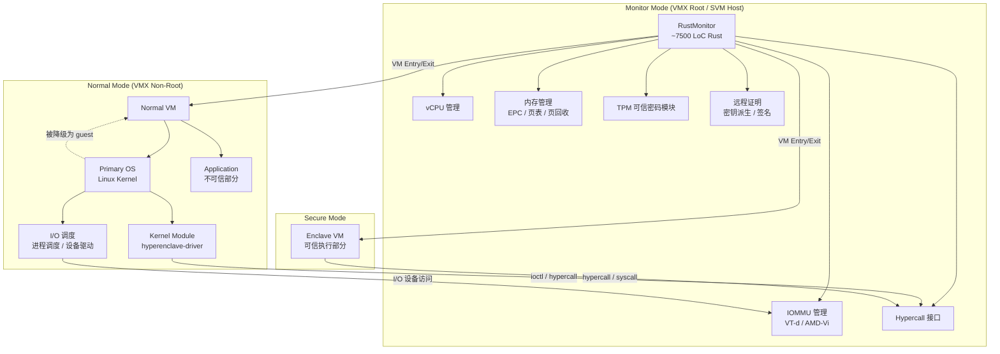
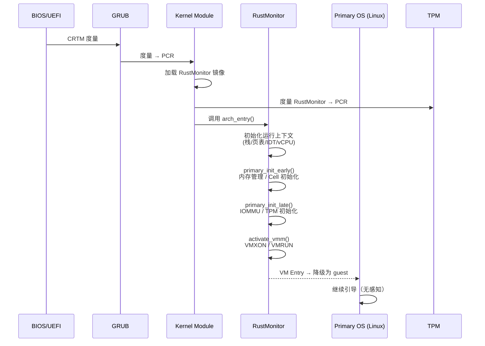
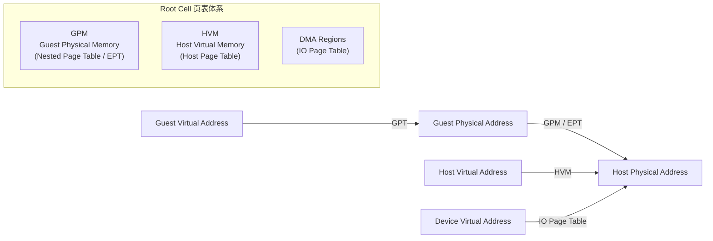
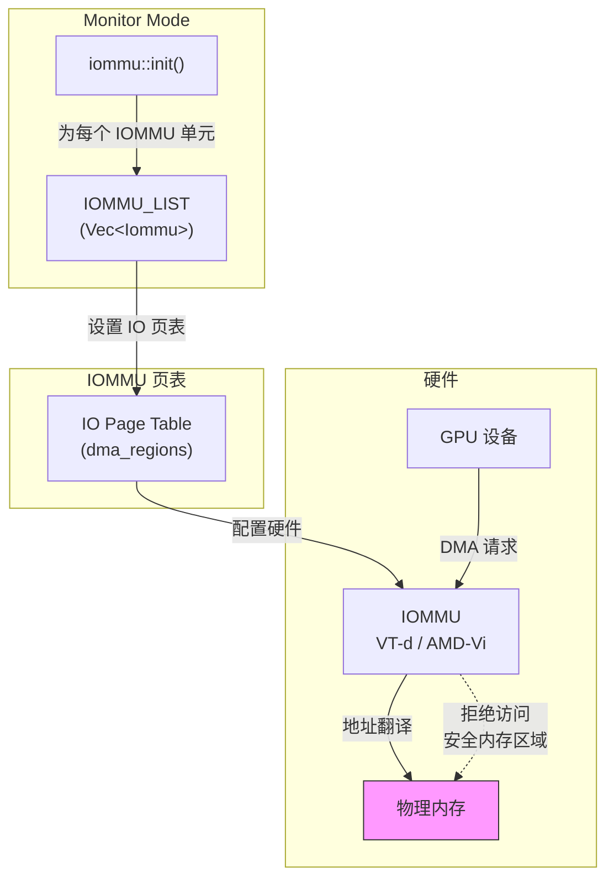
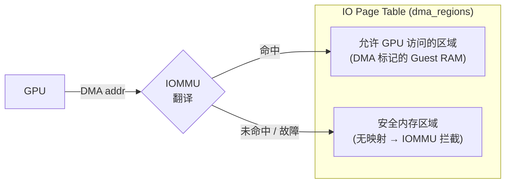
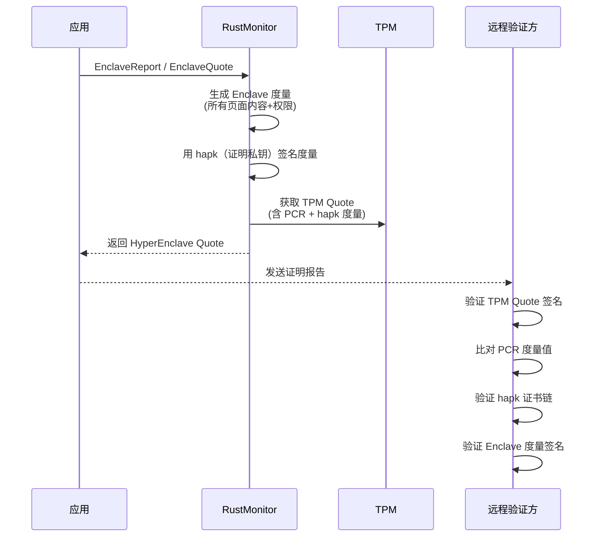

# RustMonitor 设计架构与实现

## 1. 概述

RustMonitor 是 HyperEnclave 可信执行环境（TEE）的核心安全监控组件，以 Rust 语言实现，运行于 x86 虚拟化扩展的最高特权级（Monitor Mode，即 VMX root mode / SVM host mode）。其职责是管理 Enclave 内存、强制内存隔离、控制 Enclave 状态转换，并与 L1 Host OS（Primary OS，通常为 Linux）协同完成对 CPU、GPU 及其他硬件资源的管理。

RustMonitor 约 7,500 行 Rust 代码，加少量汇编用于上下文切换。其设计遵循最小 TCB 原则——功能上等价于一个轻量 Type-1 Hypervisor，但规模远小于 KVM 或 Xen，因此更易于形式化验证。CertiK 已对其页表管理模块完成了约 27,200 行 Coq 证明脚本的机器检查证明，证明了数据流不干涉性（data-flow noninterference）。

> **注**：本文技术结论基于 HyperEnclave USENIX ATC'22 论文、ASPLOS'24 形式化验证论文，以及 HyperEnclave 开源代码库。

---

## 2. 系统架构总览

### 2.1 运行模式

HyperEnclave 系统运行在三种特权模式下：

| 模式 | 硬件映射 | 运行组件 | 信任级别 |
|------|---------|---------|---------|
| **Monitor Mode** | VMX root mode / SVM host mode | RustMonitor | 可信（TCB） |
| **Normal Mode** — Ring 0 | VMX non-root mode Ring 0 | Primary OS（Linux）内核 | 不可信 |
| **Normal Mode** — Ring 3 | VMX non-root mode Ring 3 | 应用程序不可信部分 | 不可信 |
| **Secure Mode** | 灵活映射（见 2.2） | Enclave（可信部分） | 可信 |

### 2.2 Enclave 灵活运行模式

RustMonitor 支持三种 Enclave 运行模式共存：

- **GU-Enclave（Guest User Enclave）**：运行于 guest Ring 3 / VMX non-root mode，通过嵌套页表（NPT/EPT）管理内存，适合计算密集型任务。
- **P-Enclave（Privileged Enclave）**：运行于 guest Ring 0 / VMX non-root mode，可自行管理页表和响应异常，异常处理性能比 GU-Enclave 提升约 68×。
- **HU-Enclave（Host User Enclave）**：运行于 host Ring 3 / VMX root mode，以 syscall/sysret 替代 hypercall 进行模式切换，消除嵌套页表遍历开销，适合 I/O 密集型任务。

### 2.3 架构组件关系



---

## 3. RustMonitor 与 L1 Host 的协同机制

### 3.1 启动流程：Measured Late Launch

RustMonitor 采用 **Measured Late Launch** 方式加载——Primary OS 先正常引导，然后由内核模块在早期用户空间（early userspace）加载并启动 RustMonitor，随后将 Primary OS 降级至 Normal Mode。



关键步骤说明：

1. **内核模块**（`hyperenclave-driver`，约 3,500 行 C 代码）由 Primary OS 在引导时加载，挂载于 `/dev/hyperenclave`。
2. 内核模块将 RustMonitor 镜像度量并扩展至 TPM PCR，然后在 early userspace 调用 `arch_entry()` 入口。
3. RustMonitor 的 [`main()`](file:///home/cpy/projects/gpu/hyperenclave/src/main.rs) 执行多核同步初始化：
   - Primary CPU 执行 `primary_init_early()`：初始化日志、内存管理子系统、Root Cell。
   - 所有 CPU 执行 `PerCpu::init()`：创建 vCPU 结构、设置 host 页表。
   - Primary CPU 执行 `primary_init_late()`：初始化 IOMMU、TPM 密码模块。
   - 所有 CPU 执行 `activate_vmm()`：进入 VMX root mode，通过 `VMLAUNCH` / `VMRUN` 激活虚拟化。
4. Primary OS 被降级为 Normal VM 的 guest，继续运行但不再拥有最高特权。

### 3.2 职责分工

RustMonitor 与 L1 Host 在硬件管理上遵循 **"RustMonitor 监控，Host 执行"** 的分工原则：

| 管理领域 | RustMonitor（Monitor Mode） | L1 Host（Normal Mode） |
|---------|---------------------------|----------------------|
| **CPU 调度** | 管理 vCPU 上下文切换、VM Entry/Exit | 负责进程调度策略，通过 hypercall 请求模式切换 |
| **内存管理** | 管理 EPC 物理页池、Enclave 页表、嵌套页表、页回收 | 管理自身内存、处理非安全内存的缺页异常 |
| **I/O 设备** | 配置 IOMMU 页表，隔离 DMA 访问 | 负责设备驱动、I/O 调度 |
| **GPU** | 通过 IOMMU 隔离 GPU DMA，保护安全内存 | GPU 驱动运行于 Host，通过 IOMMU 受限访问 |
| **中断处理** | 拦截中断/异常，决定路由至 Enclave 或 Host | 处理路由过来的中断 |
| **安全策略** | 强制内存隔离、Enclave 度量、远程证明 | 不参与安全决策 |

---

## 4. CPU 管理

### 4.1 vCPU 生命周期

每个物理 CPU 核心对应一个 [`PerCpu`](file:///home/cpy/projects/gpu/hyperenclave/src/percpu.rs) 结构，其中包含一个 [`Vcpu`](file:///home/cpy/projects/gpu/hyperenclave/src/arch/x86_64/intel/vcpu.rs) 实例。CPU 有三种状态：

```mermaid
stateDiagram-v2
    [*] --> HvDisabled: 系统启动
    HvDisabled --> HvEnabled: PerCpu::init()<br/>vCPU 创建，页表建立
    HvEnabled --> EnclaveRunning: enclave_enter()<br/>VM Entry 到 Enclave
    EnclaveRunning --> HvEnabled: enclave_exit() / enclave_aex()<br/>VM Exit 退出 Enclave
    HvEnabled --> HvDisabled: deactivate_vmm()<br/>VMXOFF / 返回 Linux
```

CPU 状态管理核心逻辑（[`percpu.rs`](file:///home/cpy/projects/gpu/hyperenclave/src/percpu.rs)）：

- **`CpuState::HvDisabled`**：虚拟化未激活，CPU 运行在原生模式。
- **`CpuState::HvEnabled`**：RustMonitor 已激活，CPU 在 Monitor Mode 运行 Normal VM。
- **`CpuState::EnclaveRunning`**：当前 CPU 正在执行 Enclave 代码。

### 4.2 VMCS/VMCB 管理

RustMonitor 为每个 CPU 维护硬件虚拟化控制块：

- **Intel VMX**：通过 [`Vmcs`](file:///home/cpy/projects/gpu/hyperenclave/src/arch/x86_64/intel/vcpu.rs) 管理 VMCS 区域，配置 Host/Guest 状态、执行控制、EPT 指针。VM Entry 使用 `VMLAUNCH`/`VMRESUME`，VM Exit 由 `vmx_exit` 汇编入口跳转至 [`vmexit_handler`](file:///home/cpy/projects/gpu/hyperenclave/src/arch/x86_64/vmm.rs)。
- **AMD SVM**：通过 VMCB 控制块管理 Guest 状态，使用 `VMRUN`/`#VMEXIT` 机制。

VM Exit 处理（以 Intel 为例，[`vmexit.rs`](file:///home/cpy/projects/gpu/hyperenclave/src/arch/x86_64/intel/vmexit.rs)）支持以下退出原因：

| Exit Reason | 处理方式 |
|------------|---------|
| `EXCEPTION_NMI` | 转发至 Enclave 或 Host |
| `EXTERNAL_INTERRUPT` | 触发 Enclave AEX 或注入至 Host |
| `CPUID` | 虚拟化 CPUID，隐藏 VMX/SVM 特性 |
| `VMCALL` | 分发至 Hypercall 处理框架 |
| `MSR_READ` / `MSR_WRITE` | 模拟 MSR 读写 |
| `EPT_VIOLATION` | Enclave 缺页处理或错误处理 |
| `TRIPLE_FAULT` | 注入 #GP 异常 |

### 4.3 中断路由

当 Enclave 运行期间发生外部中断：

1. RustMonitor 拦截中断（VM Exit）。
2. 保存 Enclave 上下文，触发 **AEX（Asynchronous Enclave Exit）**。
3. 将中断路由至 Primary OS 处理。
4. Primary OS 处理完成后，应用通过 `ERESUME` hypercall 恢复 Enclave 执行。

P-Enclave 模式可进一步优化：Enclave 自身可直接处理中断，减少模式切换开销。

---

## 5. 内存管理

### 5.1 物理内存分区

RustMonitor 通过内核命令行参数 `memmap=` 预留物理内存，分为两部分：

- **Hypervisor 内存**：RustMonitor 自身代码、数据、堆、PerCpu 区域。
- **EPC（Enclave Page Cache）内存**：专用于 Enclave 页面。

这些内存在 Host 的 NPT/EPT 中被映射为空页面（`empty_mapper`），Primary OS 和 Normal VM 无法访问。

### 5.2 多级页表体系

RustMonitor 维护三套页表（[`Cell`](file:///home/cpy/projects/gpu/hyperenclave/src/cell.rs)）：



- **GPM（Guest Physical Memory）**：嵌套页表（Intel EPT / AMD NPT），控制 Normal VM 对物理内存的访问。RustMonitor 将安全内存区域映射为空页面，阻止 Host 访问。
- **HVM（Host Virtual Memory）**：RustMonitor 自身的 host 虚拟地址映射，用于访问 hypervisor 代码、EPC 内存、IOMMU MMIO 等。
- **DMA Regions（IO Page Table）**：IOMMU 页表，控制外设 DMA 访问。

### 5.3 Enclave 内存隔离

RustMonitor 对 Enclave 提供以下安全保证：

- **R-1**：Primary OS 和应用程序不能访问属于 RustMonitor 和 Enclave 的物理内存（通过 NPT 移除映射实现）。
- **R-2**：Enclave 只能访问自身内存和 marshalling buffer（通过独立 GPT/NPT 实现）。
- **R-3**：DMA 设备不能访问安全内存（通过 IOMMU 实现）。

Enclave 的页表完全由 RustMonitor 管理，Primary OS 不参与——这从根本上防御了页表映射攻击（如 controlled-channel attack）。

### 5.4 共享内存（Marshalling Buffer）

Enclave 与 Host 应用之间的参数传递通过 **Marshalling Buffer** 实现：

1. 应用在 Normal VM 中预分配 marshalling buffer（`mmap` + `MAP_POPULATE`）。
2. Enclave 初始化时，将 buffer 的基地址和大小通过 hypercall 传递给 RustMonitor。
3. RustMonitor 验证 buffer 地址不在 Enclave 地址范围内，然后将其映射到 Enclave 的 GPT。
4. 运行时通过 `SharedMemoryAdd`/`SharedMemoryRemove`/`SharedMemoryInvalidStart`/`SharedMemoryInvalidEnd` 等 hypercall 动态管理共享内存的映射与失效。

---

## 6. GPU 与设备管理

### 6.1 IOMMU 隔离架构

RustMonitor 通过 IOMMU（Intel VT-d / AMD IOMMU）对外设 DMA 进行隔离，保护安全内存不被恶意设备访问。这对于 GPU 等高性能 DMA 设备尤为关键。



IOMMU 初始化流程（[`iommu/mod.rs`](file:///home/cpy/projects/gpu/hyperenclave/src/iommu/mod.rs)）：

1. 从 `HvSystemConfig` 读取平台 IOMMU 单元信息（基地址、大小）。
2. 为每个 IOMMU 单元创建 [`Iommu`](file:///home/cpy/projects/gpu/hyperenclave/src/arch/x86_64/intel/vtd.rs) 实例：
   - **Intel VT-d**：建立 Root Table → Context Table → IO Page Table 三级结构，配置无效化队列。
   - **AMD IOMMU**：建立 Device Table → IO Page Table 结构，配置命令缓冲区。
3. 将 Root Cell 的 `dma_regions` 页表设置为 IOMMU 的 IO 页表。
4. 启用 IOMMU 翻译功能。

### 6.2 GPU DMA 隔离

GPU 作为高带宽 DMA 设备，其对物理内存的访问必须经过 IOMMU 翻译：

- RustMonitor 在 IO Page Table 中**仅映射允许 GPU 访问的内存区域**（即 `dma_regions` 中标记为 `MemFlags::DMA` 的区域）。
- 安全内存（RustMonitor 自身、EPC）在 IO Page Table 中**没有映射**，GPU DMA 请求会被 IOMMU 硬件拦截并产生故障。
- RMRR（Reserved Memory Region Reporting）范围也会被自动加入 DMA 区域，确保保留设备的正常工作。



### 6.3 GPU 驱动协同

GPU 驱动运行于 L1 Host（Primary OS）的 Normal Mode：

1. **GPU 驱动**在 Host 中管理 GPU 设备的初始化、命令提交、显存管理。
2. **GPU 的 MMIO 寄存器**通过 Host 页表映射，Host 可正常访问 GPU 控制寄存器。
3. **GPU 的 DMA 访问**受 IOMMU 约束——RustMonitor 在启动时配置 IOMMU 页表，仅允许 GPU 访问非安全物理内存。
4. 当 Host 需要 GPU 访问 Enclave 数据时，数据需通过 marshalling buffer 传递，RustMonitor 可选择性地临时映射特定页面到 IO Page Table。

### 6.4 内存加密支持

在 AMD 平台上，RustMonitor 支持 **SME（Secure Memory Encryption）**：

- EPC 内存和 hypervisor 内存以加密标记映射（`MemFlags::ENCRYPTED`）。
- 在 GPM 中，加密地址空间（C-bit = 1）的 EPC 区域也被映射为空页面，防止 Host 通过加密视图读取安全数据。
- IOMMU 和 Host 页表均支持加密/非加密视图的隔离。

---

## 7. Hypercall 接口

RustMonitor 与 L1 Host 之间的交互通过 Hypercall 机制实现。Kernel Module 在 Host 中通过 `VMCALL`（Intel）或 `VMMCALL`（AMD）指令陷入 Monitor Mode，由 [`handle_hypercall()`](file:///home/cpy/projects/gpu/hyperenclave/src/arch/x86_64/vmm.rs) 分发处理。

### 7.1 Hypercall 分类

```mermaid
graph TB
    HC["Hypercall 接口<br/>(HyperCallCode)"]

    HC --> SYS["系统管理"]
    HC --> ENC_LC["Enclave 生命周期"]
    HC --> ENC_RT["Enclave 运行时"]
    HC --> SHM["共享内存管理"]
    HC --> SEC["安全服务"]

    SYS --> DIS["HypervisorDisable (0x0)"]
    SYS --> CMRM["InitCmrm / SetInitCmrmDone"]

    ENC_LC --> CREATE["EnclaveCreate (0x10)"]
    ENC_LC --> ADD["EnclaveAddPage (0x11)"]
    ENC_LC --> INIT_E["EnclaveInit (0x12)"]
    ENC_LC --> DESTROY["EnclavePrepareDestroy / FinishDestroy"]
    ENC_LC --> EDMM["EnclaveAugmentPage / ModifyPageType<br/>RestrictPagePerm / RemovePage"]

    ENC_RT --> ENTER["EnclaveEnter (0x80000000)"]
    ENC_RT --> EXIT["EnclaveExit (0x80000001)"]
    ENC_RT --> RESUME["EnclaveResume (0x80000005)"]
    ENC_RT --> ACCEPT["EnclaveAccept / AcceptCopy"]

    SHM --> ADD_SHM["SharedMemoryAdd (0x101)"]
    SHM --> RM_SHM["SharedMemoryRemove (0x102)"]
    SHM --> INV["InvalidStart / InvalidEnd"]

    SEC --> REPORT["EnclaveReport / EnclaveQuote"]
    SEC --> KEY["EnclaveGetKey"]
    SEC --> TPM["TpmCmdSync (0x16)"]
    SEC --> CERT["HypervisorSignCSR / WriteCert"]
```



### 7.2 特权级校验

每个 Hypercall 根据编码的高 2 位区分特权级：

- `0x0000_0000 ~ 0x3FFF_FFFF`：**Supervisor 级**，仅允许 Ring 0（内核模块）调用。
- `0x8000_0000 ~ 0xFFFF_FFFF`：**User 级**，允许 Ring 3（应用）调用。

RustMonitor 在分发前验证当前 CPU 状态和调用者特权级，不合法则注入 #GP 异常。

---

## 8. 可信引导与证明

### 8.1 度量启动链

RustMonitor 的信任根来自 TPM：

1. CRTM → BIOS → GRUB → Kernel → initramfs → RustMonitor，每个组件的度量值依次扩展至 TPM PCR。
2. RustMonitor 首次初始化时，从 TPM RNG 生成根密钥 `K_root`，通过 TPM Seal 操作存储。
3. RustMonitor 在将控制权交还 Primary OS 前，用常量填充 PCR，防止 Host 检索 `K_root`。
4. Enclave 的证明密钥和密封密钥均从 `K_root` 和 Enclave 度量值派生。

### 8.2 远程证明流程



---

## 9. 关键实现细节

### 9.1 代码模块结构

```
src/
├── main.rs              # 入口，多核初始化协调
├── cell.rs              # Root Cell：GPM / HVM / DMA 页表管理
├── percpu.rs            # PerCpu：每 CPU 状态、vCPU、Enclave 线程
├── config.rs            # HvSystemConfig：平台配置（内存区域、IOMMU 信息）
├── header.rs            # HvHeader：hypervisor 元数据
├── hypercall/           # Hypercall 分发与实现
│   ├── mod.rs           # HyperCallCode 枚举与分发
│   ├── enclave.rs       # Enclave 生命周期 hypercall
│   └── tc.rs            # TPM/密码模块接口
├── enclave/             # Enclave 管理
│   ├── manager.rs       # Enclave 管理器
│   ├── epcm.rs          # EPCM（Enclave Page Cache Metadata）
│   ├── shared_mem.rs    # Marshalling Buffer 管理
│   ├── reclaim.rs       # 页回收
│   └── report.rs        # 证明与报告
├── iommu/mod.rs         # IOMMU 抽象层
├── memory/              # 内存管理子系统
│   ├── paging.rs        # 通用页表框架
│   ├── frame.rs         # 物理页帧分配
│   ├── heap.rs          # 堆内存管理
│   └── mmio.rs          # MMIO 访问封装
└── arch/x86_64/
    ├── vmm.rs           # VmExit 处理、VcpuAccessGuestState trait
    ├── cpu.rs           # CPU 特性检测
    ├── entry.rs         # arch_entry 入口（汇编 + Rust）
    ├── intel/           # Intel VMX 实现
    │   ├── vcpu.rs      # VMCS 配置、VM Entry/Exit
    │   ├── vmexit.rs    # VM Exit 处理
    │   ├── ept.rs       # EPT 页表
    │   └── vtd.rs       # VT-d IOMMU
    └── amd/             # AMD SVM 实现
        ├── vcpu.rs      # VMCB 配置
        ├── vmexit.rs    # #VMEXIT 处理
        ├── npt.rs       # NPT 页表
        └── iommu.rs     # AMD IOMMU
```

### 9.2 性能数据

| 操作 | Intel SGX | HU-Enclave | GU-Enclave | P-Enclave |
|------|-----------|-----------|-----------|----------|
| EENTER | — | 1,163 cycles | 1,704 cycles | 1,649 cycles |
| EEXIT | — | 1,144 cycles | 1,319 cycles | 1,401 cycles |
| ECALL | 14,432 cycles | 8,440 cycles | 9,480 cycles | 9,700 cycles |
| OCALL | 12,432 cycles | 4,120 cycles | 4,920 cycles | 5,260 cycles |

HU-Enclave 模式将模式切换从 hypercall（~880 cycles）降低为 syscall（~120 cycles），对 I/O 密集型负载（如 Redis、Lighttpd）效果显著。

---

## 10. 总结

RustMonitor 作为 HyperEnclave 的安全监控核心，通过以下机制与 L1 Host 协同管理硬件：

1. **CPU 管理**：RustMonitor 持有 VMX root / SVM host 特权，管理所有 vCPU 的生命周期和上下文切换；L1 Host 负责进程调度策略，通过 hypercall 请求 Enclave 模式切换。
2. **内存管理**：RustMonitor 独占管理 EPC 物理页、Enclave 页表和嵌套页表；L1 Host 管理自身内存但无法访问安全区域。
3. **GPU/设备管理**：RustMonitor 配置 IOMMU 页表隔离 DMA 访问，GPU 驱动运行于 Host 但 DMA 受 IOMMU 约束；安全内存对 GPU 不可见。
4. **中断管理**：RustMonitor 拦截所有中断/异常，决定路由目标；L1 Host 处理被路由过来的中断。
5. **安全服务**：RustMonitor 独占管理 TPM 交互、远程证明、密钥派生；L1 Host 仅作为证明报告的传递通道。

这种"监控者 + 执行者"的分工模式，在保证安全隔离的同时，最大限度地复用了 L1 Host 的设备驱动和调度能力，避免了传统 Type-1 Hypervisor 需要实现完整设备栈的复杂性。
