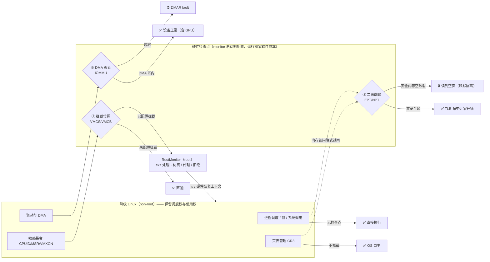
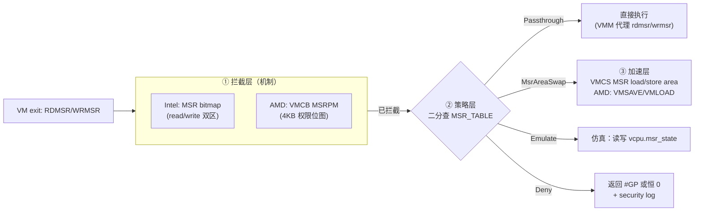
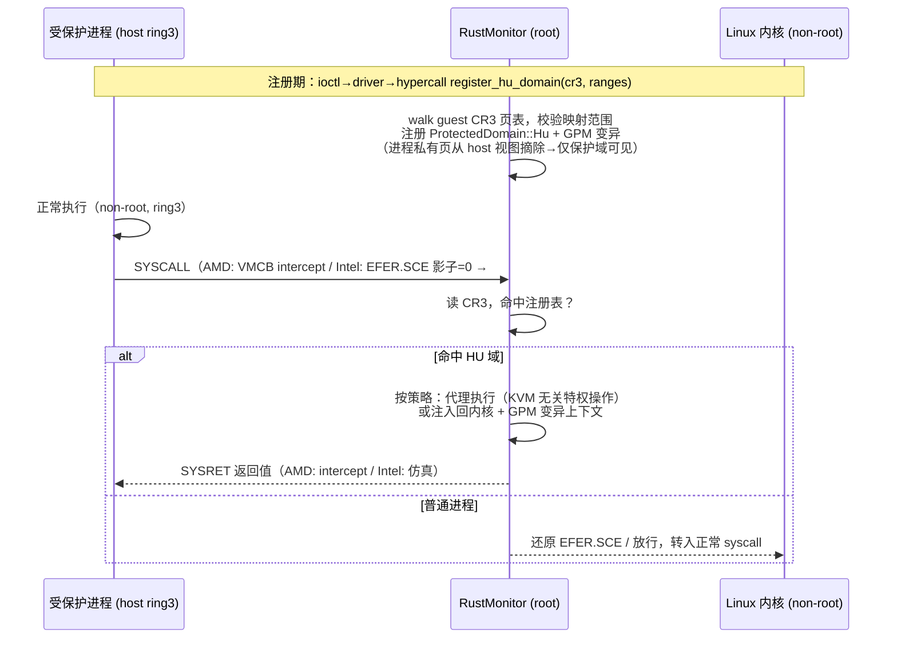

# RustMonitor v2 架构设计：面向 OS–硬件完全隔离的演进式重构

> **设计基准**：以 Windows Hyper-V / VBS 的能力模型为对标（hypervisor 独占 root mode，OS 及其上所有执行域全面运行于 non-root），以 HyperEnclave 论文（ATC'22）规格为功能基线，基于当前开源代码库的实测现状（AMD/Intel 双厂商构建与测试验证于 2026-09）。
>
> **结论先行**：v2 选择**演进式重构**而非重写。保留经形式化验证的内存隔离核心（CertiK，ASPLOS'24）与实测可用的双厂商 VMX/SVM 激活路径；重构虚拟化语义层——MSR 虚拟化、CPUID 策略引擎、分区模型、全局状态安全化；补齐论文规格中的 HU-Enclave 与电源/生命周期管理。目标是把"OS 与硬件隔离"从当前的**内存域完备、CPU 域残缺**状态推进到**全资源域完备**。
>
> **图示约定**：每张图提供双版本——上方**看板图**（表格化直观视图）与折叠的 **Mermaid 源图**（精确版本），两者内容一致。

---

## 1. 设计目标与"OS–硬件隔离"的工程定义

### 1.1 隔离完备性矩阵（v2 验收口径）

"OS 与硬件的隔离"不是单一开关，而是对每个硬件资源域的**仲裁权归属**。下表是 v2 的总验收矩阵，`✅ 已完备 / ⚠️ 部分 / ❌ 缺失`为 v1 实测状态：

| 硬件资源域 | v1 状态 | v2 目标策略 | 机制 |
|---|---|---|---|
| CPU 特权指令（VMX/SVM 指令族） | ✅ | root 独占 | 非 root 执行即 #UD，v1 已具备 |
| 物理内存（RAM 隔离） | ✅ | monitor 仲裁 | GPM（EPT/NPT）安全内存空映射 |
| 设备 DMA（含 GPU） | ✅ | monitor 仲裁 | IOMMU DMA 页表，仅映射 `MemFlags::DMA` 区域 |
| 真实页表（CR3 树） | ✅ | guest 自管 + SLAT 仲裁 | 非 root CR3 写不触发 exit，但所有 GPA→HPA 须经 GPM |
| **MSR 访问** | ❌ | 三层虚拟化 | 统一拦截策略表 + 仿真 + MSR 硬件切换区（见 §4.2） |
| **CPUID 枚举** | ⚠️ | 策略引擎 | 拓扑/特性位受控视图（见 §4.3） |
| **中断控制器（LAPIC）** | ⚠️ | 分阶段：直通 AEX → vAPIC | 阶段 1 保留现有直通 + AEX；阶段 2 posted interrupt / AVIC |
| **时钟（TSC / LAPIC timer）** | ⚠️ | TSC 虚拟化 | TSC_OFFSET per-VP；timer 由 host 持有 |
| **电源管理（S3/S4/SMI）** | ❌ | SMM 锁定校验 + PM 端口拦截 | 见 §4.7 |
| **性能监控（PMU/LBR/PT/PEBS）** | ❌ | 拒绝（fail-closed） | 调试/追踪类 MSR 拦截拒绝，防 enclave 侧信道 |
| I/O 端口（PIO） | 未纳管 | 统一拦截策略表 | PM1x 端口必须受控（S3 仲裁前置条件） |

### 1.2 对标基准

**Windows Hyper-V**（TLFS 为公开规范）给出的参考模型：partition 是隔离的 GPA 空间单元，VirtualProcessor（VP）是调度单元，root partition 的 Windows 内核与用户态全部运行于 non-root；hypervisor 通过 CPUID leaf 0x40000000 自识别、通过 SynIC 合成中断、通过 reference TSC page 提供一致时间。VBS/VSM 在此之上用 VTL 把 Secure Kernel 放入更高保护层。[^2]

**HyperEnclave 论文**（ATC'22）定义的三种 enclave 模式是功能基线：GU-Enclave（guest user，SGX SDK 兼容）、HU-Enclave（host user，普通 Linux 进程免改造入保护域）、P-Enclave（宿主特权代码保护域）。[^1] 开源代码仅实现 GU。

### 1.3 基石问答：monitor 为何能拦截，又为何不影响降级 OS 的硬件调度与使用

一句话答案：**monitor 能拦，是因为 CPU 硬件提供了"敏感事件强制上交"的执行模式；不影响，是因为拦截面被精确配置为"越权面"——而 OS 的全部正常职能走直通**。展开为三问：

#### 1.3.1 拦截能力之源：双模式执行 + 三道硬件闸门

虚拟化的经典理论是 Popek–Goldberg 的 trap-and-emulate 模型（1974）：VMM 满足三个形式化要求——**等价性**（guest 行为与裸机几乎一致）、**资源控制**（VMM 完全掌控资源）、**效率**（绝大多数指令直接执行，无需 VMM 介入）。[^8] x86 因敏感指令不全在特权层（如 SGDT 在 ring3 也执行），长期不满足经典可虚拟化条件，直到 VT-x/SVM 用另一种思路解决：**不修改指令集，而是给 CPU 两种执行域**。

- **VMX non-root / SVM guest mode**：降级 OS 的全部代码在此运行。该模式下 CPU 硬件改变语义：被配置为拦截的敏感事件**不再执行**，而是触发 **VM exit**——CPU 自动保存 guest 完整上下文（VMCS guest-state area / VMCB），加载 monitor 预设的入口（HOST_RIP/HOST_RSP），切换到 root mode。[^3][^4] 对应地，monitor 处理完毕后执行 VM entry，硬件原子地恢复 guest 上下文——**guest 从未感知"被暂停过"，这就是等价性的硬件保证**。
- **拦截面可配置到极细粒度**：单条 MSR（bitmap 1 bit）、单个 IO 端口、单个异常向量、单个 CR 位。因此"monitor 能拦截"的准确表述是：**monitor 能在任意粒度上选择拦截什么**——这是 §3.1 "策略与机制分离"原则的硬件根源。
- **内存与 DMA 的拦截是另外两道独立闸门**（不经指令拦截）：non-root 下所有地址翻译必过 EPT/NPT 二级翻译，无映射即 EPT violation；设备 DMA 必过 IOMMU 页表，越界即 DMAR fault。[^3][^4] 这两道闸对 OS 是**隐式**的——不改变任何指令行为，只改变"物理地址是否可达"。

#### 1.3.2 不影响之因：调度权与仲裁权的分离

核心命题：**降级剥夺的是 OS 的"物理主权"（root mode 与物理直达权），完整保留其"治理权"（调度、内存管理、设备使用）**。三个证据链：

**① 直通优先的拦截面配置（现有代码锚点，非设计臆断）**：

| OS 日常职能 | 是否 exit | 证据（`intel/vcpu.rs`） |
|---|---|---|
| 进程调度 / 锁 / 系统调用执行 | 否，逐指令直通 | 无对应拦截事件 |
| 中断处理（设备 IRQ） | 否，LAPIC 直接投递 non-root | :324 注释 `NO INTR_EXITING to pass-through interrupts` |
| 页表管理（CR3 写 / INVLPG / mmap / 缺页） | 否 | :335 `CR3_LOAD/STORE_EXITING` 显式置于 must-be-0 位 |
| 设备驱动（MMIO / PIO） | 否 | :333 注释 `NO UNCOND_IO_EXITING to pass-through PIO` |
| CPUID / bitmap 命中的 MSR / hypercall / VMX 指令 | 是 | 现有拦截面 |

（enclave 运行期间的中断 exit 是唯一例外——那是 AEX 语义需要，属 monitor 的保护域职能，非常态。）

**② 1:1 直通式 CPU 模型，monitor 从不抢占**：HyperEnclave 与 KVM 的根本差异——KVM 是分时复用式（vCPU 由宿主调度线程驱动，受宿主调度器支配）；HyperEnclave 是分区直通式（每 CPU 一个 vCPU ≡ pCPU，与 Jailhouse 同族 [^5]）。Linux 调度器的时间片、RCU、NO_HZ、CPU idle 全部照旧——monitor 不持有任何 CPU 时间，只在 exit 瞬间短暂借用，处理完立即归还。

**③ 被拦截的恰好只有"越权"，且直通的安全性由下一道闸兜底**：逐条检查拦截清单——vmxon/vmrun（再虚拟化）、读安全内存（EPT 空映射）、DMA 越界（IOMMU）、隐藏面 CPUID/MSR——**没有一项属于 OS 的正常职能**。反过来，直通项的安全性有纵深保证：即使 OS 把自己的页表搞乱、调度器完全失效，最坏自伤，物理边界仍由 GPM/IOMMU 兑底，伤不到安全内存。**拦截面 = 越权面，两者精确重合，这就是"能拦而不扰"的原因**——Popek–Goldberg "资源控制"与"等价性"在安全 hypervisor 上的具体化。[^8]

量化佐证：论文实测降级后 Linux 常规负载性能开销在个位数百分比以内（Redis/NGINX/Docker 等场景）[^1]；二级翻译的代价被硬件 TLB 吸收，命中时开销趋近于零。

#### 1.3.3 monitor 如何管理硬件：定义可达性边界，而非接管驱动

"管理"的准确语义：**monitor 不驱动任何设备（驱动仍是 OS 的），monitor 定义物理可达性边界并仲裁敏感事件**——"设备归 OS 使用，边界归 monitor 仲裁"：

| 资源域 | monitor 的管理手段 | OS 保留的完整自主权 |
|---|---|---|
| CPU | 独占 root mode + 配置拦截面 + CPUID 画像 | 进程调度、SMP 管理、idle |
| 物理 RAM | GPM 定义可见地图，安全内存空映射 | 非安全区的分配/回收/大页 |
| EPC（enclave 内存） | monitor 全权（OS 完全不可见） | 无 |
| 设备（含 GPU） | IOMMU DMA 页表划界 | 驱动、MMIO/PIO 使用、DMA 发起 |
| 中断 / 时钟 | 直通 + TSC offset（AEX 例外） | IRQ 路由、timer、timekeeping |
| 信任根 TPM | monitor 独占（度量链） | 无 |

monitor 自身代码与数据的保护也是同一套机制：GPM 将 monitor 内存空映射（OS 视图为空页，[cell.rs:55-59](../src/cell.rs#L55-L59)），而 monitor 在 root mode 经独立的 HVM 页表访问——OS 连"知道 monitor 在哪"都不可得。

**拦截点全景**（看板图，Mermaid 版见下）：

<table>
<tr><th style="width:22%;background:#37474f;color:#ffffff;">硬件检查点<br/><small>（monitor 启动期配置，运行期零软件成本）</small></th><th style="width:20%;background:#37474f;color:#ffffff;">检查对象</th><th style="width:29%;background:#1b5e20;color:#ffffff;">直通（OS 正常职能）</th><th style="width:29%;background:#b71c1c;color:#ffffff;">拦截（越权 / 敏感）</th></tr>
<tr align="center"><td><b>无检查点</b></td><td>进程调度、锁、系统调用执行</td><td>✅ 直接执行，与裸机逐指令等价</td><td>—</td></tr>
<tr align="center"><td><b>① 拦截位图</b><br/><small>VMCS / VMCB</small></td><td>敏感指令与事件</td><td>✅ 未配置的 MSR / PIO / 异常全直通</td><td>🚫 CPUID、bitmap 命中项、VMX/SVM 指令 → VM exit → 仿真 / 拒绝</td></tr>
<tr align="center"><td><b>② 二级翻译</b><br/><small>EPT / NPT</small></td><td>每次内存访问（隐式）</td><td>✅ 非安全区有映射，TLB 命中近零开销</td><td>🔒 安全内存空映射 → 读到空页（静默隔离，不 exit）</td></tr>
<tr align="center"><td><b>③ DMA 页表</b><br/><small>IOMMU</small></td><td>每次设备 DMA</td><td>✅ DMA 授权区正常传输（含 GPU）</td><td>⛔ 越界 → DMAR fault，数据不可达</td></tr>
<tr align="center"><td colspan="4" style="background:#eceff1;">⬆️ exit 处理完成后 VM entry 硬件原子恢复上下文，TSC offset 保证时间连续性——guest 无感知</td></tr>
</table>

<details>
<summary>📐 <b>Mermaid 源图</b>（点击展开 / 折叠）</summary>



</details>

### 1.4 威胁模型（v2 决策依据）

v2 的 fail-closed 默认、拦截面选择与验证范围均以下述威胁模型为准绳（与 HyperEnclave 论文及 HyperGPU 分享材料一致，见 [rustmonitor-architecture.md §6.5](rustmonitor-architecture.md)）：

| 类别 | 内容 | v2 设计对应 |
|---|---|---|
| **可抵御**：高特权软件攻击 | ①系统管理员越权（L1 内核态读写 CVM/Enclave 寄存器与安全内存）；②攻击者与恶意 CVM 合谋；③恶意设备发起 DMA | ①GPM 空映射 + MSR/CPUID 仿真（§4.2/§4.3）；②域间隔离由 IOMMU/设备页表仲裁；③IOMMU DMA 页表仅映射授权区 |
| **不考虑**：硬件攻击 | 冷启动内存攻击（可用内存加密抵御）、PCIe 链路窃听（可用端到端加密抵御） | 内存加密走现有 SME 路径；链路加密属应用层（HyperGPU 三层加密体系） |
| **不考虑**：侧信道攻击 | 时序/缓存侧信道不在防护范围 | 但 v2 仍主动封禁调试/追踪类 MSR（LBR/PT/PEBS 拒绝，§4.2.2）——属低成本纵深防御 |
| **不考虑**：DoS 攻击 | 可用性不承诺 | hypervisor 自身 fault 路径降级注入（v1 已有） |

### 1.5 Partition 模型的已落地用例：HyperGPU 的 L2 CVM 形态

§4.1 将多分区列为“远期扩展点”——需修正：**嵌套虚拟化的 CVM 形态已在 HyperGPU（HyperEnclave 的 GPU TEE 扩展）中落地**，其部署形态为：

- **L0** = HyperEnclave（本 monitor，支持 eVMCS 嵌套虚拟化加速，~13k LoC）；
- **L1** = 降级后的 Host Linux（不可信），内含 KVM + HyperEnclave Driver + cloud-hypervisor；
- **L2** = CVM（跑 TEE OS/App，可信负载）与 Enclave VM，GPU-TEE 场景下运行密态大模型。

这证明两件事：①降级后的 L1 仍可运行 KVM 创建 L2 虚拟机，L0 需提供 eVMCS 支持其高效运行；②v2 的 Partition 模型（§4.1）与 GPM 域内变异正是对该形态的类型系统支撑——v2 不实现多分区，但不堵死 HyperGPU 已验证的落地路径。由此 v2 差距清单补充一条：**嵌套虚拟化支持（eVMCS）为 HyperGPU 形态的硬依赖**，见实现设计文档 §0.2 G15。

---

## 2. 现状基线：资产与债务

### 2.1 保留的资产（演进式重构的依据）

| 资产 | 位置/证据 | 保留理由 |
|---|---|---|
| 双厂商激活/降级路径 | `activate_vmm` + vmlaunch/vmrun；AMD/Intel 双构建实测通过 | Late-launch 核心，实测可用 |
| GPM/HVM/DMA 三套页表 | `src/memory/`，EPT/NPT + VT-d/AMD-Vi | 隔离核心，页表模块经形式化验证（约 27,200 行 Coq 证明）[^6] |
| Enclave 生命周期 + AEX + EDMM + EPC 回收 | `src/enclave/`（EDMM 694 行、EWB/ELDB/PCMD、TLB track） | 功能完备度高，测试之外的最成熟子系统 |
| Hypercall 分层接口 | `src/hypercall/`，Supervisor < 0x4000_0000 / User ≥ 0x8000_0000 | ABI 稳定，driver/SDK/Occlum 生态依赖它 |
| TPM 度量链 + 远程证明 | Measured Late Launch、SIGMA、CMR | 信任根基 |

### 2.2 重构的债务（v2 的问题清单，均有代码锚点）

| # | 债务 | 代码锚点 | 影响 | 状态（2026-09） |
|---|---|---|---|---|
| D1 | MSR 处理空壳：读恒返 0、写丢弃 | `src/arch/x86_64/vmm.rs:89,101` | host 内核读 APIC_BASE/MTRR 等得到错误值，行为不可预测 | ✅ PR2（MSR 子系统重建） |
| D2 | Intel/AMD 拦截不对称：Intel 有 MSR bitmap（PAT/MTRR/x2APIC），AMD 未设 MSR 拦截 | `intel/structs.rs` vs `amd/vcpu.rs:226-242` | 同一策略两厂商行为不同 | ✅ PR2（同表驱动双厂商位图） |
| D3 | VMCS MSR 自动切换区未启用 | `intel/vcpu.rs:372`（`VM_EXIT_MSR_STORE_COUNT=0`） | 缺失 host/guest MSR 状态的零成本切换通道 | ✅ PR2（MSR load/store area 启用） |
| D4 | 仅 GU-Enclave：进入时禁用 EFER.SCE | `arch/x86_64/enclave.rs:212` | HU/P-Enclave 缺失，论文规格未闭合 | ⬜ PR6（HU-Enclave 未实现） |
| D5 | 全局单例 unsafe：`ENCLAVE_MANAGER` 由 `static mut EMPTY_BUFFER` transmute 而来 | `enclave/manager.rs:90-92` | 84 个 warning 中 `static_mut_refs` 类 UB 风险的主要来源 | ✅ PR1（LateInit） |
| D6 | 单 Cell（Root Cell），无分区抽象 | `src/cell.rs` | 无法表达多隔离域/多 guest，扩展受限 | ⬜ 不在 v2 范围（多分区不实现） |
| D7 | 5 级页表（LA57）不支持 | `intel/ept.rs:225` | 新平台（LA57 默认开启）无法运行 | ◐ PR1 fail-fast（拒绝 LA57 激活）；5 级 EPT ⬜ P2 |
| D8 | CR0/CR4 保留位不检查 | `intel/vcpu.rs:79`、`amd/vcpu.rs:64` | guest 可写入未定义组合 | ✅ PR1（保留位校验） |
| D9 | CPUID 仅最小伪装 | `cpuid.rs` | 拓扑/特性视图不受控 | ✅ PR3（策略引擎：快照+掩码） |
| D10 | 电源/SMI/CPU 热插拔缺失 | — | S3 后 monitor 状态不保证 | ◐ PR4（PIO/PM/APMC + SMM 锁定）；CPU 热插拔 §8 ⬜ |
| D11 | 测试覆盖极低（3 个单元测试） | cmr×2、intervaltree×1 | 重构安全网不足 | ✅ PR1–PR5（AMD 21 / Intel 22） |

> **状态图例**：✅ 已解决 / ◐ 部分解决 / ⬜ 未实现。债务的权威追踪见《实现设计》§0.2 差距总表与 §12 PR 切分（D1–D3→§3、D4→§6、D5/D7/D8→§9、D9→§4、D10→§5/§8、D11→§11）。D6（多分区）按 v2 架构 §6 明确不实现。

---

## 3. 总体架构

### 3.1 设计原则

1. **演进不重写**：D5–D7 类债务以重构解决，不动核心数据结构形态；页表与激活路径作为受保护资产。
2. **策略与机制分离**：MSR/CPUID/PIO 的"允许什么"是策略（集中一张表，可审计），"如何拦截"是机制（Intel/AMD 各自实现，行为对齐）。
3. **fail-closed 默认**：未知 MSR/未知 CPUID 叶子/未知 PIO 端口默认拒绝并记录，白名单放行。安全 hypervisor 的正确默认方向。
4. **隔离单元正交化**：Partition（SLAT 粒度的隔离单元，Hyper-V 语义）与 ProtectedDomain（SLAT 内容变异粒度的保护单元，HyperEnclave 语义）是两个维度，v2 显式建模而非混在 Cell 概念里。

### 3.2 分层模型

<table>
<tr><th colspan="4" style="background:#1565c0;color:#ffffff;padding:10px;">🖥️ NON-ROOT 层（VMX non-root / SVM guest mode）—— 全部 OS 代码在此运行</th></tr>
<tr align="center">
<td style="background:#e3f2fd;padding:10px;width:25%;"><b>Root Partition</b><br/><small>Linux 内核<br/>（原宿主，已降级）</small></td>
<td style="background:#e8f5e9;padding:10px;width:25%;"><b>🔒 HU-Enclave</b><br/><small>受保护进程<br/>（免改造入保护域）</small></td>
<td style="background:#e8f5e9;padding:10px;width:25%;"><b>🔒 GU-Enclave</b><br/><small>SGX SDK 兼容<br/>（现有实现）</small></td>
<td style="background:#f5f5f5;padding:10px;width:25%;"><b>子分区</b><br/><small>远期扩展：<br/>P-Enclave / 多 VM</small></td>
</tr>
</table>

<p align="center">⬇️ <b>VM exit</b>：指令 / 异常 / MSR / CPUID / PIO / EPT violation&emsp;&emsp;⬆️ <b>VM entry</b>：resume / AEX 恢复 / 中断注入</p>

<table>
<tr><th colspan="5" style="background:#2e7d32;color:#ffffff;padding:10px;">🛡️ ROOT 层（VMX root / SVM host mode）—— RustMonitor v2</th></tr>
<tr align="center">
<td style="background:#fff3e0;padding:10px;width:18%;"><b>接口层</b><br/><small>VM exit 分发<br/>Hypercall 分发</small></td>
<td style="width:4%;">➡️</td>
<td style="background:#fff8e1;padding:10px;width:26%;"><b>虚拟化语义层</b> 🆕<br/><small>MSR 虚拟化（策略+仿真+area）<br/>CPUID 策略引擎<br/>中断/时间虚拟化（直通AEX → vAPIC/posted）<br/>电源/生命周期仲裁</small></td>
<td style="width:4%;">⬅️</td>
<td style="background:#ede7f6;padding:10px;width:18%;"><b>策略层</b>（纯数据）<br/><small>MSR 策略表<br/>CPUID 策略表<br/>PIO 策略表</small></td>
</tr>
<tr align="center">
<td colspan="5" style="background:#e8f5e9;padding:10px;"><b>隔离核心</b> ✅ 保留（形式化验证资产）：GPM 嵌套页表（EPT/NPT）&emsp;|&emsp;DMA 页表（VT-d / AMD-Vi）&emsp;|&emsp;Enclave/EPC 管理（AEX / EDMM / 回收）</td>
</tr>
</table>

<p align="center">⬇️ 硬件仲裁（GPM / DMA / posted interrupt）</p>

<table>
<tr><th style="background:#424242;color:#ffffff;padding:10px;">⚙️ 硬件层：CPU ・ 内存 ・ 设备（含 GPU）・ IOMMU ・ TPM</th></tr>
</table>

<details>
<summary>📐 <b>Mermaid 源图</b>（点击展开 / 折叠）</summary>

```mermaid
flowchart TB
    subgraph NR["VMX non-root / SVM guest mode（全部 OS 代码在此运行）"]
        direction TB
        HK["Root Partition：Linux 内核（原宿主，已降级）"]
        HU["ProtectedDomain：HU-Enclave 受保护进程"]
        GU["ProtectedDomain：GU-Enclave（SGX SDK 兼容）"]
        KA["子分区（远期，P-Enclave/多 VM）"]
        HK --- HU
        HK --- GU
        HK --- KA
    end

    subgraph RM["VMX root / SVM host mode —— RustMonitor v2"]
        direction TB
        subgraph SEM["虚拟化语义层（新增/重构）"]
            MSR["MSR 虚拟化<br/>策略表 + 仿真 + MSR-area 切换"]
            PID["CPUID 策略引擎"]
            IVT["中断/时间虚拟化<br/>直通AEX → vAPIC/posted"]
            PWR["电源/生命周期仲裁"]
        end
        subgraph CORE["隔离核心（保留，形式化验证资产）"]
            GPM["GPM 嵌套页表<br/>EPT/NPT"]
            DMA["DMA 页表<br/>VT-d / AMD-Vi"]
            EPC["Enclave/EPC 管理<br/>AEX/EDMM/回收"]
        end
        subgraph HYP["接口层"]
            HC["Hypercall 分发"]
            VMX["VM exit 分发"]
        end
        subgraph POL["策略层（纯数据）"]
            PT["MSR 策略表<br/>CPUID 策略表<br/>PIO 策略表"]
        end
        HYP --> SEM
        SEM --> CORE
        POL --> SEM
    end

    HW["硬件：CPU/内存/设备/IOMMU/TPM"]

    NR -->|"VM exit（指令/异常/MSR/CPUID/PIO/EPT violation）"| RM
    RM -->|"VM entry / AEX resume / 中断注入"| NR
    RM --> ARB["仲裁"|GPM/DMA/posted interrupt]
    ARB -.-> HW
    CORE --> HW
```

</details>

关键变化：v1 的 VM exit 处理直接散落在 `vmm.rs` 的 match 分支里；v2 引入**虚拟化语义层**，策略集中在纯数据表，机制在双厂商实现中对齐。这一分层正是 KVM 的 `kvm_emulate_*` 家族与 Hyper-V 的合成设备层的共同形态。[^7]

---

## 4. 核心子系统设计

### 4.1 Partition / VP / ProtectedDomain 模型

```rust
/// 隔离单元：一个 GPA 空间 + 嵌套页表 + hypercall 权限域（Hyper-V partition 语义）
pub struct Partition {
    gpm: Gpm,                    // 本分区的 EPT/NPT（现有 Root Cell 的泛化）
    vps: [VirtualProcessor],     // 调度单元
    hc_perm: HypercallPermSet,   // 分区级 hypercall 白名单
}

/// 调度单元：现有 Vcpu + vCPU 状态镜像（vMSR/vCPUID 缓存/vAPIC）
pub struct VirtualProcessor {
    vcpu: Vcpu,                  // 保留现有实现
    msr_state: VcpuMsrState,     // §4.2
    cpuid_cache: CpuidView,      // §4.3
    parked: bool,                // §4.7 CPU 让渡
}

/// 保护单元：同一 Partition 内的受保护执行域（HyperEnclave 语义）
/// GU：现有 enclave；HU：host ring3 进程集合（§4.6）
pub enum ProtectedDomain {
    Gu(Enclave),                       // 现有实现直接迁入
    Hu { cr3_roots: BTreeSet<u64>, gpm_mutations: GpmMutations }, // 新增
}
```

改造路径：`cell.rs` 的 Root Cell 泛化为 `Partition`（v2 仍只有 1 个 root partition，但类型系统就位）；enclave 从"异常驱动的运行模式"升格为显式建模的 ProtectedDomain。**多分区在 v2 代码中不实现但不再被类型系统堵死——且该形态已被 HyperGPU 的 L2 CVM 部署验证可行（见 §1.5）：L1 降级 Linux 中的 KVM 创建 L2 CVM，L0 提供 eVMCS 支持。**

### 4.2 MSR 虚拟化子系统（v2 最大单项）

#### 4.2.1 三层结构

<table>
<tr align="center">
<td style="background:#ffebee;padding:10px;width:15%;"><b>VM exit</b><br/><small>RDMSR / WRMSR</small></td>
<td style="width:4%;">➡️</td>
<td style="background:#e3f2fd;padding:10px;width:32%;"><b>① 拦截层</b>（机制）<br/><small>Intel：MSR bitmap（read/write 双区）<br/>AMD：VMCB MSRPM（4KB 权限位图）</small></td>
<td style="width:4%;">➡️<br/><small>已拦截</small></td>
<td style="background:#e8eaf6;padding:10px;width:32%;"><b>② 策略层</b><br/><small>二分查找 MSR_TABLE<br/>（未知 MSR → 默认 Deny）</small></td>
</tr>
</table>

<p align="center">⬇️ ② 按表项动作分发到以下四类处理</p>

<table>
<tr align="center">
<td style="background:#e0f2f1;padding:10px;width:25%;"><b>Passthrough</b> ✅<br/><small>直接执行<br/>（VMM 代理 rdmsr/wrmsr）</small></td>
<td style="background:#f3e5f5;padding:10px;width:25%;"><b>AreaSwap</b> ⚡<br/><small>③ 加速层：VMCS MSR load/store area<br/>AMD：VMSAVE / VMLOAD<br/>（零 exit 成本切换）</small></td>
<td style="background:#fffde7;padding:10px;width:25%;"><b>Emulate</b> 🧮<br/><small>仿真：读写<br/>vcpu.msr_state 状态镜像</small></td>
<td style="background:#ffcdd2;padding:10px;width:25%;"><b>Deny</b> ⛔<br/><small>返回 #GP 或恒 0<br/>+ security log</small></td>
</tr>
</table>

<details>
<summary>📐 <b>Mermaid 源图</b>（点击展开 / 折叠）</summary>



</details>

- **① 拦截层**：把 v1 的不对称（D2）收敛为"策略表 → 硬件位图"的编译期/启动期生成：Intel 填 VMCS MSR bitmap 双区；AMD 分配 VMCB MSR 权限页（每 16 个 MSR 一个 u32，各 MSR 占 2 bit 读/写）并挂到 VMCB control。[^3][^4]
- **② 策略层**：`MSR_TABLE: &[MsrEntry]` 按 MSR 地址排序、二分查找；未知 MSR 命中默认 `Deny`（fail-closed）。
- **③ 加速层**：把"每次 root/non-root 切换都必须换"的 MSR 交给硬件自动切换，零 exit 成本——Intel 启用 VM-entry/exit MSR load/store area（v1 的 hook 点空置，`intel/vcpu.rs:372`）；AMD 由 VMSAVE/VMLOAD 覆盖 EFER/STAR/SYSENTER/PAT/KERNEL_GS_BASE。[^3][^4]

#### 4.2.2 MSR 分类策略表（安全 hypervisor 视角）

| 类别 | 代表 MSR | 策略 | 理由 |
|---|---|---|---|
| 身份/拓扑 | `IA32_APIC_BASE` (0x1B) | Emulate | LAPIC 基址是 host 可见状态，monitor 跟踪后回放 |
| 时钟 | `IA32_TSC` (0x10) 读、`TSC_ADJUST` (0x3B) | Passthrough + TSC_OFFSET | 读 TSC 无害；per-VP offset 使 monitor 拥有时间叙事权（KVM/Hyper-V 同款） |
| 内存类型 | `PAT` (0x277)、`MTRR*` (0xFE–0x2FF) | Emulate（缓存直读） | EPT 内存类型才是最终仲裁（guest 有效类型与 EPT MT 按 SDM 规则合并取保守值）；仿真防止类型组合破坏缓存一致性 |
| x2APIC | 0x800–0x8FF（`SELF_IPI` 0x83F、`ICR` 0x830） | 阶段 1: Emulate 注回 host；阶段 2: vAPIC | ICR 写即 IPI 发起，必须受控 |
| 分支预测缓解 | `SPEC_CTRL` (0x48)、`PRED_CMD` (0x49) | Passthrough + 审计记录 | 缓解状态需可观测，不需阻断 |
| **调试/追踪** | `DEBUGCTL` (0x1D9, LBR/BTS)、`IA32_RTIT_*`（Intel PT）、PEBS | **Deny** | 可观测 enclave 控制流与时序，属侧信道攻击面；fail-closed |
| 系统调用 | `STAR/LSTAR/CSTAR/SFMASK` (0xC0000081–84)、`SYSENTER_*` (0x174–176) | MsrAreaSwap（GU 保存/恢复）；HU 模式下参与 §4.6 仲裁 | 模式边界归属 monitor |
| 段基址 | `KERNEL_GS_BASE` (0xC0000102)、`TSC_AUX` (0xC0000103) | MsrAreaSwap | swapgs 语义完整性 |
| SMM 相关 | `MSR_SMM_FEATURE_CONTROL` 等 | Deny + 启动期校验锁定 | monitor 独占（§4.7） |

#### 4.2.3 状态镜像与未知 MSR 的语义

```rust
pub struct VcpuMsrState {
    pub apic_base: u64,
    pub pat: u64,
    pub mtrr_def_type: u64,
    pub mtrr_fixed: [u64; 11],
    pub sysenter_cs_esp_eip: [u64; 3],
    pub star_lstar_cstar_sfmask: [u64; 4],
    pub misc_enable: u64,
    // 未列出的 Emulate 项：读写都落到通用 backup map
    pub backup: BTreeMap<u32, u64>,
}
```

写入"实际硬件有副作用的 MSR"（如 CR 目标类）必须经 monitor 白名单代理执行，绝不让 guest 的 MSR 值直达硬件——这是 v2 与 v1（写直接丢弃）在安全语义上的本质区别：**v1 是静默丢弃（行为未定义），v2 是显式仲裁（行为可审计）**。

### 4.3 CPUID 策略引擎

现状是散点的最小伪装。v2 收敛为启动期"快照 + 掩码"引擎：

| 叶子 | 处理 | 目的 |
|---|---|---|
| 0x0 / 0x80000000 | max leaf 钳制 | 隐藏不受控面 |
| 0x1 | `ECX[31]` hypervisor bit：**隐身模式（默认）** | 与 v1 兼容：host 内核与工具无感知；自识别模式（置位 + 0x40000000 签名叶子）留作 driver 协作选项（Hyper-V/TLFS 模式）[^2] |
| 0x4 / 0xB / 0x1F / 0x8000001E | 拓扑固定化（启动快照 + 掩码） | 防拓扑探测干扰调度假设 |
| 0x7 | 清除 SGX/SGXLC 位 | HyperEnclave 必须**隐藏真 SGX**——真叶 0x12 同时清零，ENCLU 语义由 monitor 仿真（GU-Enclave 兼容 SGX SDK 的机制根基）[^1] |
| 0x7 | 清除 VMX/SVM 位 | non-root 执行 vmxon/svm 不可达，枚举必须一致 |
| 0x80000008 | 虚拟地址宽度 = GPM 实际宽度 | 与嵌套页表配置一致 |

### 4.4 中断与时间虚拟化

**阶段 1（保留现有机制）**：外部中断直通——enclave 运行时 `INTR_EXITING`/`ACK_INTR_ON_EXIT` 动态置位（`intel/enclave.rs:63-87` 已实现），中断触发 AEX 回 host 处理。v2 增补：per-VP `TSC_OFFSET`（VMCS/VMCB 均有对应字段），使 monitor 对每个 VP 拥有独立时间基线，为 HU-Enclave 的公平调度做准备。

**阶段 2（加速）**：posted interrupt（Intel APICv：PI descriptor + notification vector，中断直接投递进 non-root 免 exit）或 AVIC（AMD 虚拟 APIC 页）。中断路由权仍归 host LAPIC 驱动（host 是降级的原 owner，直通其硬件中断合理），monitor 只确保 enclave 的 AEX 语义与时序一致性。[^3][^4]

### 4.5 内存架构扩展

- **LA57（D7）**：`paging.rs` 的 Mapper trait 增加 PML5 层级变体，EPT/NPT root 构造按 `CPUID.7.ECX[16]` 分支；对齐 KVM 已验证的 5 级实现。
- **大页**：GPM 优先 2MB/1GB 大页映射非安全区（TLB 压力），EPC 区保持 4KB 粒度（回收语义需要）。
- **EPT 内存类型仲裁**：guest PAT/MTRR（由 §4.2 仿真）与 EPT MT 的合并语义按 SDM 取保守值，杜绝 guest 通过 MTRR 变更制造缓存类型混乱。
- **CR0/CR4（D8）**：完备 guest/host mask + read shadow 配置：host-owned 位（VMXE、SMI/SMM 相关）固定，guest 可见 shadow；写入保留位组合注入 #GP。

### 4.6 HU-Enclave 补全（论文规格 → 实现设计）

论文规格：普通 Linux 进程（无 SGX SDK 改造）注册后，其用户态代码与数据受保护域覆盖，syscall 路径经 monitor 仲裁。[^1]

**厂商机制差异是本节核心**：AMD SVM 的 VMCB 提供逐指令的 `SYSCALL`/`SYSRET` intercept 位；Intel VMX **没有** SYSCALL exiting 控制位，需要等价路径。[^4][^3]

<table>
<tr><th style="width:8%;background:#37474f;color:#ffffff;">步骤</th><th style="width:27%;background:#37474f;color:#ffffff;">触发（non-root）</th><th style="width:40%;background:#37474f;color:#ffffff;">RustMonitor 动作（root）</th><th style="width:25%;background:#37474f;color:#ffffff;">效果</th></tr>
<tr align="center"><td><b>0️⃣</b></td><td>注册：ioctl → driver → hypercall<br/><code>register_hu_domain(cr3, ranges)</code></td><td align="left">walk guest CR3 页表，校验映射范围；注册 ProtectedDomain::Hu + GPM 变异——<b>进程私有页从 host 视图摘除</b></td><td>私有页仅保护域可见</td></tr>
<tr align="center"><td><b>1️⃣</b></td><td>受保护进程正常执行<br/>（non-root, ring3）</td><td align="left">—（无介入，进程零感知）</td><td>私有页可正常读写</td></tr>
<tr align="center"><td><b>2️⃣</b></td><td>SYSCALL<br/><small>AMD：VMCB intercept ／ Intel：EFER.SCE 影子=0 → #UD</small></td><td align="left">读 CR3，比对 HU 域注册表</td><td>域归属判定</td></tr>
<tr align="center"><td><b>3️⃣</b></td><td>命中 HU 域</td><td align="left">按策略：<b>代理执行</b>（与内核无关的特权操作）<b>或注入回内核</b> + GPM 变异上下文</td><td>SYSRET 返回值给进程<br/><small>AMD：intercept ／ Intel：仿真</small></td></tr>
<tr align="center"><td><b>4️⃣</b></td><td>未命中（普通进程）</td><td align="left">还原 EFER.SCE / 放行</td><td>转入正常 syscall 路径</td></tr>
</table>

<details>
<summary>📐 <b>Mermaid 源图</b>（点击展开 / 折叠）</summary>



</details>

- **AMD/Hygon 路径**（论文实验平台即 Hygon）：VMCB 置 SYSCALL/SYSRET intercept，精确、零额外成本。[^4]
- **Intel 路径**：MSR bitmap 拦截 EFER 写，guest EFER 镜像保持 SCE=0 → SYSCALL 执行触发 #UD → #UD exit（异常位图）→ monitor 识别 RIP 属于 HU 域则仿真 syscall，否则按普通 #UD 注入。代价是普通进程的 syscall 也会 exit，因此 Intel 侧引入**按需开关**：仅当存在活跃 HU 域时才启用该拦截（其余时间 SCE 直通，保持 v1 的 zero-overhead）。
- **识别与加速**：exit 时以 CR3 比对注册表（BTreeSet 查找）；CR3-target list 与 VMFUNC EPTP switching（CPU 支持时）作为后续优化路径。

### 4.7 电源、SMI 与 CPU 生命周期

- **SMM**：SMM 是 VMX 之外更高特权的 out-of-band 域，SMM 代码可访问 monitor 内存，属 late-launch 架构的固有威胁面。v2 立场：启动时校验 `MSR_SMM_FEATURE_CONTROL` 与 SMRAM 锁定状态，未锁定则告警并在度量日志中记录；不在 monitor 内模拟 SMM（那等价于重写固件）。
- **S3/S4**：late-launch hypervisor 的公认难点——同类设计 Jailhouse 明确不支持 S3（CPU 状态被 OS 回收后不可恢复）。[^5] v2 策略：PIO 拦截 PM1a/pm1_cnt 端口，默认**拒绝深度睡眠**（返回失败让 host 落回 S0 idle），保留架构上的 `suspend_park` 钩子作为后续研究项。
- **CPU 热插拔/让渡**：percpu 状态机（现 `HvDisabled/HvEnabled/EnclaveRunning`）增加 `Parked` 态：host 请求回收 CPU 时 hypercall 让渡 → monitor 停止该 CPU 的 launch 循环 → 需要时 IPI 唤醒重新 activate。这是 Jailhouse 模式的 park 语义移植。[^5]

### 4.8 全局状态安全化（Phase 0，先于一切）

消灭 D5 的 `transmute` 模式（bare-metal 无堆分配是现实约束，**保留 BSS 预留总量**，只消灭裸 unsafe）：

```rust
/// src/sync/late_init.rs —— unsafe 边界集中到这一个模块
pub struct LateInit<T>(UnsafeCell<MaybeUninit<T>>, AtomicBool);

impl EnclaveManager {
    // manager.rs: pub static ENCLAVE_MANAGER: &EnclaveManager = transmute(&EMPTY_BUFFER);
    // 替换为：
    pub static ENCLAVE_MANAGER: LateInit<EnclaveManager> = LateInit::new();
}

// 使用侧语义不变：ENCLAVE_MANAGER.get().add_enclave(...)
```

`init()` 仅允许在 primary_init 阶段调用一次，之后 `get()` 返回 `&'static T` 只读共享。配套清理 `static_mut_refs` 类 warning（84 个 warning 的主体），使 CI 可以把 `-D warnings` 立为例行门禁。

---

## 5. 实施路线

| 阶段 | 内容 | 交付判据 | 风险 |
|---|---|---|---|
| **Phase 0 安全地基** | §4.8 LateInit 重构；CR0/CR4 mask 完备（D8）；测试网扩展（策略表/页表/paging 单测，目标 >100 例） | `cargo build` 零 `static_mut_refs` warning；新单测全绿 | 低 |
| **Phase 1 隔离闭环**（用户目标核心） | §4.2 MSR 三层虚拟化 + AMD 拦截对齐（D1/D2/D3）；§4.3 CPUID 引擎（D9）；PIO 策略表；TSC_OFFSET | Linux non-root 下所有 MSR/CPUID 访问行为可预测、可审计；两厂商行为一致性测试（同一策略表驱动双实现） | 中 |
| **Phase 2 保护域扩展** | §4.6 HU-Enclave（AMD 先行，Intel 按需开关）；§4.5 LA57；posted interrupt/AVIC | HU 域注册进程免改造受保护；LA57 平台启动 | 中高 |
| **Phase 3 生命周期** | §4.7 PM 端口仲裁、Parked 状态机、SMM 校验 | S3 尝试被显式拒绝且系统稳定；CPU 让渡往返正确 | 高（研究性） |

依赖关系：Phase 0 → Phase 1 严格串行（重构地基）；Phase 2 的 HU 与 LA57 可并行；Phase 3 依赖 Phase 1 的 PIO/MSR 机制就位。

---

## 6. 风险与未决项

| 风险 | 说明 | 缓解 |
|---|---|---|
| MSR 仿真的行为保真度 | host 内核（5.4/5.10）对个别 MSR 的时序敏感访问可能依赖真实硬件行为 | 以真实硬件 rdmsr 快照做回归对比测试；策略表可按内核版本微调 |
| Intel HU-Enclave 的 #UD 仿真开销 | 无精确 SYSCALL 拦截，活跃 HU 域存在时全体进程 syscall 都 exit | 按需开关 + 论文场景主要在 Hygon（有精确拦截）；VMFUNC 优化列后续 |
| S3 拒绝的生态兼容 | 宿主环境（笔记本/云管控）可能强依赖睡眠 | 配置开关 + 度量日志显式声明；Phase 3 研究性尝试 park 方案 |
| libtpm.a 闭源依赖 | v2 不解决（超出架构范围） | 维持 fake TPM（driver `feature_mask` bit[8]）作为开发路径 |
| 形式化验证资产的有效范围 | CertiK 验证覆盖页表模块，v2 对该模块的改动（LA57）需重验证 | LA57 改动收敛在 root 构造分支，避免触碰已验证核心路径 |

## 7. 与成熟实现的机制对照

| 能力 | Windows Hyper-V | KVM | RustMonitor v2 |
|---|---|---|---|
| OS 降级方式 | 引导期 hvloader | 不降级（type-2，Linux 留 root） | 运行期 late-launch + TPM 度量（独有优势） |
| 隔离单元 | partition / VP | VM / vCPU | Partition / VP + ProtectedDomain（正交双维） |
| SLAT | EPT per-partition | EPT per-VM | GPM（per-partition）+ 域内变异 |
| MSR | 全仿真（TLFS 定义合成 MSR） | 完整仿真 + 用户态直通 | 三层：策略表 + 仿真 + MSR-area 硬件切换 |
| 自识别 | CPUID 0x40000000 "Microsoft Hv" | CPUID 0x40000000 KVM | 隐身默认 + 自识别可选 |
| 中断 | SynIC 合成中断 | vAPIC + posted interrupt | 直通 AEX（阶段 1）→ posted/AVIC（阶段 2） |
| 信任根 | CPU 厂商 + TPM | CPU 厂商 | TPM（与 CPU 厂商解耦，独有） |

## 8. 引用

[^1]: Zhou et al., *HyperEnclave: An Effective and Efficient TEE on Unmodified x86-63*, USENIX ATC 2022.
[^2]: Microsoft, *Hypervisor Top-Level Functional Specification*（公开规范；partition/VP/CPUID 0x40000000/SynIC/VSM 定义）。
[^3]: Intel, *Intel 64 and IA-32 Architectures SDM* Vol.3C（VMCS MSR load/store area、MSR bitmap、posted interrupts、EPT 内存类型合并规则）、Vol.4（MSR 定义）。
[^4]: AMD, *AMD64 Architecture Programmer's Manual* Vol.2（SVM：VMCB 指令拦截含 SYSCALL/SYSRET、MSR 权限页、VMSAVE/VMLOAD、AVIC）。
[^5]: Ramsauer et al., *Jailhouse: A Linux-based Partitioning Hypervisor*, EuroSys 2014（late-launch hypervisor 的 S3 不支持与 CPU park 语义）。
[^6]: CertiK, HyperEnclave 页表模块形式化验证（ASPLOS 2024；约 27,200 行 Coq 证明脚本）。
[^7]: Linux 内核源码 `arch/x86/kvm/`（MSR/CPUID 仿真分层与 fail-closed 处理的工程参照）。
[^8]: G. J. Popek & R. P. Goldberg, *Formal Requirements for Virtualizable Third Generation Architectures*, CACM 17(7), 1974（trap-and-emulate 模型；等价性 / 资源控制 / 效率三要求）。
