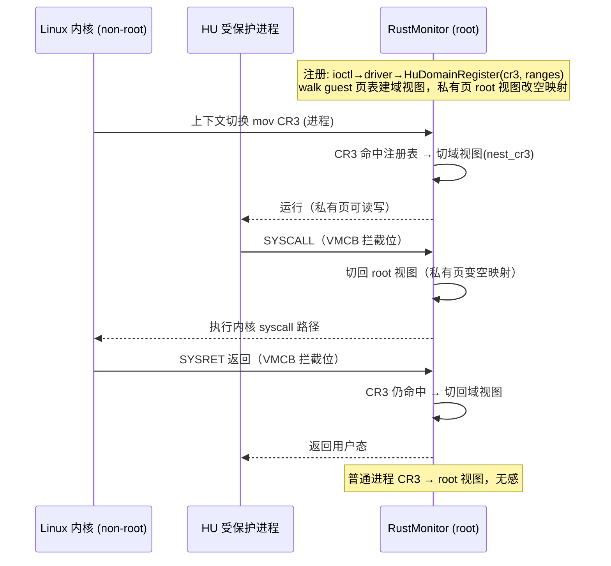

# RustMonitor v2 实现设计（Implementation Design）

> **文档定位**：本文档是《RustMonitor v2 架构设计》（`rustmonitor-v2-architecture.md`）的实现级细化，目标是"**可用且功能全面**"的 monitor：每个子系统给出模块布局、数据结构定义、函数签名、现有代码接入点与验收标准，作为编码前的设计评审稿。所有现状结论均有代码锚点（2026-09 实测，AMD/Intel 双构建通过）。
>
> **实现状态（2026-09 更新）**：**PR1–PR5 已落地并双厂商验证通过**（`make elf`/`make test` VENDOR=amd|intel SME=off 全绿；单元测试 AMD 21、Intel 22）。PR6（§6 HU-Enclave）与 §8 CPU Parked 尚未实现，对应 hypercall code 已在 ABI 中登记但返回 `ENOSYS`。下文各节标注了与本设计表的**实现偏差**，代码为唯一事实来源（`src/arch/x86_64/msr/policy.rs`、`pio.rs`、`cpuid.rs`）。
>
> **图示约定**：每张图提供双版本——上方**看板图**（表格化直观视图）与折叠的 **Mermaid 源图**（精确版本），两者内容一致。

---

## 0. 差距清单：以"可用且功能全面"为标准

### 0.1 本次代码复核的两个新发现

**F1 — Intel MSR bitmap 拦截位全部失效**：[intel/structs.rs:69](../src/arch/x86_64/intel/structs.rs#L69) 的 `mask()` 用 `&=`（应为 `|=`）设置位。由于 `AlignedPage::new()` 零初始化（[memory/mod.rs:66-68](../src/memory/mod.rs#L66-L68)），`0 &= (1<<bit)` 恒为 0。**后果：Intel 侧任何 MSR 都不触发拦截，MSR 完全直通，`vmm.rs` 的 `handle_msr_read/write` 实为不可达代码**。这同时解释了"读恒返 0"未致系统崩溃的原因——它从不执行。
**F2 — AMD vCPU 状态访问读错源**：[amd/vcpu.rs:297-303](../src/arch/x86_64/amd/vcpu.rs#L297-L303) 的 `fs_base()/gs_base()` 读真实 MSR `IA32_FS_BASE`（VM exit 后是 **host** 值），应读 `vmcb.save.fs_base/gs_base`（VMCB save 区有这些字段，见 `kernel_gs_base` 的同款用法 [amd/vcpu.rs:219](../src/arch/x86_64/amd/vcpu.rs#L219)）。

### 0.2 差距总表

优先级定义：**P0 = 阻塞"可用"**（host 内核行为不可预测/未定义）；**P1 = 阻塞"功能全面"**（v2 目标能力缺失）；**P2 = 质量与健壮性**。

| # | 能力 | 现状（锚点） | 级别 | v2 处置 |
|---|---|---|---|---|
| G1 | MSR 读/写仿真 | 空壳（[vmm.rs:85-104](../src/arch/x86_64/vmm.rs#L85-L104)）+ F1 bitmap 失效 + AMD 无拦截 | **P0** | §3 整体重建 ✅ **PR2** |
| G2 | MSR 状态切换 | MSR load/store area 未启用（[intel/vcpu.rs:372-374](../src/arch/x86_64/intel/vcpu.rs#L372-L374) 全写 0） | **P0** | §3.4 ✅ **PR2** |
| G3 | CPUID 策略 | 仅清 VMX/SVM 位 + 自识别叶子（[vmm.rs:106-145](../src/arch/x86_64/vmm.rs#L106-L145)）；SGX 位/0x12 叶/LA57 位/topology 叶未处理 | **P0** | §4 ✅ **PR3** |
| G4 | LA57 检测 | L5 paging 只打日志继续跑（[intel/vcpu.rs:83-85](../src/arch/x86_64/intel/vcpu.rs#L83-L85)）→ 后续必崩；EPT 5 级 unimplemented（[intel/ept.rs:225](../src/arch/x86_64/intel/ept.rs#L225)） | **P0** | 启动期 fail-fast ✅ **PR1**；5 级实现列 P2 ⬜ |
| G5 | AMD vCPU 状态语义 | F2 | **P0** | §9.3 一行修正 ✅ **PR1** |
| G6 | PIO/电源仲裁 | PIO 全直通（[intel/vcpu.rs:333](../src/arch/x86_64/intel/vcpu.rs#L333) 注释明确 pass-through）；PM1x/APMC(0xB2) 端口可触发 S3/SMI | **P0** | §5 ✅ **PR4** |
| G7 | HU-Enclave | 缺失（论文三种模式仅 GU，enclave enter 禁 EFER.SCE） | P1 | §6 ⬜ **PR6**（未实现） |
| G8 | TSC 虚拟化 | TSC_OFFSET 未使用 | P1 | §7 ✅ **PR5**（阶段1 offset=0） |
| G9 | CPU 让渡/热插拔 | CpuState 仅 3 态（[percpu.rs:40-44](../src/percpu.rs#L40-L44)） | P1 | §8 ⬜（未实现；PR5 仅登记 CpuPark/CpuUnpark code） |
| G10 | 全局状态安全化 | `transmute` static mut（[manager.rs:90-92](../src/enclave/manager.rs#L90-L92)），84 warning | P1 | §9.1 ✅ **PR1**（LateInit） |
| G11 | CR0/CR4 保留位 | Intel set_cr 已有 FIXED0/1 逻辑（[intel/vcpu.rs:441-476](../src/arch/x86_64/intel/vcpu.rs#L441-L476)）；AMD 仅清 NW（[amd/vcpu.rs:317-324](../src/arch/x86_64/amd/vcpu.rs#L317-L324)）；`Vcpu::new` 的 TODO 检查未做 | P2 | §9.2 ✅ **PR1** |
| G12 | 测试 | 3 个单元测试 | P1 | §11 ✅ 单元测试扩至 AMD 21 / Intel 22 | 
| G13 | VT-d cache line 硬编码 64B（[intel/vtd.rs:415](../src/arch/x86_64/intel/vtd.rs#L415)） | P2 | 读 CAP 寄存器 | |
| G14 | libtpm.a 闭源 | 二进制依赖，无法重建 | — | 架构范围外，fake TPM 兑底 |
| G15 | 嵌套虚拟化支持（eVMCS） | HyperGPU 形态的硬依赖：L1 降级 Linux 需跑 KVM 创建 L2 CVM，L0 需提供 enlightened VMCS 加速；当前代码库未见 eVMCS 实现（VMCS 操作为直接 vmptrld/vmwrite） | **P1** | 见架构文档 §1.5；需评估对 libvmm vmcs 层的扩展（VMCS shadowing + eVMCS 区域） |

**不在 v2 范围**（v2 架构文档 §6 已定）：SMM 模拟、S3 真睡眠（明确拒绝）、多分区/多 VM、libtpm 重写。注：G15 的嵌套虚拟化仅在其依赖 HyperGPU CVM 形态部署时需要，与“多分区不实现”不矛盾——L1 KVM 自身可在现有双页表体系上运行，eVMCS 是性能优化项兼 HyperGPU 前置项。

---

## 1. 模块布局

```text
src/
├── arch/x86_64/
│   ├── vmm.rs                    # [改] VmExit 分发：MSR/CPUID handler 改调策略层
│   ├── cpuid.rs                  # [改] 增加策略引擎（快照+掩码）
│   ├── msr/                      # [新] MSR 虚拟化子系统（厂商无关核心）
│   │   ├── mod.rs                #     门面：handle_rdmsr/handle_wrmsr
│   │   ├── policy.rs             #     MsrAction 枚举 + MSR_POLICY_TABLE + 查找
│   │   └── emul.rs               #     VcpuMsrState 状态镜像 + 仿真读写
│   ├── pio.rs                    # [新] PIO 策略表（端口区间 → 动作）
│   ├── policy_stats.rs           # [新] PR5：fail-closed deny 计数器（GetPolicyStats 导出）
│   ├── intel/
│   │   ├── structs.rs            # [改] MsrBitmap 由策略表生成（修 F1）；新增 IoBitmap、MsrArea
│   │   ├── vcpu.rs               # [改] 挂接 MSR area/IO bitmap；CR0/CR4 检查；LA57 fail-fast
│   │   └── vmexit.rs             # [改] exit 分发增加 RDMSR/WRMSR/PIO/#UD-for-HU 分支
│   └── amd/
│       ├── vcpu.rs               # [改] MSRPM/IOPM 分配挂接；fs_base/gs_base 修正；CR0/CR4
│       └── vmexit.rs             # [改] exit 分发同上 + SYSCALL/SYSRET 拦截处理
├── hypercall/
│   ├── mod.rs                    # [改] 新增 code（§10）+ validate_state 扩展
│   └── hu.rs                     # [新] HU 域注册/注销 hypercall ⬜（PR6，未创建）
├── enclave/
│   ├── hu_domain.rs              # [新] ProtectedDomain::Hu：CR3 注册表 + GPM 视图 ⬜（PR6，未创建）
│   └── manager.rs                # [改] LateInit 化
├── percpu.rs                     # [改] 挂 VcpuMsrState ✅；CpuState::Parked ⬜（§8，未加）
└── sync/
    └── late_init.rs              # [新] LateInit<T> 封装（§9.1）
```

依赖方向（禁止反向）：`vmexit(厂商) → vmm.rs(公共) → msr/cpuid/pio(策略) → PerCpu 状态镜像`。策略层不依赖厂商代码，双厂商行为对齐由“同一张表驱动两套硬件位图”保证。

> **落地状态（PR1–PR5）**：除下列三项外，本布局中的 `[新]`/`[改]` 文件均已落地——已创建 `msr/{mod,policy,emul}.rs`、`pio.rs`、`policy_stats.rs`、`sync/late_init.rs`，已改造 `vmm.rs`、`cpuid.rs`、`intel/{structs,vcpu,vmexit}.rs`、`amd/{vcpu,vmexit}.rs`、`hypercall/mod.rs`、`enclave/manager.rs`、`percpu.rs`。**尚未落地（PR6/§8）**：① `hypercall/hu.rs`、`enclave/hu_domain.rs`（§6 HU 域，未创建）；② `percpu.rs` 的 `CpuState::Parked` 变体（§8，未加）；③ `intel/vmexit.rs` 的 `#UD`-for-HU 分支与 `amd/vmexit.rs` 的 `SYSCALL/SYSRET` 拦截分支（§6，未接；两文件的 RDMSR/WRMSR/PIO 分支已接）。未落地项对应 hypercall code 已登记但返回 `ENOSYS`（§10）。

---

## 2. 总体 exit 处理流（改造后）

<table>
<tr><th colspan="3" style="background:#37474f;color:#ffffff;padding:10px;">🔀 VM exit 分发看板（v2 改造后）—— 按 exit reason 路由</th></tr>
<tr align="center"><td colspan="3" style="background:#eceff1;padding:6px;"><b>VM exit 事件入口</b></td></tr>
<tr align="center">
<td style="background:#e3f2fd;padding:10px;width:33%;"><b>RDMSR / WRMSR</b><br/><small>msr::handle_rdmsr / handle_wrmsr<br/>查表 → 仿真 / 直通 / 拒绝</small></td>
<td style="background:#e8eaf6;padding:10px;width:33%;"><b>CPUID</b><br/><small>cpuid 策略引擎<br/>快照 + 掩码</small></td>
<td style="background:#e0f2f1;padding:10px;width:33%;"><b>IO instruction</b><br/><small>pio 策略表<br/>PM1x / APMC 拒绝</small></td>
</tr>
<tr align="center">
<td style="background:#fff3e0;padding:10px;"><b>VMCALL</b><br/><small>hypercall 分发<br/>（含 HU 域注册）</small></td>
<td style="background:#f3e5f5;padding:10px;"><b>CR3 load</b>（HU 活跃时）<br/><small>GPM 视图切换</small></td>
<td style="background:#fce4ec;padding:10px;"><b>SYSCALL / SYSRET / #UD</b><br/><small>HU 域路径（§6）</small></td>
</tr>
<tr align="center">
<td colspan="3" style="background:#e8f5e9;padding:10px;"><b>EPT violation / AEX</b> —— 现有 enclave 路径（保留不动）</td>
</tr>
<tr align="center"><td colspan="3" style="padding:6px;">⬇️ 全部处理完成后统一 <b>vmresume / vmrun</b> 返回 non-root</td></tr>
</table>

<details>
<summary>📐 <b>Mermaid 源图</b>（点击展开 / 折叠）</summary>

```mermaid
flowchart LR
    E["VM exit"] --> D{"exit reason"}
    D -->|RDMSR/WRMSR| M["msr::handle_rdmsr/wrmsr<br/>查表→仿真/直通/拒绝"]
    D -->|CPUID| C["cpuid 策略引擎<br/>快照+掩码"]
    D -->|IO instruction| P["pio 策略表<br/>PM1x/APMC 拒绝"]
    D -->|VMCALL| H["hypercall 分发<br/>(含 HU 域注册)"]
    D -->|CR3 load<br/>(HU 活跃时)| HU["GPM 视图切换"]
    D -->|SYSCALL/SYSRET/#UD| HU
    D -->|EPT violation/AEX| S["现有 enclave 路径<br/>(保留不动)"]
    M --> R["vmresume/vmrun"]
    C --> R
    P --> R
    H --> R
    HU --> R
    S --> R
```

</details>

---

## 3. MSR 虚拟化子系统（G1+G2，P0）

### 3.1 策略表（`msr/policy.rs`）

```rust
#[derive(Debug, Clone, Copy, PartialEq)]
pub enum MsrAction {
    /// 不拦截，硬件直通（host 是降级前的原 owner，多数 MSR 直通即正确）
    Passthrough,
    /// 拦截后由 monitor 代理执行真实 rdmsr/wrmsr（读安全且需要真实值的 MSR）
    Proxy,
    /// 拦截 + 读写 vCPU 状态镜像（值属于 guest 可变状态）
    Emulate,
    /// 拦截 + 借助 VMCS MSR load/store area 或 VMSAVE/VMLOAD 硬件自动切换
    AreaSwap,
    /// 拦截并拒绝：#GP 注入 + security log（fail-closed 默认）
    Deny,
}

pub struct MsrEntry {
    pub msr: u32,
    pub read: MsrAction,   // RDMSR 动作
    pub write: MsrAction,  // WRMSR 动作
    pub name: &'static str, // 诊断日志用
}

/// 按 msr 升序排序的静态表；二分查找。未知 MSR → Deny。
pub static MSR_POLICY_TABLE: &[MsrEntry] = &[ /* §3.2 */ ];
```

**未知 MSR 的默认动作是 `Deny`**（fail-closed）。现有代码直通一切（F1），改后未知 MSR 会拒绝——为兼容 5.4/5.10 内核的全部访问模式，编码时需以真实内核 MSR 访问清单回归（§11），必要时对个别 MSR 降级为 `Proxy`。

### 3.2 MSR 分类表（完整策略，Intel SDM Vol.4 / AMD APM Vol.2 为准 [^1][^2]）

| 区间/MSR | 读 | 写 | 依据 |
|---|---|---|---|
| `0x10` IA32_TSC | Passthrough | —（只读） | RDTSC 直通 + TSC_OFFSET（§7） |
| `0x1B` IA32_APIC_BASE | Emulate | Emulate | LAPIC 基址是 guest 可见状态，切换视图需跟踪 |
| `0x27` IA32_SYS_ENTRY_CS / `0x28-0x2A` ESP/EIP | AreaSwap | AreaSwap | v1 Intel 已存 VMCS SYSENTER 字段（[intel/vcpu.rs:272-274](../src/arch/x86_64/intel/vcpu.rs#L272-L274)）；AMD 走 VMSAVE |
| `0x3B` IA32_TSC_ADJUST | Emulate | Emulate（换算到 TSC_OFFSET） | per-VP 时间基线归 monitor |
| `0x79` IA32_BIOS_UPDT_TRIG / `0x8B` BIOS_SIGN / `0x19F-0x1B0` MCA* / `0x406-0x577` MC_ADDR* | Passthrough | Passthrough | RAS 属于整机，host 原生管理 |
| `0x98` IA32_PLATFORM_ID 等只读平台 MSR | Proxy | Deny | 平台值需真实，写拒绝 |
| `0x174-0x176` SYSENTER_*（同 0x27 族） | AreaSwap | AreaSwap | — |
| `0x1D9` IA32_DEBUGCTL | Emulate（返 0） | Deny | LBR/BTS 是 enclave 侧信道面，fail-closed |
| `0x200-0x26F` MTRRphysBas/Mask、`0x250-0x26F`、`0x2FF` DEF_TYPE、`0x277` PAT | Emulate（初值=启动快照） | Emulate | 有效内存类型由 GPM/EPT 最终仲裁；仿真防类型混乱 |
| `0x4000_0000`-`0x4000_00FF` Intel 特性 MSR（SGX 枚举等） | Emulate（按 CPUID 隐藏结果返 0） | Deny | 与 §4 CPUID 隐藏 SGX 配套 |
| `0x480-0x4BF` VMX 能力 MSR | Emulate（返 0） | Deny | VMX 已对 guest 隐藏，枚举必须一致 |
| `0x48` SPEC_CTRL / `0x49` PRED_CMD | Proxy | Passthrough+审计 | 缓解措施 guest 自决，monitor 记录写值 |
| `0x8xx` x2APIC 区（`0x802-0x83F`） | Emulate | Emulate | 阶段 1：`SELF_IPI(0x83F)`/`ICR(0x830)` 写转内核（先返成功+log）；TPR/EOI 读写状态镜像 |
| `0x8F0/0x8F1` ucode patch status | Proxy | Deny | — |
| `0xC0000080` EFER | **由模式决定**：常规 Passthrough；HU 活跃(Intel) → Emulate（SCE 影子=0，§6.3） | 同左 | EFER.SCE 仲裁权归 monitor |
| `0xC0000081-0x84` STAR/LSTAR/CSTAR/SFMASK | AreaSwap | AreaSwap | AMD VMCB save 区原生字段（[amd/vcpu.rs:215-218](../src/arch/x86_64/amd/vcpu.rs#L215-L218)）；Intel 走 MSR area |
| `0xC0000100/0xC0000101` FS_BASE/GS_BASE | AreaSwap | AreaSwap | 同上 |
| `0xC0000102` KERNEL_GS_BASE | AreaSwap | AreaSwap | swapgs 语义 |
| `0xC0000103` TSC_AUX | AreaSwap | AreaSwap | RDTSCP 返回值 |
| `0xC0001xxx` AMD 特性区 | Proxy/Passthrough 按 APM | 同左 | 编码时按 Hygon 实测清单补 |
| IA32_RTIT_*(0x570-0x58F)/PEBS/PMC 区 | Emulate（返 0） | Deny | 调试/追踪侧信道，fail-closed |
| MSR_SMM_* | Emulate（返 0） | Deny | SMM 归 monitor 独占（§5.3） |

> **实现偏差（以 [`msr/policy.rs`](../src/arch/x86_64/msr/policy.rs) 为准，PR2 落地）**：实际策略表在编码时根据 5.x 内核热路径回归作了如下调整，代码为唯一事实来源：
>
> | MSR | 设计（本表） | 实现 | 理由 |
> |---|---|---|---|
> | `0x10` IA32_TSC | 写“—（只读）” | 读/写均 Passthrough | TSC 归 guest 原生，RDTSC 直通 + TSC_OFFSET（§7） |
> | `0x1B` IA32_APIC_BASE | Emulate | Passthrough | LAPIC 基址归 guest 原生，直通避免与 x2APIC 语义分裂 |
> | `0x48/0x49` SPEC_CTRL/PRED_CMD | Proxy | Passthrough | 缓解措施 guest 自决，直通不破坏其时序 |
> | `0x1D9` IA32_DEBUGCTL | Emulate读/Deny写 | Emulate/Emulate | 镜像读写一致，写不落到硬件（LBR/BTS 仍不生效） |
> | `0x802-0x83F` x2APIC 区 | Emulate | Passthrough | 阶段1 直通，避免 ICR/EOI 高频 exit（与 §11 压力目标一致） |
> | `0xC0000080` EFER | 由模式决定（Passthrough/HU-Emulate） | AreaSwap | VMCS guest 字段 / VMCB save 区硬件切换；HU 影子 SCE 逻辑待 PR6 |
> | `0xC0000103` TSC_AUX | AreaSwap | Emulate | 软件镜像（RDTSCP 返回值），不依赖硬件 area |
> | `0x3B` IA32_TSC_ADJUST | Emulate | **未列入表** | 落 fail-closed Deny；TSC 换算待非零 offset 阶段一并实现 |
>
> 另：表仅列**两厂商位图覆盖窗口内**的 MSR（低 `0x0-0x1FFF`、高 `0xC000_0000-0xC000_1FFF`，AMD 额外 `0xC001_0000-0xC001_1FFF`）；窗口外 MSR 无法拦截，不列入，由硬件对不存在寄存器自行 #GP（等价裸机）。

### 3.3 状态镜像（`msr/emul.rs`）

```rust
pub struct VcpuMsrState {
    pub apic_base: u64,
    pub pat: u64,
    pub mtrr_def_type: u64,
    pub mtrr_phys: [(u64, u64); 32],       // (base, mask) × IA32_MTRRcap.VCNT 快照
    pub x2apic: X2ApicShadow,              // tpr/eoi/isr/irr 等最小集
    pub spec_ctrl: u64,
    pub tsc_adjust: i64,
    // Emulate 类未知项兜底（写后可读回）
    pub backup: BTreeMap<u32, u64>,
    pub boot_snapshot: MtrrBootSnapshot,   // 启动期真实硬件快照，供 passthrough 读修正
}
```

挂载点：`PerCpu` 新增 `pub msr_state: VcpuMsrState`（[percpu.rs:47-55](../src/percpu.rs#L47-L55) 结构体扩展；`init()` 时以真实硬件值初始化）。**厂商无关**，两厂商共用。

### 3.4 公共 handler（`msr/mod.rs`，替换 vmm.rs 空壳）

```rust
pub fn handle_rdmsr(cpu: &mut PerCpu) -> HvResult {
    let id = cpu.vcpu.regs().rcx as u32;
    match policy_lookup(id).read {
        MsrAction::Passthrough => { /* 不可达：拦截位图不生成此项 */ }
        MsrAction::Proxy => { let v = unsafe { read_msr_raw(id) }; cpu.vcpu.regs_mut().rax = v as u32; ... }
        MsrAction::Emulate   => { let v = cpu.msr_state.read(id)?; ... }
        MsrAction::Deny      => { security_log!(id); return cpu.vcpu.inject_gp(); }
        ...
    }
    cpu.vcpu.advance_rip(2)
}
```

### 3.5 Intel 接入

1. **重建 MsrBitmap**（修 F1）：`MsrBitmap::from_policy()` 遍历 `MSR_POLICY_TABLE`，`AreaSwap/Emulate/Proxy/Deny` 均置拦截位（读/写分别），用 `|=` 修正语义；`Passthrough` 不置位。位图布局（4×1KB：read-low/read-high/write-low/write-high）沿用现有 [structs.rs:50-71](../src/arch/x86_64/intel/structs.rs#L50-L71) 的正确部分。
2. **启用 MSR load/store area**（修 G2）：`Vcpu` 增加两个 `AlignedPage`（store 区 / load 区），每项 16 字节（MSR index + value）。AreaSwap 项填入两区，`VM_EXIT_MSR_STORE_COUNT / VM_EXIT_MSR_LOAD_COUNT / VM_ENTRY_MSR_LOAD_COUNT` 写实际数量（上限读 `IA32_VMX_MISC[25:8]+1`，典型 256 项足够）。入口/出口地址写 `VM_EXIT_MSR_STORE_ADDR` 等三个 64 位字段（替换 [intel/vcpu.rs:372-374](../src/arch/x86_64/intel/vcpu.rs#L372-L374) 的三个 0）。首次 vmlaunch 前从真实 MSR 加载 guest 初值进 load 区。
3. **EFER 特殊处理**：Intel 现有 VMCS 已有 guest/host EFER 字段 + entry/exit 加载（[intel/vcpu.rs:368](../src/arch/x86_64/intel/vcpu.rs#L368)），EFER 从策略表移出，由 VMCS 硬件切换 + HU 模式下的影子逻辑管理。

### 3.6 AMD 接入

1. **分配 MSRPM**（已实现，[`amd/vcpu.rs`](../src/arch/x86_64/amd/vcpu.rs) `MsrPermissionMap`）：三段 2048 字节区间——`0x0-0x1FFF`、`0xC000_0000-0xC000_1FFF`、`0xC001_0000-0xC001_1FFF`（共 6144 字节），每 MSR 2 bit（LSB=读、bit1=写），**置位=拦截**。以 `Frame::new_contiguous(2, 12)`（两页 8KB、4KB 对齐，VMRUN 要求）分配，仅用前 6144 字节。由 `apply_policy()` 遍历同一张 `MSR_POLICY_TABLE` 生成（与 Intel `MsrBitmap::from_policy()` 同源），VMCB control 的 `msrpm_base_pa`（offset 0x48）挂接 + `set_intercept(MSR_PROT)`。
2. **AreaSwap 项（实现纠正）**：AMD 对 AreaSwap MSR（EFER/STAR/LSTAR/CSTAR/SFMASK/FS_BASE/GS_BASE/KERNEL_GS_BASE/PAT）**同样置拦截位**（`apply_policy` 对所有非 `Passthrough` 动作置位）。guest 的 RDMSR/WRMSR 因此陷入 handler，AreaSwap 分支调 `rdmsr_virt/wrmsr_virt` 读写 **VMCB save 区字段**（而非真实硬件 MSR），保证 guest 视图与 VM entry 加载值一致。——**两厂商都拦截 AreaSwap，区别仅在值存何处**（Intel：VMCS guest 字段 / MSR load-store area；AMD：VMCB save 区），表是同一张，位图生成器各写各的。（原设计“AMD 不置位即天然等价”的表述与实现不符，已纠正：不拦截会使 guest 写落到真实 MSR、与 VMCB 切换值不一致。）
3. handler 侧 AMD/Intel 完全共用 §3.4（exit reason 分发各自接）。

### 3.7 验收（G1/G2 DoD）

- `MSR_POLICY_TABLE` 单测：有序性（二分前提）、无重复、每项动作合法。
- 两厂商位图生成单测：同一策略表 → Intel bitmap 位 / AMD MSRPM 位一致。
- 集成：non-root 下 `rdmsr`/`wrmsr` 全表扫描（LKM 测试模块），Emulate 项读回写值，Deny 项收 #GP，Passthrough 项与裸机值一致。

---

## 4. CPUID 策略引擎（G3，P0）✅ 已实现（PR3）

现有 [vmm.rs:106-145](../src/arch/x86_64/vmm.rs#L106-L145) 保留叶子签名/特性位逻辑，收敛到 `cpuid.rs` 的策略引擎：

```rust
pub struct CpuidPolicy {
    pub stealth: bool,               // 默认 false：保持现有自识别（driver/SDK 兼容）
    snapshots: [(u32, u32, CpuidRegs)],  // 启动期快照（叶子, subleaf → 四寄存器）
}

pub fn emulate(&self, cpu: &mut PerCpu) -> HvResult {
    // 1. 查快照（未快照叶子 → 现场执行 cpuid! 后按掩码处理）
    // 2. 掩码规则：
    //    leaf 1 / 0x80000001: 清 VMX/SVM；stealth 时清 HYPERVISOR 位
    //    leaf 7:  清 SGX(EBX[2])/SGXLC(EDX[18])/5级页表(ECX[16])/PT(EBX[25])
    //    leaf 0x12 (SGX 枚举): 整叶清零 —— 与 leaf7.SGX 位一致
    //    leaf 0x80000008: EAX[7:0] 虚拟地址宽度 = GPM 实际宽度（48）
    //    leaf 4/0xB/0x1F: 拓扑固定化（快照回放，禁用运行时探测差异）
    //    leaf 0xD: XCR0 允许集与 monitor xsave 管理一致（沿用现有 xsave_state_info）
}
```

要点：**leaf 0x12 与 leaf 7.SGX 位的一致性**是 GU-Enclave 兼容 SGX SDK 的前提（内核 probe SGX 时若只看到 leaf 1 位而无 0x12 枚举会异常）；**LA57 位清除**与 G4 的启动期 fail-fast 配套（宿主内核已开 5 级页表时 monitor 拒绝激活，而不是运行中崩）。

> **实现说明（以 [`cpuid.rs`](../src/arch/x86_64/cpuid.rs) 为准，PR3 落地）**：`CpuidPolicy::snapshot()` 在激活前于 Linux 上下文冻结拓扑叶（4/0xB/0x1F，遍历 sub-leaf 至无效项停），`emulate(leaf, subleaf, guest_osxsave)` 对非快照叶现场执行 `cpuid!` 后由 `apply_masks` 施加掩码。与本节设计签名的偏差：①快照存储用 `BTreeMap<(u32,u32), CpuidRegs>`（非定长数组），支持变长 sub-leaf；②`emulate` 入参为 `(leaf, subleaf, guest_osxsave)` 而非 `&mut PerCpu`，返回 `CpuidRegs` 由调用方写回 guest 寄存器（厂商无关，两厂商 exit 分发各自接线）；③`guest_osxsave` 镜像 guest CR4.OSXSAVE——leaf 1.ECX[27] 跟随 guest，真实 XCR0 由 XSETBV 拦截保持权威；④**leaf 0xD 不施加掩码**（设计曾要求“与 xsave 管理一致”，实现改为直接回放裸机值——monitor 的 `xcr0_supported_bits/xsave_state_info` 本就基于同一裸机枚举，天然同步，无需再掩码）。掩码覆盖：leaf 1 清 VMX、leaf 0x8000_0001 清 SVM、leaf 7.0 清 SGX/SGX_LC/PT/LA57、leaf 0x12 整叶清零、leaf 0x8000_0008 地址宽度钉到 48（VA）/min(实际,48)（PA）。单测 `test_masks_*` + `test_policy_on_real_cpu` 覆盖。

---

## 5. PIO 策略与电源仲裁（G6，P0）✅ 已实现（PR4）

### 5.1 PIO 策略表（`pio.rs`）

```rust
pub struct PioEntry { pub port: u16, pub mask: u16, pub action: PioAction } // mask 支持区间
pub enum PioAction { Allow, DenyInjectGP, DenyReturnFF }   // 读返回 FF（模拟无设备）
static PIO_POLICY_TABLE: &[PioEntry] = &[
    // ACPI PM1a_CNT / PM1b_CNT（S3/S4 入口）——通常 0x604/0xB004，启动期从 ACPI FADT 解析，此处为回退值
    PioEntry { port: 0x604, mask: !0x1, action: DenyInjectGP },
    // APMC 端口 0xB2/0xB3 —— 写 0xB2 触发 SMI，SMI 是 out-of-band 高特权域，必须封
    PioEntry { port: 0xB2, mask: !0x3, action: DenyInjectGP },
];
```

### 5.2 厂商接入

- **Intel**（已实现，[`intel/structs.rs`](../src/arch/x86_64/intel/structs.rs) `IoBitmap`）：`PROC_BASED_VM_EXEC_CONTROL` 增 `USE_IO_BITMAPS`，新增 8KB `IoBitmap`（A 页端口 0x0000-0x7FFF、B 页 0x8000-0xFFFF），仅策略表端口置拦截位——**不开 UNCOND_IO_EXITING**（内核 PIO 频繁，全拦不可用）。VMCS `IO_BITMAP_A/B`（0x2000/0x2002）挂接。
- **AMD**（已实现，[`amd/vcpu.rs`](../src/arch/x86_64/amd/vcpu.rs) `IoPermissionMap`）：IOPM = `Frame::new_contiguous(3, 12)`（12KB、4KB 对齐），同源生成，VMCB `iopm_base_pa`（offset 0x40）挂接 + `set_intercept(IOIO_PROT)`。
- handler（公共，[`pio.rs`](../src/arch/x86_64/pio.rs) `handle_pio`）：exit qualification / VMCB exit_info 解析端口与方向，查表执行动作；未列端口不拦截（直通），但若意外陷入则 fail-closed 注入 #GP。

> **实现决策：AMD IOPM 第三页前 3 bits（string I/O 地址大小全局控制 A16/A32/A64）不置位**。依据 AMD SVM Reference Manual（33047）§2 “IOIO Intercepts”：“intercept IOIO instructions (IN, OUT, INS, OUTS) **on a port-by-port basis**”——string I/O（INS/OUTS）同样按端口位拦截，且多字节访问“**all bytes** 的权限位均被检查，任一置 1 即拦截”。因此仅需编码端口位即足够，**无需 string I/O 模拟器**；第三页保持清零使 string I/O 只跟随端口位，与 Intel I/O bitmap 语义对齐（单测 `test_iopm_follows_policy` 断言 `map[8192]==0`）。
>
> **双厂商 exit-info 解析**（handler 仅需 PORT + 方向，两来源一致）：Intel exit qualification bits31:16=端口、bit3=方向（1=IN），指令长取 `exit_instruction_length`；AMD EXITINFO1 bits31:16=端口、bit0=TYPE（1=IN），EXITINFO2=指令后的 RIP，故 `instr_len = exit_info_2 - guest_rip`。当前策略表均为 `DenyInjectGP`（#GP 为 fault，RIP 停在 I/O 指令，不依赖 instr_len）。

### 5.3 SMM 立场

不做 SMM 模拟（等价重写固件）。启动期校验并锁定：`MSR_SMM_FEATURE_CONTROL`（0x4E0）LOCKED、SMRAM 已锁；未锁定则**记录度量日志 + 拒绝激活**（fail-closed，比 v2 架构文档的"告警"更强，因 APMC 已封，双保险）。

---

## 6. HU-Enclave 保护域（G7，P1）⬜ 未实现（PR6）

### 6.1 模型：双 GPM 视图 + CR3 驱动切换

受保护进程（HU 域）的私有物理页在 **root 视图**（内核常态）下是空映射（同 EPC 手法，[cell.rs:55-90](../src/cell.rs#L55-L90) 的 `new_with_empty_mapper`）；在**域视图**下解锁。视图归属由"当前 CR3"决定，CR3 切换是唯一转移点：

```rust
pub struct HuDomain {
    pub cr3: u64,                    // 注册时快照
    pub gpaddr_ranges: Vec<(u64, u64)>, // 进程私有页 GPA 范围（注册时 walk guest 页表获得）
    pub view: MemorySet<NestedPageTable>, // root GPM 克隆 + 私有页解锁
}
pub struct HuRegistry { domains: BTreeMap<u64, Arc<HuDomain>> } // key = cr3

// PerCpu 新增：
pub struct PerCpu {
    ...
    pub current_view: GpmView,       // Root | Hu(Arc<HuDomain>)
}
```

**切换机制**（enter/exit 视图，per-CPU）：
- AMD：直接写 `vmcb.control.nest_cr3`（下次 vmrun 生效，近零成本）；
- Intel：优先 VMFUNC EPTP switching（EPTP list，CPU 支持时 ~100 cycle）；不支持则 `vmptrld`（每域独立 EPTP 指针），成本高但正确。

### 6.2 执行流（AMD 精确路径）

<table>
<tr><th style="width:10%;background:#37474f;color:#ffffff;">步骤</th><th style="width:24%;background:#37474f;color:#ffffff;">触发（non-root）</th><th style="width:40%;background:#37474f;color:#ffffff;">RustMonitor 动作（root）</th><th style="width:26%;background:#37474f;color:#ffffff;">结果</th></tr>
<tr align="center"><td><b>0️⃣ 注册</b></td><td>ioctl → driver → <code>HuDomainRegister(cr3, ranges)</code></td><td align="left">walk guest 页表建<b>域视图</b>；私有页在 root 视图改<b>空映射</b>（同 EPC 手法）</td><td>域就绪</td></tr>
<tr align="center"><td><b>1️⃣ 切入</b></td><td>内核上下文切换 <code>mov CR3</code>（进程）</td><td align="left">CR3 命中注册表 → 切域视图（写 <code>vmcb.control.nest_cr3</code>）</td><td>受保护进程运行<br/>私有页可读写</td></tr>
<tr align="center"><td><b>2️⃣ syscall</b></td><td>SYSCALL（VMCB 拦截位）</td><td align="left">切回 root 视图（私有页变空映射）</td><td>内核执行 syscall 路径</td></tr>
<tr align="center"><td><b>3️⃣ 返回</b></td><td>SYSRET（VMCB 拦截位）</td><td align="left">CR3 仍命中 → 切回域视图</td><td>返回用户态，继续受保护</td></tr>
<tr align="center"><td><b>4️⃣ 普通</b></td><td>普通进程 CR3</td><td align="left">未命中 → root 视图</td><td>无感，零开销</td></tr>
</table>

<details>
<summary>📐 <b>Mermaid 源图</b>（点击展开 / 折叠）</summary>



</details>

AMD VMCB 有精确的 `SYSCALL`/`SYSRET` intercept 位（APM Vol.2 §15.10 通用拦截向量 [^2]），仅 HU 域存在时置位（按需开关，普通时段零开销）。

### 6.3 Intel 路径（#UD 仿真）

Intel VMX 无 SYSCALL exiting 控制位 [^1]。方案：HU 活跃时 MSR bitmap 拦截 EFER 写，保持 guest EFER 镜像 SCE=0 → SYSCALL/SYSRET 执行触发 #UD → 异常 exit → monitor 判定：CR3 命中域 且 RIP 合法 → 手工仿真（syscall：收 RCX=RIP/R11=RFLAGS、切视图、跳 LSTAR；sysret：反向）。非 HU 场景不启用，保持 v1 零开销。开销 = 活跃域期间每次 syscall 一次 #UD exit（论文 HU 主场景在 Hygon，有精确拦截）[^3]。

### 6.4 hypercall ABI（driver 侧配套）

```rust
HuDomainRegister   = 0x30,   // Supervisor: arg0 = &HuConfig{ pid, cr3, nranges, ranges_gva }
HuDomainUnregister = 0x31,   // Supervisor: arg0 = cr3
```

安全约束：注册时 walk guest 页表校验范围全部为用户态可写页；fork/exit 的 CR3 失效由 driver 注销（driver 负责进程事件钩子，monitor 只信注册表）。

---

## 7. TSC 虚拟化（G8，P1）✅ 已实现（PR5，阶段1 offset=0）

- Intel：`VmcsField64Control::TSC_OFFSET` 写 per-VP offset（激活时初值 = 真实 TSC - vCPU 名义 TSC）；AMD：`vmcb.control.tsc_offset`。
- RDTSC/RDTSCP 不拦截（硬件自动加 offset，SDM §25.3 / APM §15.11 [^1][^2]）；`TSC_ADJUST` 写换算入 offset（§3.2）。
- 用途：AEX 统计的时间基线、HU 域公平性审计。阶段 1 offset 恒 0（语义就位，功能等价直通）。

> **实现说明（PR5 落地，阶段1）**：双厂商 offset 字段已接线并恒置 0——Intel [`intel/vcpu.rs`](../src/arch/x86_64/intel/vcpu.rs) `setup_vmcs_control` 末尾 `VmcsField64Control::TSC_OFFSET.write(0)`（**未设 `USE_TSC_OFFSETTING` 主控位**，故 RDTSC/RDTSCP 直接读真实 TSC，功能等价直通）；AMD [`amd/vcpu.rs`](../src/arch/x86_64/amd/vcpu.rs) `vmcb.tsc_offset = 0`（AMD 无条件应用 offset，0 即直通）。字段就位为将来非零 per-VP offset 预留（届时 Intel 需补 `USE_TSC_OFFSETTING`）。`TSC_ADJUST`（0x3B）**未列入 MSR 策略表**，落 fail-closed Deny；其“写换算入 offset”逻辑待非零 offset 阶段与 §3.2 一并实现。

---

## 8. CPU 生命周期（G9，P1）⬜ 未实现（§8 移出 PR5；code 0x40/0x41 已登记返回 ENOSYS）

```rust
pub enum CpuState { HvDisabled, HvEnabled, EnclaveRunning, Parked } // 新增
```

- `CpuPark(0x40)` / `CpuUnpark(0x41)` hypercall：park = 复用 `deactivate_vmm` 路径（[percpu.rs:159-182](../src/percpu.rs#L159-L182)）回 Linux，但**不动 IOMMU、不减 ACTIVATED_CPUS**；unpark = driver IPI 唤醒后重走 `activate_vmm`。
- **安全前置条件（fail-closed）**：park 仅当全局无活跃 enclave 且 EPC 全部回收（`ENCLAVE_MANAGER` 空闲）时允许，否则返回 EBUSY。理由：park 的 CPU 回 Linux root mode 运行，GPM 不再保护其物理访问（Jailhouse 同款约束 [^4]）。

---

## 9. 安全地基（P0 前置，先于 §3 合入）

### 9.1 LateInit（G10）

```rust
// sync/late_init.rs —— 全库唯一 unsafe 汇聚点
pub struct LateInit<T>(UnsafeCell<MaybeUninit<T>>, AtomicBool);
impl<T> LateInit<T> {
    pub const fn new() -> Self;
    pub unsafe fn init(&self, value: T);        // 仅 primary_init 阶段，二次 init panic
    pub fn get(&self) -> &T;                    // 未 init 调用 panic（编程错误 fail-fast）
}
// manager.rs: pub static ENCLAVE_MANAGER: LateInit<EnclaveManager>;
// 用点: ENCLAVE_MANAGER.get().add_enclave(...)
```

保留 BSS 预留总量（EMPTY_BUFFER 大小不变），消灭 `transmute` + `static_mut_refs` 主体；`-D warnings` 进 CI。

### 9.2 CR0/CR4 保留位（G11）

- Intel：`set_cr` 已用 FIXED0/FIXED1（保留），补 `Vcpu::new` 启动校验（清 [intel/vcpu.rs:79](../src/arch/x86_64/intel/vcpu.rs#L79) TODO）：对 linux.cr0/cr4 做保留位检查，违例 → 启动失败而非继续。
- AMD：`set_cr` 增加同款 mask（CR0/CR4 保留位按 CPUID.8000_0001 EDX / APM §CR 定义 [^2]），替换现在只清 NW 的弱检查（[amd/vcpu.rs:319](../src/arch/x86_64/amd/vcpu.rs#L319)）。

### 9.3 F2 修正（一行）

`amd/vcpu.rs` `fs_base()/gs_base()` → 读 `self.vmcb.save.fs_base / self.vmcb.save.gs_base`（libvmm VmcbSaveArea 字段，若缺则补字段——APM Vol.2 VMCB save area 布局 [^2]）。

---

## 10. Hypercall ABI 扩展总表（不与现有冲突）

| Code | 名称 | 级别 | 状态门 | 实现状态 | 说明 |
|---|---|---|---|---|---|
| 0x30 | HuDomainRegister | Supervisor | HvEnabled | ⬜ 登记，返回 `ENOSYS` | §6.4，待 PR6 |
| 0x31 | HuDomainUnregister | Supervisor | HvEnabled | ⬜ 登记，返回 `ENOSYS` | §6.4，待 PR6 |
| 0x40 | CpuPark | Supervisor | HvEnabled | ⬜ 登记，返回 `ENOSYS` | §8，EPC 空闲才允许 |
| 0x41 | CpuUnpark | Supervisor | HvDisabled | ⬜ 登记，返回 `ENOSYS` | §8 唤醒路径 |
| 0x42 | GetPolicyStats | Supervisor | HvEnabled | ✅ 已实现（PR5） | 导出 MSR/PIO deny 计数快照（诊断） |

编码约束：遵守现有 `privilege_level()` 位 30 判别（< 0x4000_0000 为 Supervisor，[hypercall/mod.rs:95-101](../src/hypercall/mod.rs#L95-L101)）；`validate_state` 同步扩展（0x30/0x31/0x40/0x42 归 `HvEnabled` 组，0x41 CpuUnpark 单独归 `HvDisabled` 唤醒态）；ABI 变更同步 hyperenclave-driver。

> **实现说明（PR5 落地）**：五个 code 已在 [`hypercall/mod.rs`](../src/hypercall/mod.rs) `HyperCallCode` 枚举登记，`privilege_level`/`validate_state`/dispatch 全部接线。**仅 `GetPolicyStats(0x42)` 有实体**：handler `get_policy_stats` 经 `GuestPtr<PolicyStatsSnapshot>` 把 [`policy_stats.rs`](../src/arch/x86_64/policy_stats.rs) 的 `POLICY_STATS.snapshot()`（`msr_denies`/`pio_denies` 两个 `u64`）写回 guest 缓冲。**与设计偏差**：设计描述为“安全日志环形导出”，实现收敛为**两个单调计数器快照**（`#[repr(C)]` 16 字节），不维护环形日志——deny 已在 handler 处发生，计数器仅供 driver 粗粒度诊断，不参与任何安全判定。`HuDomainRegister/Unregister(0x30/0x31)`、`CpuPark/Unpark(0x40/0x41)` 的 body 分别属 §6（PR6）与 §8（未排期），当前 dispatch 统一 `hypercall_hv_err_result!(ENOSYS)` 干净拒绝，不 fall-through。

---

## 11. 测试与验收矩阵（G12）✅ 单元测试已落地（AMD 21 / Intel 22）；集成/压力项待 CI 与实机

| 层 | 内容 | 工具 |
|---|---|---|
| 单元（no_std 可跑） | MSR 策略表有序性/覆盖；位图生成器双厂商一致性；CpuidPolicy 掩码；LateInit；PIO 表；IOPM/IO bitmap；PolicyStats | `cargo test`（PR1–PR5 后 **AMD 21 / Intel 22** 例全绿） |
| 集成（嵌套虚拟化 CI） | KVM 嵌套 VMX/SVM 下 monitor 激活→MSR 全表扫描→CPUID 一致性→deny #GP | QEMU `-enable-kvm -cpu host`（CI 冒烟） |
| 集成（裸机矩阵） | Hygon C86 / Intel Xeon：Linux 5.4+5.10，跑 sgx-sdk test + Deny 项验证 | 实机 |
| 压力 | MSR 高频路径（x2APIC ICR/EOI）exit 数量与延迟统计 | stats 模块 |

---

## 12. 实施切分（依赖顺序，每步可独立交付）

| PR | 内容 | 依赖 | 状态 | DoD |
|---|---|---|---|---|
| PR1 | §9 安全地基（LateInit + CR0/CR4 + F2 修正 + LA57 fail-fast） | 无 | ✅ 完成 | 构建 0 `static_mut_refs` warning；测试全绿 |
| PR2 | §3 MSR 子系统（策略表/镜像/双厂商位图/area/handler） | PR1 | ✅ 完成 | §3.7 验收全过 |
| PR3 | §4 CPUID 引擎 | PR1 | ✅ 完成 | G3 全项掩码断言 + 嵌套虚拟化冒烟 |
| PR4 | §5 PIO + PM/APMC 仲裁 + SMM 锁定校验 | PR2（复用表机制） | ✅ 完成 | 写 0xB2/PM1a 收 #GP；系统稳定 |
| PR5 | §7 TSC + §10 ABI（**范围收敛**：§8 Parked 移出，见下注） | PR2 | ✅ 完成 | TSC offset 双厂商接线；GetPolicyStats 往返；余 code 登记返回 ENOSYS |
| PR6 | §6 HU-Enclave（AMD 先行，Intel #UD 路径次之） | PR2/PR5 | ⬜ 待做 | 受保护进程免改造运行；内核视图读私有页得空映射 |

PR2–PR6 每步保持双厂商构建绿灯与现有 SGX SDK 测试不回归。**当前基线**：`make elf`/`make test`（VENDOR=amd|intel，SME=off）全绿，单元测试 **AMD 21 / Intel 22**。

> **PR5 范围收敛说明**：原设计 PR5 = §7 TSC + §8 Parked + §10 ABI。实施时 §8（CPU Parked 生命周期）因涉及 `deactivate_vmm`/`activate_vmm` 往返与 IOMMU/ACTIVATED_CPUS 语义，风险高且与 TSC/ABI 无耦合，**移出 PR5 单独排期**；PR5 实际交付 §7 TSC offset（阶段1 恒 0）+ §10 ABI 骨架（5 个 code 登记，仅 GetPolicyStats 实现，HU/Park code 返回 ENOSYS）。§8 对应 `CpuPark/CpuUnpark(0x40/0x41)` 已在 ABI 预留，body 待后续 PR。

## 13. 引用

[^1]: Intel 64 and IA-32 SDM Vol.3C（VMCS MSR load/store area、MSR bitmap、IO bitmap、TSC offset、EPT 内存类型合并）；Vol.4（MSR 定义）。
[^2]: AMD64 APM Vol.2（VMCB：MSR 权限位图、IO 权限位图、通用拦截向量含 SYSCALL/SYSRET、VMSAVE/VMLOAD、tsc_offset、save area 布局）。
[^3]: Zhou et al., *HyperEnclave*, USENIX ATC 2022（HU-Enclave 规格：Sec.4 设计、Hygon 实验平台）。
[^4]: Ramsauer et al., *Jailhouse*, EuroSys 2014（park 语义与 root-mode 物理访问不受限的约束）。
